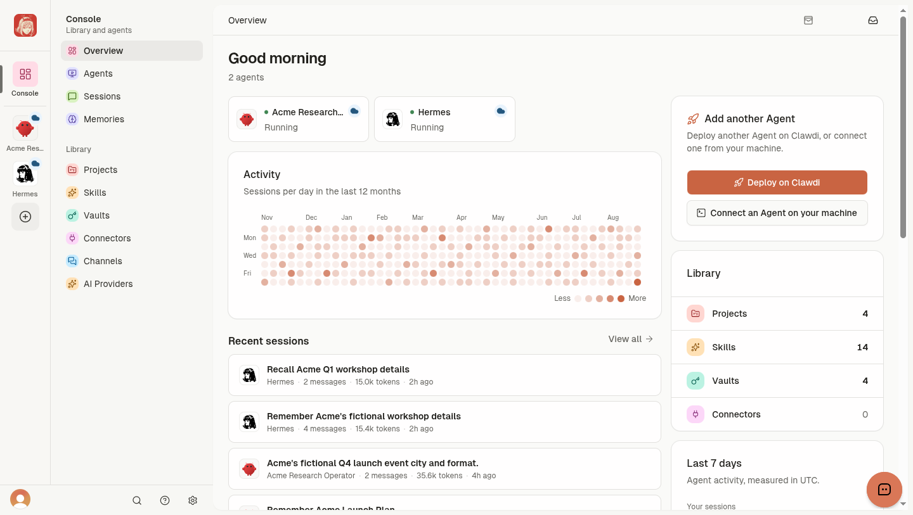

<h1 align="center">Clawdi</h1>

<p align="center">
  <strong>The best home for all your AI agents.<br>Run them in the cloud or connect your own—with their context and tools in one place.</strong>
</p>

<p align="center">
  <a href="https://www.npmjs.com/package/clawdi"></a>
  <a href="https://github.com/Clawdi-AI/clawdi/actions/workflows/cli-publish.yml"></a>
  <a href="https://github.com/Clawdi-AI/clawdi/stargazers"></a>
  <a href="LICENSE"></a>
</p>

<p align="center">
  <a href="https://clawdi.ai">Website</a> ·
  <a href="https://docs.clawdi.ai">Docs</a> ·
  <a href="docs/clawdi-cloud-product-tour.md">Product tour</a> ·
  <a href="https://www.npmjs.com/package/clawdi">npm</a>
</p>

<p align="center">
  
</p>

Clawdi supports two run paths:

- **Cloud Agents:** deploy a managed Hermes or OpenClaw runtime.
- **Connected Agents:** connect supported Agent software already running on your computer.

Clawdi brings available Agent history and reusable resources into one dashboard, CLI, and MCP layer. Support varies by Agent software and run path.

## Start

The fastest path is a managed [Cloud Agent](https://docs.clawdi.ai/cloud-agents/deploy).

To connect an Agent on macOS or Linux:

```bash
curl -fsSL https://clawdi.ai/install.sh | sh
clawdi auth login
clawdi setup
clawdi doctor
```

On Windows, or for a package-manager-owned installation, use Node.js 24+:

```bash
npm i -g clawdi
```

Read the [Connected Agent quickstart](https://docs.clawdi.ai/getting-started/quickstart) for agent detection, headless login, and setup details.

## Product capabilities

- **Sessions and memory:** sync supported Agent history and keep durable context available across sessions.
- **Skills and Projects:** manage reusable instructions, organize Cloud-owned resources, and link selected Projects to Agents.
- **Vaults:** store secrets server-side and resolve explicit `clawdi://` references at runtime.
- **Connectors and Channels:** expose app tools through MCP and connect supported messaging bots to Cloud Agents.
- **AI Providers:** configure model access for local catalogs and supported Cloud Agent runtimes.
- **Open source stack:** run the MIT-licensed CLI, FastAPI backend, TanStack dashboard, and PostgreSQL data layer yourself.

Precise behavior and access boundaries are documented in [Core concepts](https://docs.clawdi.ai/concepts/core-concepts).

## Connected Agent support

| Agent | Sessions | Skills | MCP setup |
| --- | --- | --- | --- |
| Claude Code | Yes | Yes | Automatic |
| Codex | Yes | Yes | Automatic |
| Hermes | Yes | Yes | Automatic |
| OpenClaw | Yes | Yes | Manual hint where required |
| Pi | Yes | No | No |
| OpenCode | Yes | No | No |

Each adapter exposes only the modules its Agent software supports.

## Self-host

```bash
git clone https://github.com/Clawdi-AI/clawdi.git
cd clawdi
bun install
```

The repository contains:

```text
apps/web/          TanStack dashboard
backend/           FastAPI backend and database migrations
packages/cli/      CLI, Agent adapters, and MCP server
packages/shared/   Shared API types and schemas
docs/              Architecture and contributor guides
```

Follow [`AGENTS.md#local-end-to-end`](AGENTS.md#local-end-to-end) for the complete local runbook. See [Architecture](docs/architecture.md), [AI Providers](docs/ai-providers.md), and [Managed runtime](docs/managed-runtime.md) for deeper technical contracts.

## Development

```bash
bun run typecheck
bun run test
bun run check
```

`bun run test` uses the clean Docker-backed runner. Backend, frontend, CLI, and release workflows are documented in [`AGENTS.md`](AGENTS.md).

## License

MIT. See [`LICENSE`](LICENSE).
