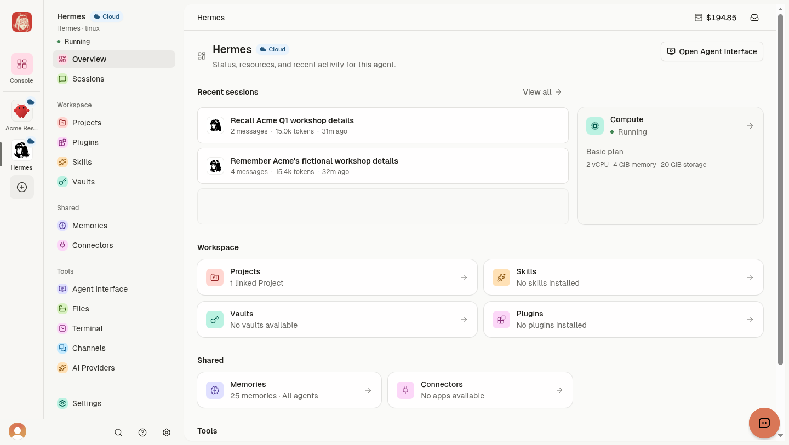
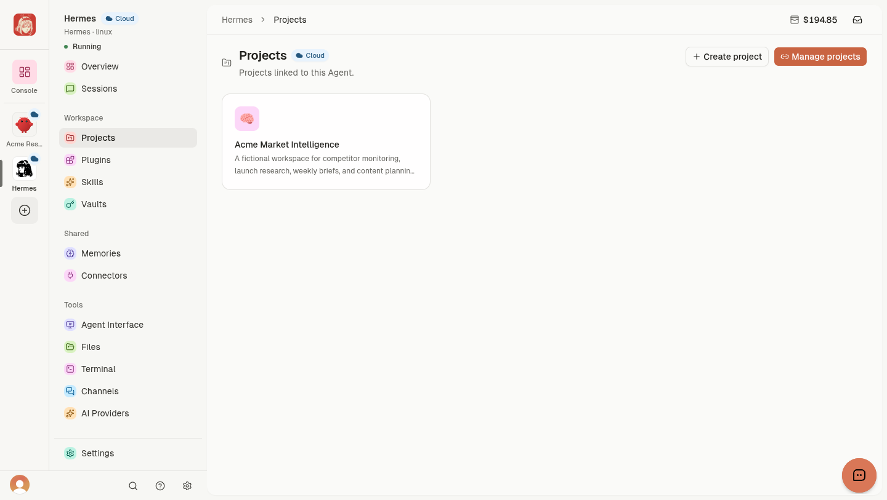
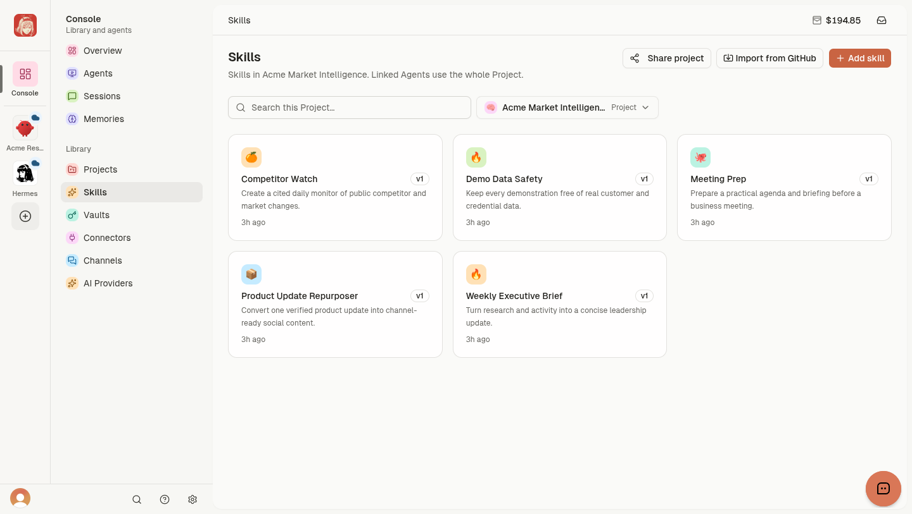
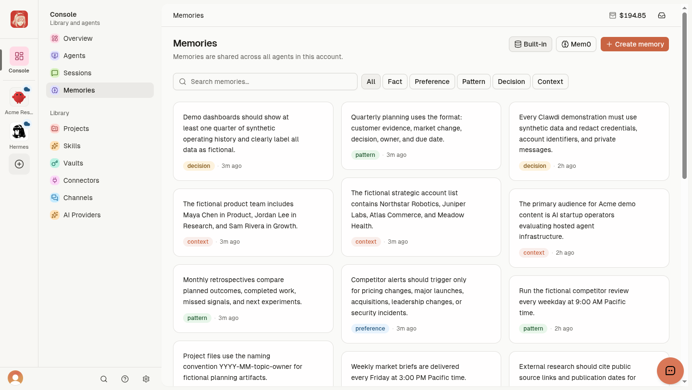
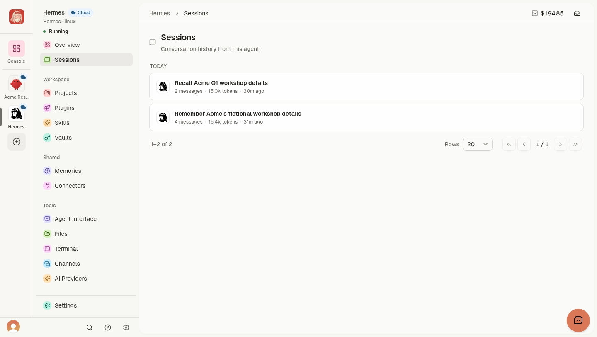
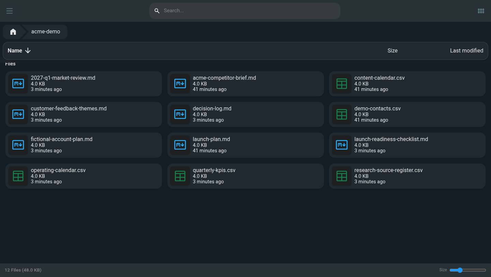

# Clawdi Cloud product tour

This tour shows the current Clawdi Cloud experience with a synthetic Acme
Market Intelligence workspace. The demo contains 25 account Memories, five
Project Skills, 12 Workspace files, a linked Project, and multiple Agent
Sessions. Names, companies, decisions, and activity are fictional.

For task-by-task instructions, use the canonical [Clawdi
Docs](https://docs.clawdi.ai). Start with the [Cloud Agent
quickstart](https://docs.clawdi.ai/cloud-agents/deploy) or [connect a local
Agent](https://docs.clawdi.ai/getting-started/quickstart).

## One product, two run paths

Clawdi brings supported Agent activity, context, and tools into one product.
A **Cloud Agent** runs in a remote runtime managed by Clawdi. A **Connected
Agent** runs on your computer. Agent software, including Hermes, OpenClaw,
Claude Code, and Codex, is a separate choice from the run path.

## Start from a Running Agent

The Agent overview brings deployment state, compute, linked Projects, recent
Sessions, and shared resource counts together. A Cloud Agent can open its
Agent Interface, Files, and Terminal from the same navigation.

Follow [Cloud Agent states and
recovery](https://docs.clawdi.ai/cloud-agents/states-and-recovery) when the
status remains unclear. Runtime state and individual tool readiness are
separate checks.

## Link selected Projects

A Project groups Project Skills and Vault access. Linking one to an Agent is
an explicit action, which makes the selected resources available without
changing Project ownership.

Read [Projects and
sharing](https://docs.clawdi.ai/guides/projects-and-sharing) before attaching
Vaults or inviting a Viewer.

## Build a reusable Skill library

Project Skills are Cloud-owned reusable instructions. Agent Skills remain
authoritative in the Agent software's guarded filesystem and appear in the
Cloud dashboard as a read-only inventory.

The [Skills guide](https://docs.clawdi.ai/guides/skills) covers both locations,
copying, explicit imports, and safe review of third-party Skills.

## Keep durable account context

Memories hold account-level facts, preferences, patterns, decisions, and
context that supported Agents can recall in later interactions. Each record
should be concise, reusable, and self-contained.

Memories stay outside Projects. Store credentials and tokens in Vaults. See
[Memories](https://docs.clawdi.ai/guides/memories) for categories, recall,
editing, and deletion.

## Review Agent history

Sessions provide searchable Agent conversation history for later review and
recall. Session availability and detail depend on the connected Agent
software and its synchronization path.

See [Sessions](https://docs.clawdi.ai/guides/sessions) for search, sharing, and
export workflows.

## Use the remote Workspace

A Cloud Agent's Files view opens its private Workspace. The synthetic demo
includes quarterly reviews, operating calendars, decision logs, feedback
themes, research sources, launch plans, and KPI history.

Workspace files are designed to persist across normal restarts and platform
updates. Source control or another external system should hold the durable
copy of important work. Deleting a Cloud Agent permanently removes its remote
resources. Read [Agent Interface, Files, and
Terminal](https://docs.clawdi.ai/cloud-agents/agent-interface-and-terminal)
for access, readiness, and persistence boundaries.

## Continue the journey

- [Give an Agent shared context](https://docs.clawdi.ai/guides/workflows/give-an-agent-context)
- [Connect an app and verify its tools](https://docs.clawdi.ai/guides/workflows/connect-an-app)
- [Share a Project with a teammate](https://docs.clawdi.ai/guides/workflows/share-a-project)
- [Configure Cloud Agent AI access](https://docs.clawdi.ai/cloud-agents/ai-access)
