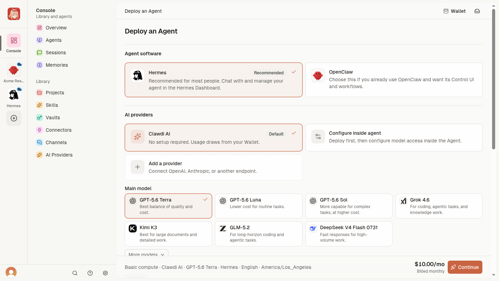
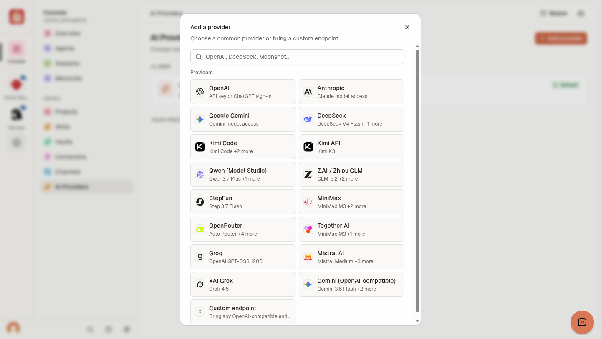
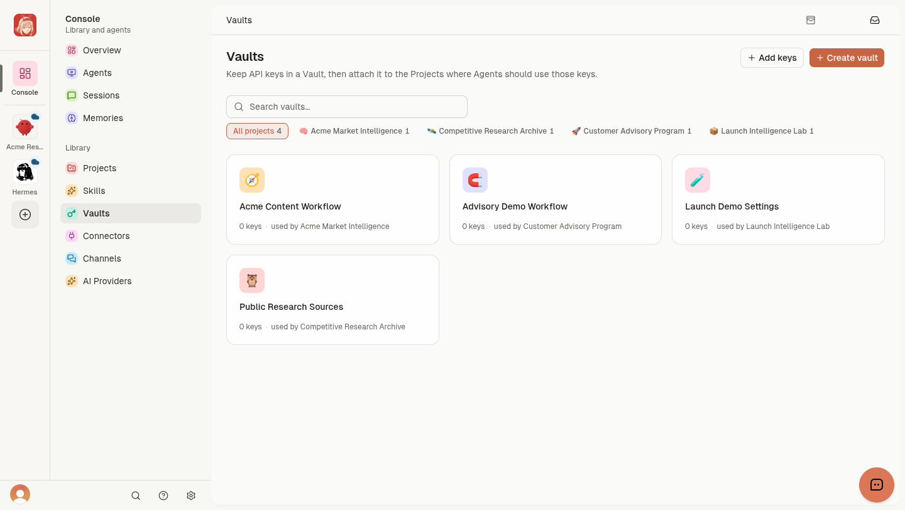
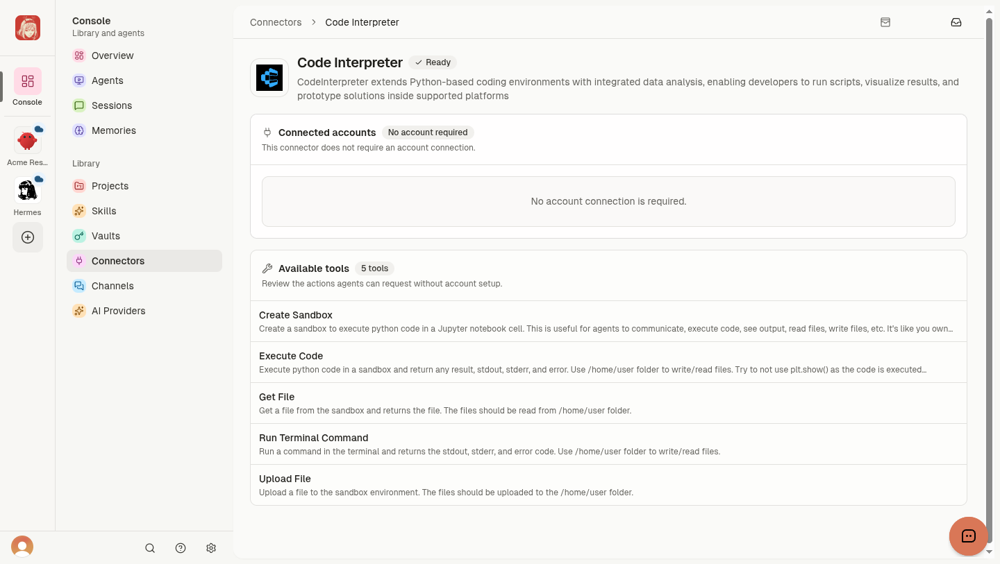
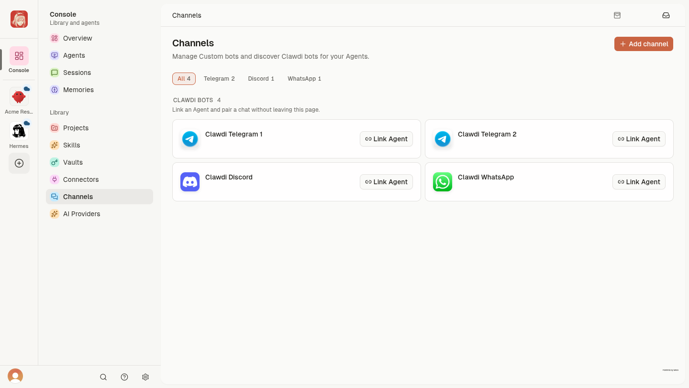

# Clawdi Cloud product tour

Screens use a fictional Acme Market Intelligence workspace. All names, data, decisions, and activity are synthetic.

For setup instructions, use the [Clawdi Docs](https://docs.clawdi.ai): [deploy a Cloud Agent](https://docs.clawdi.ai/cloud-agents/deploy) or [connect an Agent](https://docs.clawdi.ai/getting-started/quickstart).

## One product, two run paths

A **Cloud Agent** runs in Clawdi. A **Connected Agent** runs on your computer. Agent software, such as Hermes, OpenClaw, Claude Code, or Codex, is a separate choice.

## Deploy a Cloud Agent

Choose Hermes or OpenClaw, select AI access and a model when required, then choose Basic or Performance compute. Review the monthly price before deploying.

## Choose from AI Providers

Clawdi AI uses Wallet funds. BYOK connects a supported provider, with model traffic billed by that provider. Custom OpenAI-compatible endpoints are also supported.

## Review activity

Overview shows Session starts, recent Sessions, and Library resources.

## Open a running Agent

The Agent page shows status, compute, Projects, Sessions, and resources. Cloud Agents also provide Agent Interface, Files, and Terminal.

See [states and recovery](https://docs.clawdi.ai/cloud-agents/states-and-recovery) for unclear runtime status.

## Link Projects

A Project groups Skills and Vault access. Link a Project to share those resources with an Agent.

See [Projects and sharing](https://docs.clawdi.ai/guides/projects-and-sharing).

## Reuse Skills

Project Skills are Cloud-owned instructions. Agent Skills remain in the Agent software and appear as read-only inventory.

See [Skills](https://docs.clawdi.ai/guides/skills).

## Scope secrets with Vaults

Vault access follows Project boundaries. The demo Vaults are empty.

Add secrets through the Vault interface and attach each Vault only where needed.

## Use Connector tools

Some Connectors work without account authorization. Authorized external accounts appear in the Overview Connector count.

See [Connect an app](https://docs.clawdi.ai/guides/workflows/connect-an-app).

## Connect messaging Channels

Channels link Telegram, Discord, or compatible WhatsApp bots to Cloud Agents.

See [Channels](https://docs.clawdi.ai/guides/channels).

## Keep durable context

Memories store concise account-level facts and preferences. Credentials belong in Vaults.

See [Memories](https://docs.clawdi.ai/guides/memories).

## Review Agent history

Sessions provide searchable conversation history. Availability depends on Agent software and connection path.

See [Sessions](https://docs.clawdi.ai/guides/sessions).

## Use the remote Workspace

Files opens a Cloud Agent's private Workspace. Keep important work in source control or another durable system; deleting the Agent removes its remote resources.

See [Agent Interface, Files, and Terminal](https://docs.clawdi.ai/cloud-agents/agent-interface-and-terminal).

## Next

- [Give an Agent shared context](https://docs.clawdi.ai/guides/workflows/give-an-agent-context)
- [Connect an app](https://docs.clawdi.ai/guides/workflows/connect-an-app)
- [Share a Project](https://docs.clawdi.ai/guides/workflows/share-a-project)
- [Configure Cloud Agent AI access](https://docs.clawdi.ai/cloud-agents/ai-access)
