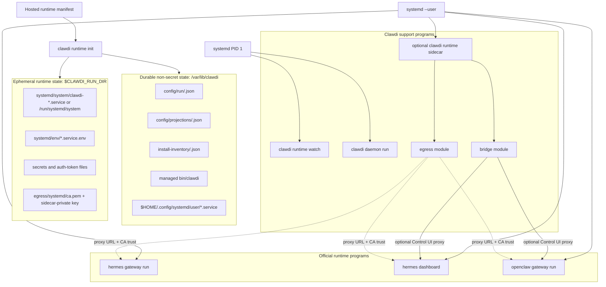
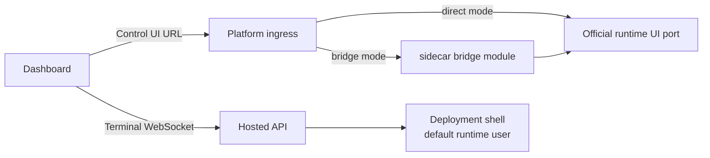

# Managed Runtime Contract

| Field | Value |
| --- | --- |
| Status | Public runtime contract |
| Last updated | 2026-07-02 |
| Owner | CLI runtime layer |

This document describes the public Clawdi CLI and dashboard contract for managed
runtime environments. It intentionally avoids deployment-specific topology,
private service details, live service hosts, and internal runtime orchestration.

Related public docs:

- CLI notes: [`plans/managed-runtime-cli.md`](plans/managed-runtime-cli.md)
- Roadmap: [`plans/managed-runtime-roadmap.md`](plans/managed-runtime-roadmap.md)
- Projection boundary:
  [`plans/runtime-projection-boundary.md`](plans/runtime-projection-boundary.md)
- Agent v2 cross-repo release operations:
  [`clawdi-hosted` runbook](https://github.com/Clawdi-AI/clawdi-hosted/blob/main/docs/v2/ops/2026-07-12-agent-v2-cross-repo-release-runbook.md)

## Scope

The open-source CLI owns local runtime convergence, explicit `clawdi run`
env-injection, runtime UI bridging, and diagnostics. It does not own
OpenClaw/Hermes binaries, native update flows, or runtime process behavior.
The web app owns the hosted deployment dashboard surfaces, including Control UI
and Terminal tabs. First-party hosted control planes may provide desired state,
credentials, terminal authorization, rollout policy, and deployment lifecycle,
but those platform-specific implementations are outside this repository.

The public contract covers:

- validating runtime desired state;
- installing or verifying supported agent runtimes through their normal
  installers;
- writing non-secret local run configuration;
- projecting short-lived secrets only for the current runtime session;
- running final hosted runtimes from direct process-manager entries that name
  official Hermes/OpenClaw binaries;
- running Clawdi-owned support programs under the runtime process manager;
- supporting explicit `clawdi run -- <command>` when a caller opts into Clawdi
  runtime env injection;
- optionally proxying runtime browser UIs through the sidecar bridge module when
  Clawdi, rather than the official runtime or platform ingress, owns browser
  auth and header policy;
- exposing a dashboard Terminal contract for one deployment shell;
- reporting status and diagnostics through runtime commands.

The public contract does not cover:

- deployment-specific topology;
- private control-plane endpoints;
- tenant or billing policy;
- internal service implementation;
- image build pipelines or platform rollout details.

## Core Architecture

The primary hosted runtime model is a Linux-like runtime host. The host image
provides the OS envelope, a runtime user, a stable `clawdi` bootstrap path,
official Hermes/OpenClaw installs, and a process manager. Runtime behavior
comes from the manifest and official runtime binaries, not from per-agent
wrappers.



The process manager is systemd. The important contract is that each
long-running program is declared directly with its official command, args, cwd,
and env. Clawdi support processes use `clawdi-*` service names; OpenClaw and
Hermes gateway base units use runtime-owned service names generated by official
service installers, such as `openclaw-gateway.service` and
`hermes-gateway.service`. Runtime services must not point at `clawdi run --
openclaw`, `clawdi run -- hermes`, a generated launch shell, or a PATH shim. If
Clawdi must temporarily run an auxiliary process that has no official service
installer, the unit uses a `clawdi-*` name and is documented as compatibility,
not as a runtime-owned service.

The Linux-like host preserves official updater behavior. If a user or an
official UI runs `openclaw update` or `hermes update`, PATH resolves to the
official binary. Clawdi does not intercept that command. After an updater
replaces files, the process manager may restart the relevant official program,
but the update transaction remains owned by the runtime.

The bootstrap boundary is deliberately small: system boot prepares writable
runtime directories, starts the runtime user's systemd manager, and calls
`clawdi runtime init --non-interactive`. `runtime init` is the local
administrator convergence step. It uses official installers/config commands
first, invokes official non-interactive service installers for runtime gateway
base units, and writes only transparent hosted drop-ins/env files for those
official units. When a later manifest removes an official gateway service,
`runtime init` invokes the matching official service uninstaller before it
removes the hosted drop-in/env files. Clawdi-owned support units keep
`clawdi-*` names.

Official unit ownership follows a strict contract. The official installer owns
the base unit file; Clawdi never edits or removes a base unit it did not
generate. Clawdi owns exactly two artifacts per official unit: the drop-in
`$HOME/.config/systemd/user/<unit>.service.d/10-clawdi-hosted.conf` and the env
file `$CLAWDI_RUN_DIR/systemd/env/<unit>.service.env`, both marked with the
generated-file header so convergence can identify them. Failure handling keeps
that boundary convergent in both directions:

- If an official service install fails and no base unit exists yet, the drop-in
  is not written; convergence reports the install error and the next cycle
  retries the official installer. If a base unit already exists from an earlier
  successful install, the drop-in/env are still refreshed so the running
  service keeps its current configuration.
- If an official service uninstall fails, the drop-in/env files are kept as
  retry evidence, convergence reports the error, and the next cycle retries the
  official uninstaller before removing them.
- Systemd apply (daemon-reload, enable/start, restart, stop/disable) always
  runs after convergence, even when convergence reported errors: unit files on
  disk already changed, and stops/disables for removed units must land even
  when an unrelated runtime install or projection failed.

Official service installers/uninstallers run only when the CLI runs as root
(the hosted PID 1 path). `CLAWDI_RUNTIME_INSTALL_OFFICIAL_SERVICES=1|0`
overrides that default for development and tests; when installers are skipped,
convergence still writes the hosted drop-in/env files. Similarly, systemctl
apply runs only where the environment owns a live systemd
(`/run/systemd/system`, overridable with `CLAWDI_SYSTEMD_APPLY=1|0`); when unit
files changed but apply was skipped, init/watch status reports
`systemdApply.applied=false` instead of hiding the divergence.

Hermes gateway and dashboard are separate official commands in this model. A
deployment that needs both must use an official service installer for each
runtime-owned unit. Until Hermes exposes an official dashboard service
installer, the hosted default does not synthesize `hermes-dashboard.service`; an
explicit compatibility unit, if required, must use a `clawdi-*` name. The
gateway is not treated as a bridge target unless a deployment configures an
actual HTTP/WebSocket listener for it.

### Runtime Host Contents

| Area | Contains | Must not contain |
| --- | --- | --- |
| Host envelope | runtime user, home directory, base packages, process manager, host policy | runtime-specific shell wrappers |
| Clawdi | managed `clawdi`, runtime-fetched `mitmdump` (mitmproxy) transparent gateway, status/doctor tooling, `clawdi-*` support units | per-agent command shims, OpenClaw/Hermes binaries |
| Hermes | official install and official `hermes` binary | Clawdi-owned `hermes` wrapper |
| OpenClaw | official install and official `openclaw` binary | Clawdi-owned `openclaw` wrapper |
| Runtime state | `/var/lib/clawdi`, `$CLAWDI_RUN_DIR`, workspace, short-lived secret files | durable plaintext provider secrets |

The host should not add:

- `/usr/local/bin/openclaw` or `/usr/local/bin/hermes` wrappers owned by
  Clawdi;
- generated launch scripts that call `clawdi run -- openclaw` or
  `clawdi run -- hermes`;
- a Clawdi process as PID 1 for Hermes or OpenClaw;
- direct public exposure of `--auth none` runtime ports.

The image must not contain per-agent command wrappers, generated launch scripts,
or PATH shims for `openclaw`, `hermes`, or future runtime names. Official
runtime commands still resolve to official binaries, so native commands such as
`openclaw update` and `hermes update` keep their own updater behavior.

## Support Module Boundaries

The Clawdi support programs run under the same process manager as the runtime
programs. `clawdi runtime sidecar` is one support process with optional modules,
and those modules keep explicit authority boundaries:

| Module | Starts when | Direction | Sensitive input | Network exposure | Must not own |
| --- | --- | --- | --- | --- | --- |
| manifest/watch | an auth token file exists | control-plane polling | Clawdi auth token from file | outbound API only | official runtime PID 1 |
| live-sync daemon | `liveSync.agents` is non-empty | live sync and local daemon APIs | Clawdi auth token from file | local daemon surface | egress rewrite policy |
| sidecar bridge module | `bridge.surfaces` is non-empty and platform chooses Clawdi auth/proxy | browser reverse proxy | bridge token only | declared listen ports | outbound egress policy |
| sidecar egress module | enabled egress profiles exist | runtime outbound proxy | profile bundle, CA cert/key under `$CLAWDI_RUN_DIR`, optional secret file | loopback/private proxy | live-sync/API authority |
| official runtime program | runtime is enabled | normal runtime behavior | runtime-specific env/config only | official runtime ports | Clawdi auth secrets |

The sidecar is still not a hidden wrapper around Hermes/OpenClaw. It only hosts
Clawdi-owned support modules; official runtime programs remain direct process
manager entries.

The egress module keeps its root CA certificate and private key under the
ephemeral run directory so a sidecar restart does not change the trust root for
already-running runtimes. Runtime programs receive only the CA certificate path
as trust env; the private key path is not projected into runtime env.

The sidecar bridge module is optional, not a replacement for official ports. If
the platform exposes the official ports behind trusted ingress auth and the
runtime native UI works with that auth/CORS/path policy, the bridge can be
disabled. If Clawdi needs cookie/token auth, tenant isolation, CSP/header
rewriting, WebSocket/SSE mediation, or a single hosted Control UI URL, the
bridge remains the correct inbound module.

### Official Container Reference Research

Official runtime images are useful references, but they are not the primary
hosted architecture while in-place official UI updates are a requirement:

| Image | Useful reference | Update implication |
| --- | --- | --- |
| `nousresearch/hermes-agent` | s6 starts `hermes gateway run` and, with `HERMES_DASHBOARD=1`, also starts `hermes dashboard`; ports are `8642` and `9119` | Docker installs update by pulling/recreating the image, so dashboard update cannot be the normal in-place updater path |
| `ghcr.io/openclaw/openclaw` | `tini` runs the gateway; official container rejects unauthenticated non-loopback binds; `--auth token --bind auto` works for directly exposed ports | Docker installs update by image rollout; in-place `openclaw update` belongs to non-Docker installs |

The Linux-like host can adopt these lessons without switching to container
rollout updates: use separate official systemd user services when the runtime
provides service installers for separate surfaces, keep OpenClaw loopback when
behind the bridge, and require runtime-native auth when exposing the official
OpenClaw port directly.

## Manifest Shapes

The CLI accepts two related shapes:

- `clawdi.hosted-runtime.manifest.v1` is the hosted control-plane response
  shape. It requires strict `runtime`, `locale`, `system`, `controlPlane`,
  `clawdiCli`, `runtimes`, `providers`, `liveSync`, and `recovery` fields.
  `egressProfiles`, `mcp`, and `tools` remain explicit optional projections.
- `clawdi.runtimeDesiredState.v1` is the normalized internal convergence shape
  consumed by `runtime init`.

Normalization maps hosted fields into the internal shape:

| Hosted field | Internal purpose |
| --- | --- |
| `deploymentId`, `environmentId`, `instanceId`, `generation` | Identity, cache keys, status, and idempotence |
| `runtime` | The single enabled runtime selected and served by this deployment |
| `locale.language`, `locale.timezone` | Product-supported agent language and valid IANA timezone |
| `system.home`, `system.workspace` | Runtime HOME and workspace root |
| `system.persistentPaths` | Non-empty durable filesystem paths owned by the runtime host |
| `controlPlane.cloudApiUrl` | Cloud-owned API origin derived from the Cloud service configuration |
| `clawdiCli.packageSpec` | System-managed CLI package selection; agent v2 uses the floating `clawdi@agent-v2` channel |
| `clawdiCli.registry` | System-managed npm registry; agent v2 uses `https://registry.npmjs.org` |
| `runtimes.<name>.enabled` | Run config and systemd unit state |
| `runtimes.<name>.provider_ids` | Required non-empty provider pool; no single-provider aliases or account fallback |
| `runtimes.<name>.primary_model` | Required structured `{provider_id, model}` selection within that provider pool |
| `runtimes.<name>.install` | Supported official installer input |
| `runtimes.<name>.run` | Command, args, cwd, env, and PATH projection |
| `runtimes.<name>.services` | Runtime-owned auxiliary processes, such as a browser dashboard, managed without user command shims |
| `runtimes.<name>.paths.home`, `runtimes.<name>.paths.workspace` | Required runtime-local home and workspace paths |
| `bridge.surfaces` | Optional authenticated runtime surface listen/upstream mappings |
| `providers` | Required runtime-scoped AI provider projections whose keys exactly match selected `provider_ids` |
| `mcp`, `tools` | Runtime MCP/tool projection input |
| `liveSync.{enabled,agents}` | Required explicit daemon sync configuration; Cloud does not derive it from agent metadata |
| `egressProfiles` | Explicit local sidecar profiles |
| `recovery.{cacheManifest,allowOfflineBoot}` | Required explicit manifest cache and offline-boot behavior |

Manifest `runtime`, `runtimes`, and `generation` are part of the remote manifest
ETag. The CLI applies any non-304 manifest without monotonic generation gating,
writes `generation` into managed state, sync state, egress bundles, run configs,
and projections, then caches the fetched manifest as last-good. A runtime
selection or generation change therefore produces a new ETag so `runtime watch`
converges immediately.

Manifest validation is defensive. Agent v2 requires exactly one enabled
`openclaw` or `hermes` compute runtime, emits its name in top-level `runtime`,
and includes only that entry in `runtimes`. Codex remains an add-on/live-sync
agent type, not a selectable hosted compute runtime. Zero, multiple, disabled,
or unsupported selections fail closed. Cloud accepts only canonical
`provider_ids` plus structured `primary_model`; provider aliases, single-value
bindings, model strings, and account-provider fallback are rejected. Required
`system` and runtime `paths` are validated before persistence and again before
manifest assembly. `install`, `run`, and each `services` entry are strict
contract objects, so unknown nested fields never reach the CLI.

For agent deployment v2, Cloud API manifest assembly owns `clawdiCli` and emits
`npm:clawdi` with `clawdi@agent-v2`, the official
`https://registry.npmjs.org` registry. Admin desired state and ambient npm
configuration cannot override that channel or registry. The
deployment bootstrap environment seeds the CLI before its first manifest; the
CLI persists the selected channel and registry, then ordinary self-updates
resolve the ongoing authority emitted by Cloud manifests. `minimumCliVersion`
is the independent protocol floor, currently `0.12.10-beta.51` for this
contract. Cloud also derives `controlPlane.cloudApiUrl` from its own
`public_api_url`; Hosted runtime-state input cannot provide URL authority.
`controlPlane` contains only `cloudApiUrl`, and the public manifest does not
contain `manifestUrl`, `apiUrl`, or `appId`.

`locale` contains exactly `language` and `timezone`; personality is not part of
Cloud desired state. Revision `d8f2a1c4b6e9` adds the required
`hosted_runtime_states.locale` column without a default or data backfill and
removes the obsolete `clawdi_cli`, `control_plane`, and `provider_id` columns.
It also makes `system` non-null. A non-empty table is a pre-DDL rollout stop
condition: operators stop rollout and resolve or decommission the state through
the approved procedure before retrying. The migration does not prescribe
direct deletion, backfill, repair, or preservation of prelaunch state.

## Commands

Runtime operators can use these commands in controlled environments:

```bash
clawdi runtime init --non-interactive
clawdi runtime watch
clawdi runtime sidecar
clawdi runtime status --json
clawdi runtime doctor --json
clawdi run -- <command>
```

Normal local onboarding still uses `clawdi setup`. Runtime commands are for
managed environments where configuration is supplied by policy or a manifest,
not by an interactive user setup flow.

`runtime watch` is the long-running reconciliation loop. It refreshes remote
manifest state using ETags, applies changes, records status, and falls back to
last-good cached manifests only when recovery policy allows it. `runtime
sidecar` is the single Clawdi support process for optional runtime-local modules:
the bridge module exposes manifest-declared browser surfaces behind hosted access
controls, and the egress module proxies outbound runtime traffic when explicit
egress profiles are enabled.

Cloud also emits a signal-only `runtime_manifest_changed` event on the existing
`/v1/sync/events` SSE plane after a manifest-affecting transaction commits. The
event contains only `type` and `environment_id`; the CLI always fetches the
manifest and applies the normal ETag contract. Bound deploy keys are filtered
to their exact environment, while unbound user keys may receive any owned
environment and filter again client-side. PostgreSQL LISTEN/NOTIFY carries the
signal across API workers and replicas. ETag polling remains the reliability
fallback when an SSE connection or bounded queue drops an event.

The current hosted bridge surfaces are browser-facing runtime UIs. Each surface
declares its listen address, upstream target, protocol behavior, auth model, and
header rewrite rules. The bridge must not become a generic arbitrary-port
forwarder. Terminal is deliberately out of scope because it is a shell-exec
authorization path, not a browser UI proxy.

## Bridge Policy

The sidecar bridge module stays in the architecture as an optional inbound
module. The default safe mode is bridge-on with loopback runtime upstreams.
Direct official port exposure is an explicit manifest/platform choice.

| Mode | Runtime bind/auth | External exposure | Bridge |
| --- | --- | --- | --- |
| Bridge mode | runtime may bind loopback and use local/no auth | Dashboard reaches the runtime through Clawdi access controls | enabled |
| Direct official port mode | runtime must use runtime-native auth or trusted ingress auth | Platform ingress exposes the official runtime port | disabled or bypassed |

Use bridge mode when Clawdi owns browser-facing auth, tenant isolation,
cookie/token handling, CSP/frame header rewriting, WebSocket/SSE mediation, or a
single hosted Control UI URL. Disable the bridge only when platform ingress and
the official runtime together cover those responsibilities.

## Desired State Boundary

The CLI consumes a desired-state document plus optional secret values. The
desired state should contain only non-secret configuration such as enabled
runtimes, locale, command launch settings, channel projections, and provider routing
metadata. Secret values are delivered separately and must not be cached in
plain text.

At the boundary:

- the control plane owns desired-state generation and secret resolution;
- the CLI owns local validation, projection, diagnostics, and command launch;
- the runtime process owns normal agent behavior after launch.

The CLI writes durable non-secret state under the service state root. Important
outputs include:

| Output | Purpose |
| --- | --- |
| `config/clawdi.json` | Redacted managed runtime config |
| `sync/runtimes.json` | Runtime sync state |
| `cache/manifest.last-good.json` | Last accepted manifest |
| `cache/manifest.etag`, `cache/channels.etag` | Remote refresh cache validators |
| `install-inventory/<runtime>.json` | Install/verify observation |
| `config/projections/<runtime>.json` | Runtime projection payload |
| `config/run/<runtime>.json`, `config/run/<runtime>+<service>.json` | `clawdi run` launch config for runtime main processes and internal runtime-owned services |
| `$CLAWDI_RUN_DIR/secrets/*` | Short-lived token and secret files for the current runtime session |
| `$CLAWDI_RUN_DIR/systemd/env/*.service.env` | Ephemeral env files for local systemd services, including short-lived runtime secrets |
| `$CLAWDI_RUN_DIR/systemd/system/*.service` or `/run/systemd/system/*.service` | Generated system units for root-owned Clawdi support programs |
| `$HOME/.config/systemd/user/*.service` | Official runtime gateway base units, plus Clawdi-owned user support units such as the sidecar |
| `$HOME/.config/systemd/user/*.service.d/10-clawdi-hosted.conf` | Transparent hosted drop-ins for official runtime units |

Short-lived secrets belong under the runtime run directory, not in durable
config. Status and diagnostic output must redact secrets.

## Command And Launch Model

`clawdi run -- <command>` is a local vault-injection command and an interactive
hosted shell boundary. In hosted mode, it first tries to resolve the command
against a generated runtime run config. If a matching enabled config exists, it
launches that runtime with the configured command, args, cwd, env, PATH, secret
refs, and optional sidecar profile. If the config exists but is disabled,
`clawdi run` exits with a disabled-runtime error.

Interactive shell commands are not intercepted. `openclaw`, `hermes`, and
future runtime names resolve to official binaries on PATH. Clawdi only
participates when the caller explicitly invokes `clawdi run` or when
`runtime init` projects manifest-selected config.

Hosted daemon startup avoids `clawdi run`. For OpenClaw/Hermes gateways,
`runtime init` invokes the official service installer to create the base user
unit, then writes a hosted drop-in with the minimum local environment needed by
the Linux-like container. Sensitive env lives under `$CLAWDI_RUN_DIR/systemd/env`
instead of durable unit files:

```ini
# $HOME/.config/systemd/user/openclaw-gateway.service.d/10-clawdi-hosted.conf
[Service]
WorkingDirectory=/home/clawdi/clawdi
Environment="XDG_RUNTIME_DIR=%t"
Environment="DBUS_SESSION_BUS_ADDRESS=unix:path=%t/bus"
EnvironmentFile="/run/clawdi/systemd/env/openclaw-gateway.service.env"
ExecStart="/home/clawdi/.openclaw/bin/openclaw" "gateway" "run" "--allow-unconfigured"
```

When bridge surfaces or egress profiles are enabled, systemd runs the Clawdi
support processes: the bridge surface process and, for egress interception, a
runtime-fetched `mitmdump` (mitmproxy) transparent gateway running under the
explicit non-root `CLAWDI_EGRESS_UID` and `CLAWDI_EGRESS_GID` numeric identity
(both default to `10002`). The CLI owns its paths, permissions, and privilege
drop; the image does not need a named egress account. Engagement is a minimal
nft redirect of the runtime UID's
outbound :80/:443 to the local mitmproxy port (default-allow: non-profiled hosts
pass through end-to-end against the real upstream CA); no forward-proxy env is
injected. Bridge token/surface config and egress profile/CA/secret config stay
inside those support processes. Runtime programs therefore receive only CA-trust
env such as `NODE_EXTRA_CA_CERTS`, `REQUESTS_CA_BUNDLE`, and `SSL_CERT_FILE`;
support control env and secret-file paths stay out of the official runtime
process.

This ownership boundary is codified in
[ADR-0002](adr/0002-runtime-image-is-a-stable-capability-envelope.md).

Hermes has multiple official long-running surfaces. The Linux-like host should
use official service installers for each runtime-owned surface when both are
needed. Clawdi should not emulate that fan-out with shell wrappers or a
runtime-owned-looking `hermes-dashboard.service`.

OpenClaw's hosted default stays loopback and leaves auth selection to the
runtime config projection. In v2 hosted, Clawdi patches
`gateway.auth.mode=token` from `OPENCLAW_GATEWAY_TOKEN`; the launch command must
not pass a conflicting `--auth` override:

```bash
openclaw gateway run --allow-unconfigured --bind loopback --force
```

Production manifests should provide OpenClaw configuration and a real gateway
token or password when the official OpenClaw port is exposed directly. The
official Docker test showed `--auth none --bind lan` fails closed; direct-port
manifests should use runtime-native auth and a non-loopback/container-aware
bind such as `--auth token --bind auto`. `--allow-unconfigured` is acceptable
for development, diagnostics, or first-boot recovery, but it should not hide
missing production configuration.

## Official Update Compatibility

Systemd is compatible with official updater behavior when the runtime container
boots a real `systemd --user` manager for the runtime user:

- runtime-owned units name official binaries directly;
- install roots are writable by the runtime user expected by the official
  installer;
- `openclaw`, `hermes`, and their update subcommands are not shadowed by
  Clawdi wrappers or PATH shims;
- `clawdi run` is used only when explicitly requested by a caller;
- OpenClaw receives `OPENCLAW_SYSTEMD_UNIT=openclaw-gateway.service` and can use
  `systemd-run --user --scope --collect` for managed update handoff;
- after an updater replaces files, the process manager restarts the relevant
  official programs, or autorestart picks them up when they exit.

The update transaction belongs to Hermes/OpenClaw. Clawdi may observe status,
surface diagnostics, and restart programs, but it must not emulate or wrap
`hermes update` or `openclaw update`.

Runtime-owned services use the same generated run-config and systemd model, but
they are not user commands and do not receive command shims. Gateway units must
come from official service installers. A manifest entry such as
`runtimes.hermes.services.dashboard` may still write
`config/run/hermes+dashboard.json`; until Hermes exposes an official dashboard
service installer, systemd must run it only as an explicit `clawdi-*`
compatibility unit:

```ini
ExecStart="hermes" "dashboard" "--host" "127.0.0.1" "--no-open"
```

This covers browser helper processes such as a runtime dashboard while keeping
the user's shell PATH clean: typing `hermes` enters the managed Hermes runtime,
not a dashboard alias. It must not be represented as
`hermes-dashboard.service` unless Hermes itself generates that unit.

## Provider And Channel Routing

Provider configuration uses standard Clawdi AI Provider modes:

- `openai_chat`;
- `openai_responses`;
- `anthropic_messages`;
- `google_generate_content`.

Agent-specific transport details belong to the target runtime projection layer.
For example, if a runtime needs a target-native transport name, the CLI maps the
standard provider contract into that runtime's configuration format at launch
time. The Clawdi provider model itself should stay provider-oriented, not
runtime-transport-oriented.

Channel configuration follows the same rule: the open-source contract describes
the local projection shape and validation rules, while service-specific channel
control planes remain outside this repository.

## Runtime UI And Terminal

Hosted deployment pages expose two live surfaces:

- **Control UI** embeds or links to the runtime's browser UI. It can use the
  official runtime port directly when platform ingress owns auth and header
  policy, or the sidecar bridge module when Clawdi owns those browser-facing
  controls. It is runtime-specific and should be labelled as `<Runtime> Control
  UI`.
- **Terminal** opens a shell for the deployment. It is not split per agent; a
  deployment has one Terminal surface.



The browser Terminal contract is:

1. The dashboard calls `POST /v2/deployments/{deployment_id}/terminal`.
2. The API returns a short-lived `websocket_url`.
3. The frontend removes any fragment token from the URL and sends it as a
   WebSocket subprotocol named `clawdi-terminal.<token>` when possible.
4. The frontend also sends the `tty` subprotocol and uses tty-style frames:
   `0` for terminal input/output and `1` for resize.
5. The terminal uses xterm, auto-fits to the panel, focuses on pointer down, and
   switches theme when the dashboard switches light/dark mode.

The service-side implementation is outside this repository. It must
authenticate the user, require the deployment to be running, bind the terminal
token to the deployment, and bridge the WebSocket to a shell as the default
runtime user. Query-param token transport is kept only as a compatibility
fallback for environments that reject custom WebSocket subprotocols.

## Security Rules

- Do not persist auth tokens, private keys, provider secrets, or resolved vault
  values in durable runtime config.
- Keep non-secret desired state separate from secret values.
- Treat runtime policy as an input to the CLI, not as hardcoded private logic.
- Prefer official runtime configuration and installers before proxying or
  request rewriting.
- Expose official runtime ports only behind runtime-native auth, platform
  ingress auth, or the sidecar bridge module.
- Keep defensive validation at every boundary: manifests, provider references,
  channel descriptors, filesystem paths, and process launch arguments.
- Remove `CLAWDI_AUTH_TOKEN` from agent child process environments unless that
  process is explicitly the Clawdi daemon or runtime reconciler.
- Start runtime browser UIs without public gateway auth only when they are
  reachable solely through the local sidecar bridge module and hosted access
  controls.
- Prefer WebSocket subprotocol auth for Terminal sessions so bearer tokens do
  not normally appear in URLs or proxy access logs.

## Recovery Rules

- Cache only manifests that validate and converge without install/projection
  errors.
- Use ETags for remote refreshes where the datasource supports them.
- Offline boot is allowed only when `recovery.allowOfflineBoot` is true and the
  cached manifest does not require missing secret values.
- `runtime status --json` and `runtime doctor --json` should surface enough
  state to distinguish manifest fetch failures, manifest rejection, degraded
  offline boot, install failures, and disabled runtimes.

## Implementation Notes

The CLI implementation should remain portable and testable:

- runtime commands must support JSON output for automation;
- local fixture manifests may be used for tests;
- generated provider and channel projections should be deterministic;
- diagnostics should report actionable local state without exposing secrets;
- operator-only behavior should not change normal laptop onboarding.

Primary implementation files:

| Area | Files |
| --- | --- |
| Manifest schema | `packages/cli/src/runtime/manifest-contract.ts` |
| Manifest fetch/normalize/validate | `packages/cli/src/runtime/manifest-source.ts` |
| Runtime convergence | `packages/cli/src/runtime/manifest.ts` |
| Runtime paths | `packages/cli/src/runtime/paths.ts` |
| Host policy | `packages/cli/src/runtime/host-policy.ts` |
| Run config | `packages/cli/src/runtime/run-config.ts` |
| Command execution | `packages/cli/src/commands/run.ts` |
| CLI update policy | `packages/cli/src/runtime/cli-update.ts` |
| Runtime bridge | `packages/cli/src/runtime/bridge.ts` |
| Dashboard terminal | `apps/web/src/hosted/agents/hosted-terminal-panel.tsx` |
| Dashboard hosted detail page | `apps/web/src/hosted/agents/hosted-agent-detail.tsx` |
