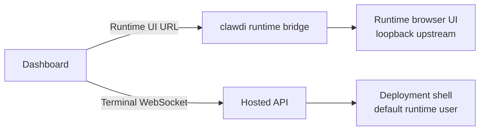

# Managed Runtime Contract

| Field | Value |
| --- | --- |
| Status | Public runtime contract |
| Last updated | 2026-06-30 |
| Owner | CLI runtime layer |

This document describes the public Clawdi CLI and dashboard contract for managed
runtime environments. It intentionally avoids deployment-specific topology,
private service details, live service hosts, and internal runtime orchestration.

Related public docs:

- CLI notes: [`plans/managed-runtime-cli.md`](plans/managed-runtime-cli.md)
- Roadmap: [`plans/managed-runtime-roadmap.md`](plans/managed-runtime-roadmap.md)
- Projection boundary:
  [`plans/runtime-projection-boundary.md`](plans/runtime-projection-boundary.md)

## Scope

The open-source CLI owns local runtime convergence, command wrapping, runtime
UI bridging, and diagnostics. The web app owns the hosted deployment dashboard
surfaces, including runtime UI and Terminal tabs. A separate control plane may
provide desired state, credentials, terminal authorization, rollout policy, and
deployment lifecycle, but that platform-specific implementation is outside this
repository.

The public contract covers:

- validating runtime desired state;
- installing or verifying supported agent runtimes through their normal
  installers;
- writing non-secret local run configuration;
- projecting short-lived secrets only for the current runtime session;
- starting commands through `clawdi run -- <command>`;
- providing stable command shims for managed runtime names;
- proxying local runtime browser UIs through the runtime bridge;
- exposing a dashboard Terminal contract for one deployment shell;
- reporting status and diagnostics through runtime commands.

The public contract does not cover:

- deployment-specific topology;
- private control-plane endpoints;
- tenant or billing policy;
- internal service implementation;
- image build pipelines or platform rollout details.

## Core Architecture

Managed runtime mode keeps the image stable and moves runtime behavior into the
CLI plus manifest:

```mermaid
flowchart TD
    Manifest[Hosted runtime manifest] --> Source[Manifest source and validation]
    Source --> Init[clawdi runtime init --non-interactive]
    Init --> State[/var/lib/clawdi state]
    Init --> RunConfigs[config/run/<runtime>.json]
    Init --> Shims[bin/<runtime> shims]
    Init --> Supervisor[supervisord.conf]
    Supervisor --> Watch[clawdi runtime watch]
    Supervisor --> Bridge[clawdi runtime bridge<br/>authenticated surfaces]
    Supervisor --> Runtime[clawdi run -- <runtime>]
    Shims --> Runtime
    Runtime --> AgentProcess[Agent runtime process]
```

The host image should contain only the stable host envelope:

- runtime user and home directory;
- base packages required by the CLI and supported installers;
- a host policy file that marks the environment as hosted;
- a stable CLI bootstrap path;
- PATH ordering that puts the service-state shim directory first;
- supervisor or equivalent process entrypoint.

Runtime behavior should come from:

- the runtime manifest;
- the `clawdi` CLI package selected by manifest policy;
- official runtime installers where supported;
- explicit `run.command` entries for future or externally installed runtimes.

Adding a new runtime should not require adding a new image-level wrapper. If the
CLI already supports the runtime, the manifest can enable it. If the CLI does
not have first-class installer/projection support yet, the manifest must provide
an explicit `run.command` or the CLI rejects the manifest instead of guessing.
Runtime availability and default enabled/disabled policy belong to the manifest
and control plane, not to the host image.

## Manifest Shapes

The CLI accepts two related shapes:

- `clawdi.hosted-runtime.manifest.v1` is the hosted control-plane response
  shape. It can include `system`, `controlPlane`, `clawdiCli`, `runtimes`,
  `providers`, `liveSync`, `mitmProfiles`, `mcp`, `tools`, and `recovery`.
- `clawdi.runtimeDesiredState.v1` is the normalized internal convergence shape
  consumed by `runtime init`.

Normalization maps hosted fields into the internal shape:

| Hosted field | Internal purpose |
| --- | --- |
| `deploymentId`, `environmentId`, `instanceId`, `generation` | Identity, cache keys, status, and idempotence |
| `system.home`, `system.workspace` | Runtime HOME and workspace root |
| `controlPlane.manifestUrl`, `controlPlane.cloudApiUrl` | Manifest datasource and API origin |
| `clawdiCli.packageSpec` | System-managed CLI package selection |
| `runtimes.<name>.enabled` | Run config, supervisor entry, and command shim state |
| `runtimes.<name>.install` | Supported official installer input |
| `runtimes.<name>.run` | Command, args, cwd, env, and PATH projection |
| `bridge.surfaces` | Authenticated runtime surface listen/upstream mappings |
| `providers` | Runtime-scoped AI provider projections and secret refs |
| `mcp`, `tools` | Runtime MCP/tool projection input |
| `liveSync` | Optional daemon sync configuration |
| `mitmProfiles` | Explicit local broker profiles |
| `recovery` | Manifest cache and offline-boot behavior |

Manifest validation is defensive. Enabled built-in runtimes must use the
expected official installer metadata unless they provide an explicit run
command. Unknown runtime names require `run.command`; otherwise the manifest is
rejected so the image does not need to know every future agent.

## Commands

Runtime operators can use these commands in controlled environments:

```bash
clawdi runtime init --non-interactive
clawdi runtime watch
clawdi runtime bridge
clawdi runtime status --json
clawdi runtime doctor --json
clawdi run -- <command>
```

Normal local onboarding still uses `clawdi setup`. Runtime commands are for
managed environments where configuration is supplied by policy or a manifest,
not by an interactive user setup flow.

`runtime watch` is the long-running reconciliation loop. It refreshes remote
manifest state using ETags, applies changes, records status, and falls back to
last-good cached manifests only when recovery policy allows it. `runtime
bridge` exposes manifest-declared runtime surfaces behind hosted access
controls.

The current hosted bridge surfaces are browser-facing runtime UIs. Each surface
declares its listen address, upstream target, protocol behavior, auth model, and
header rewrite rules. The bridge must not become a generic arbitrary-port
forwarder. Terminal is deliberately out of scope because it is a shell-exec
authorization path, not a browser UI proxy.

## Desired State Boundary

The CLI consumes a desired-state document plus optional secret values. The
desired state should contain only non-secret configuration such as enabled
runtimes, command launch settings, channel projections, and provider routing
metadata. Secret values are delivered separately and must not be cached in
plain text.

At the boundary:

- the control plane owns desired-state generation and secret resolution;
- the CLI owns local validation, projection, diagnostics, and command launch;
- the runtime process owns normal agent behavior after launch.

The CLI writes durable non-secret state under the service state root. Important
outputs include:

| Output | Purpose |
| --- | --- |
| `config/clawdi.json` | Redacted managed runtime config |
| `sync/runtimes.json` | Runtime sync state |
| `cache/manifest.last-good.json` | Last accepted manifest |
| `cache/manifest.etag`, `cache/channels.etag` | Remote refresh cache validators |
| `install-inventory/<runtime>.json` | Install/verify observation |
| `config/projections/<runtime>.json` | Runtime projection payload |
| `config/run/<runtime>.json` | `clawdi run` launch config |
| `config/runtime-command-shims.json` | Active generated command shims |
| `supervisor/supervisord.conf` | Process supervision plan |

Short-lived secrets belong under the runtime run directory, not in durable
config. Status and diagnostic output must redact secrets.

## Command And Shim Model

`clawdi run -- <command>` is both a local vault-injection command and the hosted
runtime activation boundary. In hosted mode, it first tries to resolve the
command against a generated runtime run config. If a matching enabled config
exists, it launches that runtime with the configured command, args, cwd, env,
PATH, secret refs, and optional broker profile. If the config exists but is
disabled, `clawdi run` exits with a disabled-runtime error.

Generated shims make managed runtime commands feel native:

1. `runtime init` writes one dispatcher script under the service-state bin
   directory.
2. Each managed runtime command, such as `openclaw` or `hermes`, is a symlink to
   that dispatcher.
3. The host PATH puts the shim directory first for login and non-login shells.
4. The dispatcher removes its own directory from PATH and executes:

   ```bash
   clawdi run -- "$command_name" "$@"
   ```

This prevents accidental fallback to native binaries for disabled runtimes while
keeping ordinary shell commands real. A user typing `ls`, `git`, or `python`
gets the normal shell binary. A user typing a managed runtime name gets the
manifest-controlled `clawdi run` path.

Supervisor uses the same boundary:

```ini
command=/usr/bin/env clawdi run -- <runtime>
```

The image does not need per-agent supervisor wrappers.

## Provider And Channel Routing

Provider configuration uses standard Clawdi AI Provider modes:

- `openai_chat`;
- `openai_responses`;
- `anthropic_messages`;
- `google_generate_content`.

Agent-specific transport details belong to the target runtime projection layer.
For example, if a runtime needs a target-native transport name, the CLI maps the
standard provider contract into that runtime's configuration format at launch
time. The Clawdi provider model itself should stay provider-oriented, not
runtime-transport-oriented.

Channel configuration follows the same rule: the open-source contract describes
the local projection shape and validation rules, while service-specific channel
control planes remain outside this repository.

## Runtime UI And Terminal

Hosted deployment pages expose two live surfaces:

- **Runtime UI** embeds or links to the runtime's browser UI through the
  runtime bridge. It is runtime-specific and should use the runtime's own
  product wording, such as OpenClaw Control UI or Hermes Dashboard.
- **Terminal** opens a shell for the deployment. It is not split per agent; a
  deployment has one Terminal surface.



The browser Terminal contract is:

1. The dashboard calls `POST /v2/deployments/{deployment_id}/terminal`.
2. The API returns a short-lived `websocket_url`.
3. The frontend removes any fragment token from the URL and sends it as a
   WebSocket subprotocol named `clawdi-terminal.<token>` when possible.
4. The frontend also sends the `tty` subprotocol and uses tty-style frames:
   `0` for terminal input/output and `1` for resize.
5. The terminal uses xterm, auto-fits to the panel, focuses on pointer down, and
   switches theme when the dashboard switches light/dark mode.

The service-side implementation is outside this repository. It must
authenticate the user, require the deployment to be running, bind the terminal
token to the deployment, and bridge the WebSocket to a shell as the default
runtime user. Query-param token transport is kept only as a compatibility
fallback for environments that reject custom WebSocket subprotocols.

## Security Rules

- Do not persist auth tokens, private keys, provider secrets, or resolved vault
  values in durable runtime config.
- Keep non-secret desired state separate from secret values.
- Treat runtime policy as an input to the CLI, not as hardcoded private logic.
- Prefer official runtime configuration and installers before proxying or
  request rewriting.
- Keep defensive validation at every boundary: manifests, provider references,
  channel descriptors, filesystem paths, and process launch arguments.
- Remove `CLAWDI_AUTH_TOKEN` from agent child process environments unless that
  process is explicitly the Clawdi daemon or runtime reconciler.
- Start runtime browser UIs without requiring public gateway auth when they are
  reachable only through the local runtime bridge and hosted access controls.
- Prefer WebSocket subprotocol auth for Terminal sessions so bearer tokens do
  not normally appear in URLs or proxy access logs.

## Recovery Rules

- Cache only manifests that validate and converge without install/projection
  errors.
- Use ETags for remote refreshes where the datasource supports them.
- Offline boot is allowed only when `recovery.allowOfflineBoot` is true and the
  cached manifest does not require missing secret values.
- `runtime status --json` and `runtime doctor --json` should surface enough
  state to distinguish manifest fetch failures, manifest rejection, degraded
  offline boot, install failures, and disabled runtimes.

## Implementation Notes

The CLI implementation should remain portable and testable:

- runtime commands must support JSON output for automation;
- local fixture manifests may be used for tests;
- generated provider and channel projections should be deterministic;
- diagnostics should report actionable local state without exposing secrets;
- operator-only behavior should not change normal laptop onboarding.

Primary implementation files:

| Area | Files |
| --- | --- |
| Manifest schema | `packages/cli/src/runtime/manifest-contract.ts` |
| Manifest fetch/normalize/validate | `packages/cli/src/runtime/manifest-source.ts` |
| Runtime convergence | `packages/cli/src/runtime/manifest.ts` |
| Runtime paths | `packages/cli/src/runtime/paths.ts` |
| Host policy | `packages/cli/src/runtime/host-policy.ts` |
| Run config | `packages/cli/src/runtime/run-config.ts` |
| Command execution | `packages/cli/src/commands/run.ts` |
| CLI update policy | `packages/cli/src/runtime/cli-update.ts` |
| Runtime bridge | `packages/cli/src/runtime/bridge.ts` |
| Dashboard terminal | `apps/web/src/hosted/agents/hosted-terminal-panel.tsx` |
| Dashboard hosted detail page | `apps/web/src/hosted/agents/hosted-agent-detail.tsx` |
