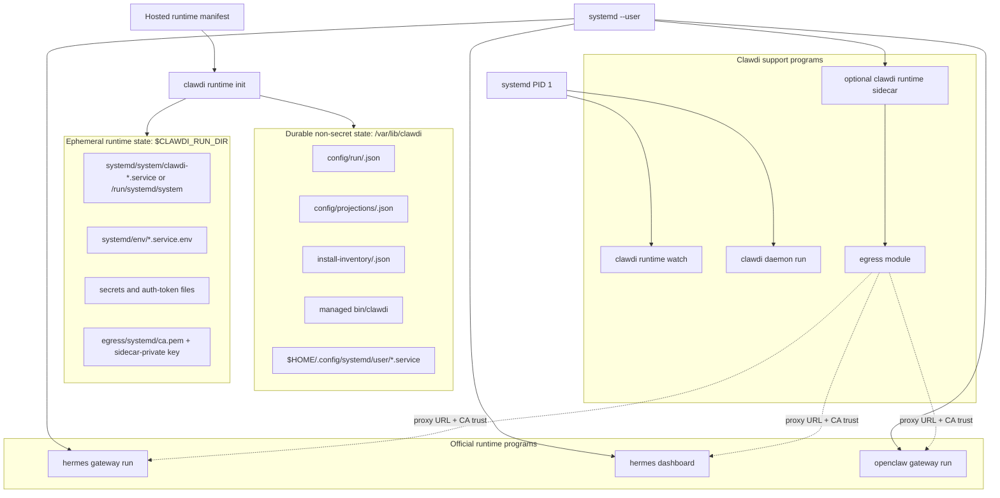
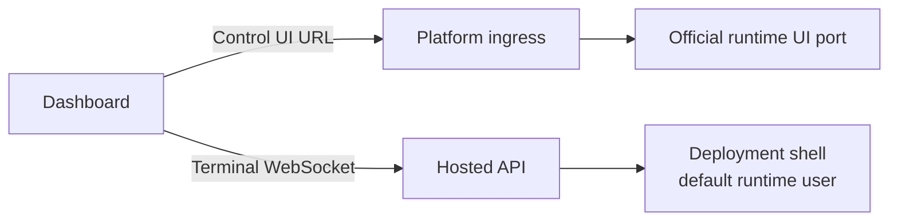

# Managed Runtime Contract

| Field | Value |
| --- | --- |
| Status | Public runtime contract |
| Last updated | 2026-07-22 |
| Owner | CLI runtime and cloud-api layers |

This document describes the public Clawdi CLI and dashboard contract for managed
runtime environments. It intentionally avoids deployment-specific topology,
private service details, live service hosts, and internal runtime orchestration.

Related public docs:

- CLI notes: [`plans/managed-runtime-cli.md`](plans/managed-runtime-cli.md)
- Roadmap: [`plans/managed-runtime-roadmap.md`](plans/managed-runtime-roadmap.md)
- Projection boundary:
  [`plans/runtime-projection-boundary.md`](plans/runtime-projection-boundary.md)

## Scope

The open-source CLI owns local runtime convergence, explicit `clawdi run`
env-injection, generic/self-hosted runtime UI bridging, and diagnostics. It does not own
OpenClaw/Hermes binaries, native update flows, or runtime process behavior.
The web app owns the hosted deployment dashboard surfaces, including Control UI
and Terminal tabs. First-party hosted control planes may provide desired state,
credentials, terminal authorization, rollout policy, and deployment lifecycle,
but those platform-specific implementations are outside this repository.

The public contract covers:

- validating runtime desired state;
- installing or verifying supported agent runtimes through their normal
  installers;
- writing non-secret local run configuration;
- projecting short-lived secrets only for the current runtime session;
- running final hosted runtimes from direct process-manager entries that name
  official Hermes/OpenClaw binaries;
- running Clawdi-owned support programs under the runtime process manager;
- supporting explicit `clawdi run -- <command>` when a caller opts into Clawdi
  runtime env injection;
- exposing strict-v2 OpenClaw directly on its native `18789` gateway with
  official token and device authentication when the typed authorization
  capability is active;
- exposing a dashboard Terminal contract for one deployment shell;
- reporting status and diagnostics through runtime commands.

The public contract does not cover:

- deployment-specific topology;
- private control-plane endpoints;
- tenant or billing policy;
- internal service implementation;
- image build pipelines or platform rollout details.

## Cloud API Runtime Observation Companion

The declarative v2 runtime adds an observation companion without changing the
existing v1 daemon heartbeat or observation writer. A deployment-bound runtime
API key sends credential-authenticated evidence to the direct `/v2` runtime
router; cloud-api appends evidence and never writes a Hosted deployment status.

Cloud-api reuses these existing runtime primitives:

- `AgentEnvironment.id` as the stable environment identity;
- managed, environment-bound `ApiKey` authentication with the dedicated
  `runtime-observations:write` scope for the runtime credential;
- the first-party `X-Admin-Key` gate, mutation idempotency, and control-plane
  audit events for Hosted-facing provisioning and retirement calls;
- PostgreSQL transactions and `FOR UPDATE` locks for ingestion and retirement
  serialization.

`POST /v1/agents/{agent_id}/sync-heartbeat` remains the frozen v1 liveness and
latest-observation transport. It neither accepts strict-v2 identity fields nor
reads or writes companion tables. Strict-v2 ingestion is
`POST /v2/runtime/environments/{environment_id}/observations`; it writes only
the companion inbox, fence high-water, and boot-session head.

Four PostgreSQL tables form the additive companion boundary:

| Table | Contract |
| --- | --- |
| `v2_runtime_environment_fences` | Permanent environment/owner/deployment binding, active or retired state, replay floor, and immutable final retirement receipt/high-waters. |
| `v2_runtime_observation_inbox` | Immutable accepted identities with the five-field boot identity, boot-scoped sequence, global event id, timestamps, payload hash, and health. Private diagnostic payloads may be compacted in place after retention eligibility, while identity and hash columns remain permanently unique. |
| `v2_runtime_observation_heads` | One immutable boot-session binding with non-regressing accepted sequence, stream position, capture time, and freshness; retirement compacts it to a tombstone. |
| `v2_runtime_observation_consumer_cursors` | Environment-and-consumer ACK state, replay horizon, and explicit fail-closed expiry/reset boundary used by safe prefix retention. |

Strict-v2 credential provisioning is only available through
admin-authenticated `POST /v2/runtime/auth/keys`. The admin and platform v1 key
APIs keep their original wire shape and cannot create a fence or
deployment-bound credential. The database requires every deployment-bound key
to be managed, environment-bound, explicitly scoped, to include
`runtime-observations:write`, and to stay within the runtime scope ceiling.

Hosted-facing `/v2` registration, read, acknowledgement, reset, retirement, and
provisioning calls all require the first-party `X-Admin-Key`. The server binds
observation cursors to its fixed Hosted controller identity, and immutable
owner/deployment authority is resolved from the environment fence rather than
caller-selected request data, so opaque cursors cannot cross consumers or
environments. Platform workload OAuth remains separate, default-closed
infrastructure for the future resale platform surface; it is not on this v2
data-plane path.

Ingestion locks the permanent environment fence and rejects a retired binding
before it inspects or creates a boot-session head. Retirement uses the same
fence lock, freezes all session high-waters, persists the final cursor and
receipt, writes one durable control-plane transition audit, and tombstones all
heads atomically. Replaying the same retirement ID returns the persisted
receipt; a different ID or deployment binding conflicts. V1 agent deletion and
key revocation retain their pre-companion behavior and do not consult the v2
fence. Trusted Hosted controller ordering obtains the retirement receipt before
using those existing teardown surfaces; the permanent fence itself is never
deleted.

Retention advances the replay floor only across a contiguous per-environment
stream prefix. Every row in a normal replay-horizon prefix must be old enough
and acknowledged by every required active consumer. Hard retention may expire
lagging consumers explicitly, but it still stops at the first younger stream
position, preventing a preserved lower id from being silently skipped. Eligible
rows are compacted in place: private diagnostics are scrubbed and
`payload_purged_at` records the one-way transition, while event ID,
environment/session/sequence identity, payload hash, timestamps, and uniqueness
constraints remain. Replay-floor maintenance may advance monotonically after
retirement without changing the immutable receipt or final high-water fields.
When the hard cap expires or advances a consumer boundary, retention writes a
redacted system audit in the same transaction as the cursor and compaction.
Active heads must reference their exact inbox stream position, and a retired
fence's final position must equal its frozen stream high-water at the database
boundary.

## Core Architecture

The primary hosted runtime model is a Linux-like runtime host. The host image
provides the OS envelope, a runtime user, a stable `clawdi` bootstrap path,
official Hermes/OpenClaw installs, and a process manager. Runtime behavior
comes from the manifest and official runtime binaries, not from per-agent
wrappers.



The process manager is systemd. The important contract is that each
long-running program is declared directly with its official command, args, cwd,
and env. Clawdi support processes use `clawdi-*` service names; OpenClaw and
Hermes gateway base units use runtime-owned service names generated by official
service installers, such as `openclaw-gateway.service` and
`hermes-gateway.service`. Runtime services must not point at `clawdi run --
openclaw`, `clawdi run -- hermes`, a generated launch shell, or a PATH shim. If
Clawdi must temporarily run an auxiliary process that has no official service
installer, the unit uses a `clawdi-*` name and is documented as compatibility,
not as a runtime-owned service.

The Linux-like host preserves official updater behavior. If a user or an
official UI runs `openclaw update` or `hermes update`, PATH resolves to the
official binary. Clawdi does not intercept that command. After an updater
replaces files, the process manager may restart the relevant official program,
but the update transaction remains owned by the runtime.

The bootstrap boundary is deliberately small: system boot prepares writable
runtime directories, starts the runtime user's systemd manager, and calls
`clawdi runtime init --non-interactive`. `runtime init` is the local
administrator convergence step. It uses official installers/config commands
first, invokes official non-interactive service installers for runtime gateway
base units, and writes only transparent hosted drop-ins/env files for those
official units. When a later manifest removes an official gateway service,
`runtime init` invokes the matching official service uninstaller before it
removes the hosted drop-in/env files. Clawdi-owned support units keep
`clawdi-*` names.

Official unit ownership follows a strict contract. The official installer owns
the base unit file; Clawdi never edits or removes a base unit it did not
generate. Clawdi owns exactly two artifacts per official unit: the drop-in
`$HOME/.config/systemd/user/<unit>.service.d/10-clawdi-hosted.conf` and the env
file `$CLAWDI_RUN_DIR/systemd/env/<unit>.service.env`, both marked with the
generated-file header so convergence can identify them. Failure handling keeps
that boundary convergent in both directions:

- If an official service install fails and no base unit exists yet, the drop-in
  is not written; convergence reports the install error and the next cycle
  retries the official installer. If a base unit already exists from an earlier
  successful install, the drop-in/env are still refreshed so the running
  service keeps its current configuration.
- If an official service uninstall fails, the drop-in/env files are kept as
  retry evidence, convergence reports the error, and the next cycle retries the
  official uninstaller before removing them.
- Systemd apply (daemon-reload, enable/start, restart, stop/disable) always
  runs after convergence, even when convergence reported errors: unit files on
  disk already changed, and stops/disables for removed units must land even
  when an unrelated runtime install or projection failed.

Official service installers/uninstallers run only when the CLI runs as root
(the hosted PID 1 path). `CLAWDI_RUNTIME_INSTALL_OFFICIAL_SERVICES=1|0`
overrides that default for development and tests; when installers are skipped,
convergence still writes the hosted drop-in/env files. Similarly, systemctl
apply runs only where the environment owns a live systemd
(`/run/systemd/system`, overridable with `CLAWDI_SYSTEMD_APPLY=1|0`); when unit
files changed but apply was skipped, init/watch status reports
`systemdApply.applied=false` instead of hiding the divergence.

Hermes gateway and dashboard are separate official commands in this model. A
deployment that needs both must use an official service installer for each
runtime-owned unit. Until Hermes exposes an official dashboard service
installer, the hosted default does not synthesize `hermes-dashboard.service`; an
explicit compatibility unit, if required, must use a `clawdi-*` name. The
Hermes dashboard binds directly to `0.0.0.0:9119` and uses Hermes' bundled
Basic authentication provider.

### Runtime Host Contents

| Area | Contains | Must not contain |
| --- | --- | --- |
| Host envelope | runtime user, home directory, base packages, process manager, host policy | runtime-specific shell wrappers |
| Clawdi | managed `clawdi`, runtime-fetched `mitmdump` (mitmproxy) transparent gateway, status/doctor tooling, `clawdi-*` support units | per-agent command shims, OpenClaw/Hermes binaries |
| Hermes | official install and official `hermes` binary | Clawdi-owned `hermes` wrapper |
| OpenClaw | official install and official `openclaw` binary | Clawdi-owned `openclaw` wrapper |
| Runtime state | `/var/lib/clawdi`, `$CLAWDI_RUN_DIR`, workspace, short-lived secret files | durable plaintext provider secrets |

The host should not add:

- `/usr/local/bin/openclaw` or `/usr/local/bin/hermes` wrappers owned by
  Clawdi;
- generated launch scripts that call `clawdi run -- openclaw` or
  `clawdi run -- hermes`;
- a Clawdi process as PID 1 for Hermes or OpenClaw;
- direct public exposure of `--auth none` runtime ports.

The image must not contain per-agent command wrappers, generated launch scripts,
or PATH shims for `openclaw`, `hermes`, or future runtime names. Official
runtime commands still resolve to official binaries, so native commands such as
`openclaw update` and `hermes update` keep their own updater behavior.

## Support Module Boundaries

The Clawdi support programs run under the same process manager as the runtime
programs. `clawdi runtime sidecar` is the egress support process and keeps an
explicit authority boundary:

| Module | Starts when | Direction | Sensitive input | Network exposure | Must not own |
| --- | --- | --- | --- | --- | --- |
| manifest/watch | an auth token file exists | control-plane polling | Clawdi auth token from file | outbound API only | official runtime PID 1 |
| live-sync daemon | `liveSync.agents` is non-empty | live sync and local daemon APIs | Clawdi auth token from file | local daemon surface | egress rewrite policy |
| sidecar egress module | enabled egress profiles exist | runtime outbound proxy | profile bundle, CA cert/key under `$CLAWDI_RUN_DIR`, optional secret file | loopback/private proxy | live-sync/API authority |
| official runtime program | runtime is enabled | normal runtime behavior | runtime-specific env/config only | official runtime ports | Clawdi auth secrets |

The sidecar is still not a hidden wrapper around Hermes/OpenClaw. It only hosts
Clawdi-owned support modules; official runtime programs remain direct process
manager entries.

The egress module keeps its root CA certificate and private key under the
ephemeral run directory so a sidecar restart does not change the trust root for
already-running runtimes. Runtime programs receive only the CA certificate path
as trust env; the private key path is not projected into runtime env.

The combined system-plus-egress CA bundle is certificate-only trust material,
but it is consumed by the non-root runtime processes through `NODE_EXTRA_CA_CERTS`,
`REQUESTS_CA_BUNDLE`, and `SSL_CERT_FILE`. The root-owned sidecar therefore
publishes it atomically as `root:<runtime primary group>` with mode `0640` on
both creation and replacement. Making it root-only would break the declared
runtime-user service model; making it world-readable would unnecessarily expose
the managed trust projection to unrelated local users. The egress CA private key
remains separate under the egress identity's private directory and is never
group-readable by the runtime user.

### Official Container Reference Research

Official runtime images are useful references, but they are not the primary
hosted architecture while in-place official UI updates are a requirement:

| Image | Useful reference | Update implication |
| --- | --- | --- |
| `nousresearch/hermes-agent` | s6 starts `hermes gateway run` and, with `HERMES_DASHBOARD=1`, also starts `hermes dashboard`; ports are `8642` and `9119` | Docker installs update by pulling/recreating the image, so dashboard update cannot be the normal in-place updater path |
| `ghcr.io/openclaw/openclaw` | `tini` runs the gateway; official container rejects unauthenticated non-loopback binds; `--auth token --bind auto` works for directly exposed ports | Docker installs update by image rollout; in-place `openclaw update` belongs to non-Docker installs |

The Linux-like host can adopt these lessons without switching to container
rollout updates: use separate official systemd user services when the runtime
provides service installers for separate surfaces, and require runtime-native
auth when exposing the official OpenClaw port directly.

## Manifest Shape

The control plane accepts only exact
`Accept: application/vnd.clawdi.runtime-bundle.v2+json` and returns strict
`clawdi.hosted-runtime.bundle.v2`. The response contains the hosted manifest,
sanitized Telegram and Discord `channelBindings`, one merged `secretValues`
map, and deterministic `sourceRevision`. Missing or unsupported media types
return `406`; the CLI does not fall back to another representation or a second
`/v1/channels` request.

Bundle responses identify the vendor media type and return `Vary: Accept`.
Negotiation `406` responses also return `Vary: Accept` and
`Cache-Control: no-store`, so errors are not reused across media types.
The v2 strong ETag is `"sha256:<sourceRevision>"`; the immutable renderer and
the revision's effective public and secret-source identity make it a strong
validator without decrypting secrets in the health summary.

The CLI normalizes these wire contracts into the desired-state shape:

- `clawdi.hosted-runtime.manifest.v1` is the hosted control-plane response
  shape served only from `/v1/runtime/manifest`. It requires explicit `runtime`
  and `environmentId` fields and rejects unknown fields instead of accepting
  compatibility payloads. `system`, `controlPlane`, `clawdiCli`, `runtimes`,
  `providers`, `liveSync`, and `recovery` are required. `egressProfiles`, `mcp`,
  and `tools` remain explicit optional projections.
- `clawdi.runtimeDesiredState.v1` is the normalized internal convergence shape
  consumed by `runtime init`.
- `clawdi.hosted-runtime.bundle.v2` wraps an inner
  `clawdi.hosted-runtime.manifest.v1` and is marked locally after validation.
  OpenClaw requires typed native auth, the exact gateway command, and an
  environment secret reference for the gateway token.

Normalization maps hosted fields into the internal shape:

| Hosted field | Internal purpose |
| --- | --- |
| `deploymentId`, `environmentId`, `instanceId`, `generation` | Identity, cache keys, status, and idempotence |
| `runtime` | Required selected compute runtime; exactly one enabled `openclaw` or `hermes` entry must match it |
| `locale.language`, `locale.timezone` | Required supported language and valid IANA timezone |
| `system.openclawControlUiAllowedOrigins` | Strict-v2 OpenClaw public origin allowlist |
| `system.openclawGatewayAuth` | Strict-v2 OpenClaw token and required device-auth capability; the token itself is an environment secret reference |
| `system.hermesDashboardAuth` | Strict-v2 Hermes Basic provider settings, public URL, session TTL, and environment secret references; plaintext credentials are never part of the manifest |
| `controlPlane.cloudApiUrl` | Required and only control-plane field; `appId`, `apiUrl`, and `manifestUrl` are not public manifest fields |
| `minimumCliVersion` | Required hosted CLI protocol floor |
| `clawdiCli.source` | Required literal `npm:clawdi` for Hosted managed CLI updates |
| `clawdiCli.packageSpec` | Required exact `clawdi@<semver>` without build metadata, at most 200 characters; remote Hosted manifests never select an npm dist-tag or local path |
| `clawdiCli.registry` | Required literal `https://registry.npmjs.org`; Hosted does not use npm registry defaults or overrides |
| `runtimes.<name>.enabled` | Run config and systemd unit state |
| `runtimes.<name>.install` | Required strict `{source: "official"}` selector; CLI owns installer URL and args |
| `runtimes.<name>.run` | Command, args, cwd, env, and PATH projection |
| `runtimes.<name>.providerMode` | Required runtime-provider ownership discriminator: `configured` or `unmanaged` |
| `runtimes.<name>.provider_ids` | Configured mode requires a non-empty unique selection; unmanaged mode requires an exact empty list |
| `runtimes.<name>.primary_model.{provider_id,model}` | Required only in configured mode and its provider must belong to `provider_ids`; absent in unmanaged mode |
| Hosted filesystem defaults | Derived locally from Hosted `RuntimePaths`: HOME, workspace, persistence root, installer home, and explicit process/service cwd use `userHome`; obsolete external `system`/runtime path fields are rejected |
| `providers.<id>` | Canonical Hosted provider projection: `kind` is exactly `openai-compatible`; normal entries also require `type` and `baseUrl`, while `provider_not_found` is the only reduced error entry |
| `runtimes.<name>.services` | Runtime-owned auxiliary processes, such as a browser dashboard, managed without user command shims |
| `providers` | Required runtime-scoped AI provider projections whose keys exactly match selected `provider_ids`; `{}` in unmanaged mode |
| `terminalTooling.codex` | Required typed Hosted terminal-tool projection with one Clawdi-managed provider metadata and secret reference, independent of runtime providers |
| `mcp`, `tools` | Existing runtime MCP/tool projection input; unrelated tool fields remain pass-through and do not include terminal Codex |
| `liveSync.{enabled,agents}` | Required explicit daemon sync configuration; Hosted does not infer it from agent metadata |
| `egressProfiles` | Explicit local sidecar profiles |
| `recovery.{cacheManifest,allowOfflineBoot}` | Required explicit manifest cache and offline-boot behavior |

Hosted parsing does not accept camel-case runtime binding aliases, snake-case
provider transport aliases, or string `primary_model` values. Provider model
catalog fields such as `models[].api_mode` and ownership metadata such as
`managed_by` remain canonical snake-case wire fields. Singular provider
`model` is not a Hosted alias; model selection lives in runtime
`primary_model`, while provider catalogs use `models[]`. Provider error
projections require `status: "error"` and `error` together, including a
non-empty `error.message`. A
`provider_not_found` entry contains `kind` plus that error pair; other error and
healthy entries retain the normal `kind`, `type`, and `baseUrl` projection.

This strict typing claim applies only to the Hosted fields modeled in this
release. `egressEngine` and `egressProfiles` use closed schemas matching the
Hosted CLI wire and are validated at admin write and manifest read boundaries.
Invalid stored egress JSON fails closed with `409`. `terminalTooling.codex` is
the one typed terminal-tool subset in this release. It does not declare MCP and
does not participate in runtime `provider_ids`, runtime primary-model selection,
source-level applied provider IDs, or runtime provider health. `mcp` and
unrelated `tools` fields retain their existing pass-through behavior. `mcp` and
`tools` remain explicit pass-through projections. The normalized generic
`clawdi.runtimeDesiredState.v1` shape also retains optional install metadata,
default install args, and arbitrary provider projection data such as singular
`model` for non-Hosted inputs.

### Runtime Provider Ownership And Terminal Codex

Agent v2 requires exactly one selected OpenClaw or Hermes runtime. Provider
intent is also explicit: `configured` means Clawdi owns the selected runtime
provider projection, while `unmanaged` means Clawdi projects no runtime provider
metadata, secret reference, environment variable, or primary model. Empty
provider state never implies a mode. Runtime-only deployments therefore render
`providerMode: "unmanaged"`, `provider_ids: []`, no `primary_model`, and
`providers: {}`. Health is exact only when the source-level applied provider set
is also empty.

Hosted Codex is a separate terminal tool plane. Its fixed provider reference is
materialized under `terminalTooling.codex` from the same repeatable-read batch as
runtime providers. When both consumers use the same provider, Cloud resolves
and decrypts that provider auth payload once. The CLI uses the terminal-tool
reference to own exactly one Hosted Codex default configuration at
`$CODEX_HOME/config.toml` (default `~/.codex/config.toml`) and a managed command
shim. The shim exports the process-scoped egress placeholder and executes the
real Codex with the original arguments; it never adds `--profile`. Managed,
BYOK, Codex OAuth, and unmanaged runtime-provider modes all receive the same
terminal Codex default. Unmanaged OpenClaw or Hermes units receive no provider
environment.

This mode controls default configuration ownership, not pod-wide network
isolation. Egress matching is domain based, so another pod process could call a
tool-plane gateway deliberately; the credential remains deployment-scoped and
charges that deployment user's wallet.

Platform provider and tool credentials are stored as encrypted provider auth
payloads and projected through bundle secret references. They are not user
Vault items, do not use `clawdi://` references, and do not depend on Vault
attach, share, delete, or resolve operations. User Vault participation remains
explicit through the existing user-facing provider and `clawdi run` flows. The
unmanaged provider discriminator does not reject an independently, explicitly
selected user Vault-backed run or service secret reference; it only prevents
provider-plane material from being inferred or projected into the runtime.
The backend's existing low-level encryption helper and key reuse is legacy
infrastructure; it is not a runtime Vault contract and this release does not
change its ciphertext format or key.

Remote Hosted CLI policy is exact-version only. Values such as npm dist-tags,
bare package names, build-metadata versions such as `clawdi@1.2.3+build.1`, and
malformed SemVer prereleases are rejected before normalization. Valid
prereleases follow SemVer identifier rules, including forms such as `beta.51`
and `rc-1.2`; empty identifiers and numeric identifiers with leading zeroes are
invalid. Prerelease CLI publication uses the standard npm `beta` dist-tag, but
that tag is non-authoritative publication metadata. Cloud and Hosted production
never resolve or persist it: rollout state contains an exact `clawdi@<semver>`
package spec, and `clawdi@beta` is rejected at both write and manifest-read
boundaries. A managed bootstrap tgz
under `/usr/local/share/clawdi/bootstrap/` is accepted only when the entire
manifest is loaded from the explicit `CLAWDI_RUNTIME_MANIFEST_PATH` test-fixture
entry point. Remote fetches cannot use that fixture schema. Generic
`clawdi.runtimeDesiredState.v1` manifests retain their existing floating package
support; exact Hosted updates do not call `npm view` and can move to either a
higher or lower exact version.

Manifest `generation` is part of the remote manifest ETag. The CLI applies any
non-304 manifest without monotonic generation gating, while treating generation
as the desired intent sequence and the ETag as effective content identity. A
generation-only control-plane bump therefore produces a new ETag so `runtime
watch` converges immediately.

Reconciliation validates and plans projections before live mutation, completes
required installers before Apply, and commits last-good, remote ETags, and
`status/runtime-applied.json` only after managed files and systemd state apply
successfully. A recoverable Apply failure restores the previous Clawdi-owned
files and systemd declaration and leaves those authority records unchanged.
Last-good remains an offline recovery cache; `runtime-applied.json` is the
online record of the applied instance, config generation, content identity,
source manifest provider IDs, and the target-specific projected provider ID map
needed for stale deletion. The record is committed only after Apply succeeds.

Manifest validation is defensive. A Hosted manifest selects exactly one enabled
`openclaw` or `hermes` compute runtime; top-level `runtime` must match the sole
entry in `runtimes`. Codex remains a live-sync agent type and is not a selectable
Hosted compute runtime. The selected runtime must provide exactly
`install: {source: "official"}`. Hosted cannot select an installer channel, URL,
or arguments; the CLI unconditionally owns the official URL and argument vector
for the selected runtime. Cloud-owned `controlPlane` contains only
`cloudApiUrl`; `appId`, `apiUrl`, and `manifestUrl` are not emitted. Generic
desired-state manifests keep their existing optional installer, channel, and
argument behavior. Unknown generic runtime names require `run.command`;
otherwise the manifest is rejected so the image does not need to know every
future agent.

## Commands

Runtime operators can use these commands in controlled environments:

```bash
clawdi runtime init --non-interactive
clawdi runtime watch
clawdi runtime sidecar
clawdi runtime status --json
clawdi runtime doctor --json
clawdi run -- <command>
```

Normal local onboarding still uses `clawdi setup`. Runtime commands are for
managed environments where configuration is supplied by policy or a manifest,
not by an interactive user setup flow.

`runtime watch` is the long-running reconciliation loop. It refreshes remote
manifest state using ETags, applies changes, records status, and falls back to
last-good cached manifests only when recovery policy allows it. `runtime
sidecar` runs outbound egress handling when explicit egress profiles are
enabled.

## Runtime UI Authentication

Strict-v2 OpenClaw binds the official gateway directly to the pod network with
`gateway run --allow-unconfigured --port 18789 --bind lan --force`, and provide
`OPENCLAW_GATEWAY_TOKEN` only through `run.secretEnv`. The local config patch
sets official token auth, preserves device authentication, disables insecure
and Host-header fallback modes, derives `gateway.controlUi.basePath` from the
clean public URL, and includes that URL's origin in `allowedOrigins`.
The patch writes `gateway.auth.token: null` to delete any stale durable token;
OpenClaw documents this RFC 7396 behavior in
[`merge-patch.ts` lines 88-113](https://github.com/openclaw/openclaw/blob/ba467fbd3efa9ab109e620c4e42cfe92388171c5/src/config/merge-patch.ts#L88-L113),
while the active token comes from the ephemeral service environment.

Direct OpenClaw exposure remains fail closed behind the typed
`openclaw-native-auth-v1` capability and an available
`OPENCLAW_GATEWAY_TOKEN`. Hosted returns the token only through an owner-checked,
no-store credential endpoint and places it in the URL fragment for the official
Control UI. Device authentication remains enabled; first-time approval follows
the official OpenClaw workflow.

Hermes direct exposure requires `hermes-basic-auth-v1`, a stable HTTPS public
URL (including any path prefix), exact `0.0.0.0:9119` service args, and the
official Basic password/session environment secret references. Hosted derives
the password and an independent session-signing secret from the deployment
credential. The CLI projects non-secret settings to `dashboard.basic_auth` and
secrets to the official `HERMES_DASHBOARD_BASIC_AUTH_*` environment variables.

The dashboard consumes the deployment endpoint's typed metadata; it does not
infer auth from the runtime name or fall back to legacy `native_url` fields.
`password` and `openclaw_device` both require `browser_mode: top_level`. Public
endpoint URLs contain no secret. The owner-checked credential response carries
the Hermes password in its no-store response or the OpenClaw token in exactly
one URL fragment parameter, never a query. Runtime/auth mismatches, unsafe URLs,
or incomplete metadata are unavailable. Neither v2 runtime uses an iframe.

The Hermes contract was verified against NousResearch/hermes-agent commit
[`8208fc52701332f213e6c51ebc0b610be00300de`](https://github.com/NousResearch/hermes-agent/tree/8208fc52701332f213e6c51ebc0b610be00300de),
specifically `cli-config.yaml.example`,
`plugins/dashboard_auth/self_hosted/__init__.py`,
`hermes_cli/dashboard_auth/public_paths.py`, and `hermes_cli/web_server.py`.

### Official OpenClaw evidence

Research was refreshed on 2026-07-22. The then-current official `main` commit
was [`ba467fbd3efa9ab109e620c4e42cfe92388171c5`](https://github.com/openclaw/openclaw/commit/ba467fbd3efa9ab109e620c4e42cfe92388171c5).
The latest stable release was
[`v2026.7.1`](https://github.com/openclaw/openclaw/releases/tag/v2026.7.1),
whose annotated tag resolves to release commit
[`2d2ddc43d0dcf71f31283d780f9fe9ff4cc04fe4`](https://github.com/openclaw/openclaw/commit/2d2ddc43d0dcf71f31283d780f9fe9ff4cc04fe4).
All behavior evidence below is pinned to the newer exact `main` commit.

| Requirement | Official line evidence | Contract consequence |
| --- | --- | --- |
| Gateway bind, port, auth, and token | [`docs/cli/gateway.md` lines 26-85](https://github.com/openclaw/openclaw/blob/ba467fbd3efa9ab109e620c4e42cfe92388171c5/docs/cli/gateway.md#L26-L85), [`configuration-reference.md` lines 629-661](https://github.com/openclaw/openclaw/blob/ba467fbd3efa9ab109e620c4e42cfe92388171c5/docs/gateway/configuration-reference.md#L629-L661) | Use native `18789`, container-reachable `lan`, required token auth, and explicit public `allowedOrigins`. |
| Control UI auth and device pairing | [`docs/web/control-ui.md` lines 33-69](https://github.com/openclaw/openclaw/blob/ba467fbd3efa9ab109e620c4e42cfe92388171c5/docs/web/control-ui.md#L33-L69) | Token is sent in `connect.params.auth.token`; a new non-loopback browser still needs device approval. |
| Device-auth downgrade | [`docs/web/control-ui.md` lines 588-632](https://github.com/openclaw/openclaw/blob/ba467fbd3efa9ab109e620c4e42cfe92388171c5/docs/web/control-ui.md#L588-L632) | Never enable `dangerouslyDisableDeviceAuth`; official docs call it a severe downgrade. |
| Dashboard URL discovery | [`docs/cli/dashboard.md` lines 20-42](https://github.com/openclaw/openclaw/blob/ba467fbd3efa9ab109e620c4e42cfe92388171c5/docs/cli/dashboard.md#L20-L42), [`src/commands/dashboard.ts` lines 33-118](https://github.com/openclaw/openclaw/blob/ba467fbd3efa9ab109e620c4e42cfe92388171c5/src/commands/dashboard.ts#L33-L118) | Official JSON discovery reports resolved HTTP/WS URLs; the official handoff uses `#token=`, not a query token. |
| Fragment and top-level browser flow | [`ui/src/app/startup-settings.ts` lines 91-172](https://github.com/openclaw/openclaw/blob/ba467fbd3efa9ab109e620c4e42cfe92388171c5/ui/src/app/startup-settings.ts#L91-L172), [`docs/web/control-ui.md` lines 742-754](https://github.com/openclaw/openclaw/blob/ba467fbd3efa9ab109e620c4e42cfe92388171c5/docs/web/control-ui.md#L742-L754) | Query tokens are legacy, warned, and stripped; `gatewayUrl` is top-level-only, so Clawdi uses a top-level fragment handoff and no iframe. |
| WebSocket auth | [`docs/concepts/architecture.md` lines 75-112](https://github.com/openclaw/openclaw/blob/ba467fbd3efa9ab109e620c4e42cfe92388171c5/docs/concepts/architecture.md#L75-L112) | The first frame is `connect`; shared-secret auth and device identity/pairing remain native OpenClaw protocol responsibilities. |
| Auth-aware readiness | [`docs/gateway/embedding.md` lines 91-107](https://github.com/openclaw/openclaw/blob/ba467fbd3efa9ab109e620c4e42cfe92388171c5/docs/gateway/embedding.md#L91-L107), [`docs/gateway/index.md` lines 40-49](https://github.com/openclaw/openclaw/blob/ba467fbd3efa9ab109e620c4e42cfe92388171c5/docs/gateway/index.md#L40-L49) | A TCP check is insufficient. Readiness requires authenticated WS `connect` through `hello-ok`, equivalent to `gateway status --require-rpc`. |
| Base path/prefix | [`docs/web/control-ui.md` lines 10-15](https://github.com/openclaw/openclaw/blob/ba467fbd3efa9ab109e620c4e42cfe92388171c5/docs/web/control-ui.md#L10-L15) | Configure official `gateway.controlUi.basePath`; do not inject or rewrite browser paths. |
| Service lifecycle | [`docs/cli/daemon.md` lines 13-47](https://github.com/openclaw/openclaw/blob/ba467fbd3efa9ab109e620c4e42cfe92388171c5/docs/cli/daemon.md#L13-L47) | Use official gateway install/start/stop/restart/status lifecycle and keep Clawdi ownership limited to its hosted drop-in/env. |

## Desired State Boundary

The CLI consumes a desired-state document plus optional secret values. The
desired state should contain only non-secret configuration such as enabled
runtimes, command launch settings, channel projections, and provider routing
metadata. Secret values are delivered separately and must not be embedded in
the manifest or general runtime config. When offline recovery is explicitly
enabled, the CLI may retain only its root-owned, reference-scoped `0600` secret
cache; it never persists the complete plaintext bundle as one document.

At the boundary:

- the control plane owns desired config generation, deterministic source
  rendering, and secret resolution;
- the CLI owns local validation, projection, diagnostics, and command launch;
- the runtime process owns normal agent behavior after launch.

For Agent v2, `generation` remains the Hosted intent/CAS sequence.
`sourceRevision` is a deterministic SHA-256 identity of the effective public
descriptor and the selected encrypted secret-source identities, keyed by
secret reference. For the immutable v2 renderer, the strong ETag is derived as
`"sha256:<sourceRevision>"`. The endpoint and summary paths use the same batch
loader and pure materializer inside a read-only repeatable-read snapshot; the
summary path does not decrypt secrets.

The manifest wire field remains `generation`, but it is specifically the
desired config generation. Cloud API records daemon convergence separately as
`observed_at`, `observed_config_generation`, and `observed_manifest_etag`, plus
validated diagnostics JSONB. Agent v2 diagnostics report applied ETag,
`sourceRevision`, and the source-level applied provider ID set only from
`runtime-applied.json`; target-specific projected IDs remain local stale-deletion
state. Health compares the v2 ETag with the validator derived from current
`sourceRevision` and requires exact provider-set equality, reporting missing and
extra sets separately. Legacy provider-set authority remains unknown.
`observed_at` is the server receipt time for the accepted heartbeat; the
client-reported timestamp remains diagnostics only. The ETag cannot be inferred
from the generation, and the generation cannot be inferred from the ETag. These
CONFIG convergence fields are separate from hosted provider COMPUTE convergence
fields such as desired or observed replica generation.

The CLI writes durable non-secret state under the service state root. Important
outputs include:

| Output | Purpose |
| --- | --- |
| `config/clawdi.json` | Redacted managed runtime config |
| `sync/runtimes.json` | Runtime sync state |
| `cache/manifest.last-good.json` | Last successfully applied effective, channel-projected manifest for offline recovery |
| `cache/manifest.etag`, `cache/channels.etag` | Legacy v1 cache validators; not Agent v2 authority |
| `status/runtime-applied.json` | Agent v2 authority for one ETag, source revision, instance, generation, content identity, source provider IDs, and target-specific projected provider IDs |
| `install-inventory/<runtime>.json` | Install/verify observation |
| `config/projections/<runtime>.json` | Runtime projection payload |
| `config/run/<runtime>.json`, `config/run/<runtime>+<service>.json` | `clawdi run` launch config for runtime main processes and internal runtime-owned services |
| `$CLAWDI_RUN_DIR/secrets/*` | Short-lived token and secret files for the current runtime session |
| `$CLAWDI_RUN_DIR/systemd/env/*.service.env` | Ephemeral env files for local systemd services, including short-lived runtime secrets |
| `$CLAWDI_RUN_DIR/systemd/system/*.service` or `/run/systemd/system/*.service` | Generated system units for root-owned Clawdi support programs |
| `$HOME/.config/systemd/user/*.service` | Official runtime gateway base units, plus Clawdi-owned user support units such as the sidecar |
| `$HOME/.config/systemd/user/*.service.d/10-clawdi-hosted.conf` | Transparent hosted drop-ins for official runtime units |

Short-lived secrets belong under the runtime run directory, not in durable
config. Offline secret recovery uses only the existing root-only,
reference-scoped secret cache. The complete plaintext bundle is never cached.
Status and diagnostic output must redact secrets.

## Command And Launch Model

`clawdi run -- <command>` is a local vault-injection command and an interactive
hosted shell boundary. In hosted mode, it first tries to resolve the command
against a generated runtime run config. If a matching enabled config exists, it
launches that runtime with the configured command, args, cwd, env, PATH, secret
refs, and optional sidecar profile. If the config exists but is disabled,
`clawdi run` exits with a disabled-runtime error.

Interactive shell commands are not intercepted. `openclaw`, `hermes`, and
future runtime names resolve to official binaries on PATH. Clawdi only
participates when the caller explicitly invokes `clawdi run` or when
`runtime init` projects manifest-selected config.

Hosted daemon startup avoids `clawdi run`. For OpenClaw/Hermes gateways,
`runtime init` invokes the official service installer to create the base user
unit, then writes a hosted drop-in with the minimum local environment needed by
the Linux-like container. Sensitive env lives under `$CLAWDI_RUN_DIR/systemd/env`
instead of durable unit files:

```ini
# $HOME/.config/systemd/user/openclaw-gateway.service.d/10-clawdi-hosted.conf
[Service]
WorkingDirectory=/home/clawdi
Environment="XDG_RUNTIME_DIR=%t"
Environment="DBUS_SESSION_BUS_ADDRESS=unix:path=%t/bus"
EnvironmentFile="/run/clawdi/systemd/env/openclaw-gateway.service.env"
ExecStart="/home/clawdi/.openclaw/bin/openclaw" "gateway" "run" "--allow-unconfigured" "--port" "18789" "--bind" "lan" "--force"
```

When egress profiles are enabled, systemd runs the Clawdi sidecar. Egress
interception uses a runtime-fetched `mitmdump` (mitmproxy) transparent gateway
running under the explicit non-root `CLAWDI_EGRESS_UID` and
`CLAWDI_EGRESS_GID` numeric identity
(both default to `10002`). The CLI owns its paths, permissions, and privilege
drop; the image does not need a named egress account. Engagement is a minimal
nft redirect of the runtime UID's
outbound :80/:443 to the local mitmproxy port (default-allow: non-profiled hosts
pass through end-to-end against the real upstream CA); no forward-proxy env is
injected. Egress profile/CA/secret config stays inside the sidecar. Runtime
programs therefore receive only CA-trust env such as `NODE_EXTRA_CA_CERTS`,
`REQUESTS_CA_BUNDLE`, and `SSL_CERT_FILE`; sidecar control env and secret-file
paths stay out of the official runtime process.

This ownership boundary is codified in
[ADR-0002](adr/0002-runtime-image-is-a-stable-capability-envelope.md).

Hermes has multiple official long-running surfaces. The Linux-like host should
use official service installers for each runtime-owned surface when both are
needed. Clawdi should not emulate that fan-out with shell wrappers or a
runtime-owned-looking `hermes-dashboard.service`.

Strict-v2 OpenClaw uses the official gateway directly on native port `18789`.
Clawdi patches `gateway.port=18789`, `gateway.bind=lan`, and
`gateway.auth.mode=token` from `OPENCLAW_GATEWAY_TOKEN`; the launch command does
not pass a conflicting `--auth` override:

```bash
openclaw gateway run --allow-unconfigured --port 18789 --bind lan --force
```

The strict manifest references the token only as
`env://OPENCLAW_GATEWAY_TOKEN`; the resolved value is absent from manifest env
and durable config. Missing token, native-auth capability, deployment policy,
public origin, exact command, or auth-aware readiness metadata rejects the
strict-v2 configuration before exposure.

## Official Update Compatibility

Systemd is compatible with official updater behavior when the runtime container
boots a real `systemd --user` manager for the runtime user:

- runtime-owned units name official binaries directly;
- install roots are writable by the runtime user expected by the official
  installer;
- `openclaw`, `hermes`, and their update subcommands are not shadowed by
  Clawdi wrappers or PATH shims;
- `clawdi run` is used only when explicitly requested by a caller;
- OpenClaw receives `OPENCLAW_SYSTEMD_UNIT=openclaw-gateway.service` and can use
  `systemd-run --user --scope --collect` for managed update handoff;
- after an updater replaces files, the process manager restarts the relevant
  official programs, or autorestart picks them up when they exit.

The update transaction belongs to Hermes/OpenClaw. Clawdi may observe status,
surface diagnostics, and restart programs, but it must not emulate or wrap
`hermes update` or `openclaw update`.

Runtime-owned services use the same generated run-config and systemd model, but
they are not user commands and do not receive command shims. Gateway units must
come from official service installers. A manifest entry such as
`runtimes.hermes.services.dashboard` may still write
`config/run/hermes+dashboard.json`; until Hermes exposes an official dashboard
service installer, systemd must run it only as an explicit `clawdi-*`
compatibility unit:

```ini
ExecStart="hermes" "dashboard" "--host" "0.0.0.0" "--port" "9119" "--no-open"
```

This covers browser helper processes such as a runtime dashboard while keeping
the user's shell PATH clean: typing `hermes` enters the managed Hermes runtime,
not a dashboard alias. It must not be represented as
`hermes-dashboard.service` unless Hermes itself generates that unit.

## Provider And Channel Routing

Provider configuration uses standard Clawdi AI Provider modes:

- `openai_chat`;
- `openai_responses`;
- `anthropic_messages`;
- `google_generate_content`.

Agent-specific transport details belong to the target runtime projection layer.
For example, if a runtime needs a target-native transport name, the CLI maps the
standard provider contract into that runtime's configuration format at launch
time. The Clawdi provider model itself should stay provider-oriented, not
runtime-transport-oriented.

Channel configuration follows the same rule: the open-source contract describes
the local projection shape and validation rules, while service-specific channel
control planes remain outside this repository.

Telegram Bot API clients construct method and file URLs as
`/bot<token>/...` and `/file/bot<token>/...`. Managed runtimes therefore give
the client a Bot API-shaped, non-secret routing placeholder. The egress sidecar
preserves that placeholder in the Cloud URL and injects the real agent-link
credential as a redacted Bearer header; cloud-api authenticates the header and
binds it to the placeholder before routing either request class. The Hosted CLI
floor `0.12.10-beta.57` is the first version with this boundary, so an exact
older CLI must not be selected for a deployment with managed Telegram bindings.

## Runtime UI And Terminal

Hosted deployment pages expose two live surfaces:

- **Control UI** opens runtime-native authentication in a top-level window. The
  surface is runtime-specific and labelled as `<Runtime> Control UI`.
- **Terminal** opens a shell for the deployment. It is not split per agent; a
  deployment has one Terminal surface.



The browser Terminal contract is:

1. The dashboard calls `POST /v2/deployments/{deployment_id}/terminal`.
2. The API returns a short-lived `websocket_url`.
3. The frontend removes any fragment token from the URL and sends it as a
   WebSocket subprotocol named `clawdi-terminal.<token>` when possible.
4. The frontend also sends the `tty` subprotocol and uses tty-style frames:
   `0` for terminal input/output and `1` for resize.
5. The terminal uses xterm, auto-fits to the panel, focuses on pointer down, and
   switches theme when the dashboard switches light/dark mode.

The service-side implementation is outside this repository. It must
authenticate the user, require the deployment to be running, bind the terminal
token to the deployment, and bridge the WebSocket to a shell as the default
runtime user. Query-param token transport is kept only as a compatibility
fallback for environments that reject custom WebSocket subprotocols.

## Security Rules

- Do not persist auth tokens, private keys, provider secrets, or resolved vault
  values in durable runtime config.
- Keep non-secret desired state separate from secret values.
- Treat runtime policy as an input to the CLI, not as hardcoded private logic.
- Prefer official runtime configuration and installers before proxying or
  request rewriting.
- Expose strict-v2 official runtime ports only when native auth and the typed
  deployment-authorization capability are active; otherwise fail closed.
- Keep defensive validation at every boundary: manifests, provider references,
  channel descriptors, filesystem paths, and process launch arguments.
- Remove `CLAWDI_AUTH_TOKEN` from agent child process environments unless that
  process is explicitly the Clawdi daemon or runtime reconciler.
- Never disable OpenClaw device auth or enable its insecure/Host-header fallback
  modes for strict v2.
- Prefer WebSocket subprotocol auth for Terminal sessions so bearer tokens do
  not normally appear in URLs or proxy access logs.

## Recovery Rules

- Cache only manifests that validate and converge without install/projection
  errors.
- Use ETags for remote refreshes where the datasource supports them.
- Offline boot is allowed only when `recovery.allowOfflineBoot` is true and the
  cached manifest does not require missing secret values.
- `runtime status --json` and `runtime doctor --json` should surface enough
  state to distinguish manifest fetch failures, manifest rejection, degraded
  offline boot, install failures, and disabled runtimes.

## Cloud Hosted Authority

Clawdi OSS does not authenticate the Hosted product session. Hosted authorizes
the owner before returning deployment credentials; Hermes and OpenClaw then own
their official browser sessions. Missing deployment secret material prevents
runtime activation and credential delivery.

The exact-only Hosted package, fixture-only bootstrap tgz, strict
provider/install fields, and preserved generic desired-state behavior described
above are the CLI boundary. The Hosted rollout writer selects
`cli_package_spec`; Cloud validates and persists it, requires the exact version
to be at least the Cloud-owned `0.12.10-beta.57` protocol floor, and owns the
public manifest projection. Cloud fixes `clawdiCli.source` to `npm:clawdi` and
`clawdiCli.registry` to `https://registry.npmjs.org`. Stored package state is
revalidated on every read and fails closed with `409` when invalid or below the
floor. There is no default, nullable fallback, floating tag, local path, or
forward compatibility use of the historical `clawdi_cli` column.

Runtime-state writes use generation compare-and-swap while locking the
corresponding `AgentEnvironment` before the optional `HostedRuntimeState`.
Lower generations return structured `stale_generation` conflicts; equal
generations with material differences return structured `generation_conflict`
responses. Both include `current_generation`. Equal identical state is an
idempotent `200`, while higher generations apply. Rejected and idempotent writes
do not create duplicate state, audit events, or manifest invalidation.

Committed manifest changes emit a signal-only `runtime_manifest_changed` event
through `/v1/sync/events`. The payload contains only `type` and
`environment_id`; clients refetch through the public manifest and ETag contract.
PostgreSQL LISTEN/NOTIFY carries the signal across API workers, bound deploy keys
receive only their environment, and ETag polling remains the missed-event
fallback.

## Implementation Notes

The CLI implementation should remain portable and testable:

- runtime commands must support JSON output for automation;
- local fixture manifests may be used for tests;
- generated provider and channel projections should be deterministic;
- diagnostics should report actionable local state without exposing secrets;
- operator-only behavior should not change normal laptop onboarding.

Primary implementation files:

| Area | Files |
| --- | --- |
| Manifest schema | `packages/cli/src/runtime/manifest-contract.ts` |
| Manifest fetch/normalize/validate | `packages/cli/src/runtime/manifest-source.ts` |
| Runtime convergence | `packages/cli/src/runtime/manifest.ts` |
| Runtime paths | `packages/cli/src/runtime/paths.ts` |
| Host policy | `packages/cli/src/runtime/host-policy.ts` |
| Run config | `packages/cli/src/runtime/run-config.ts` |
| Command execution | `packages/cli/src/commands/run.ts` |
| CLI update policy | `packages/cli/src/runtime/cli-update.ts` |
| Dashboard terminal | `apps/web/src/hosted/agents/hosted-terminal-panel.tsx` |
| Dashboard hosted detail page | `apps/web/src/hosted/agents/hosted-agent-detail.tsx` |
