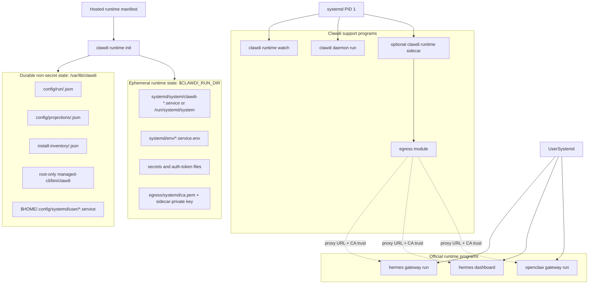
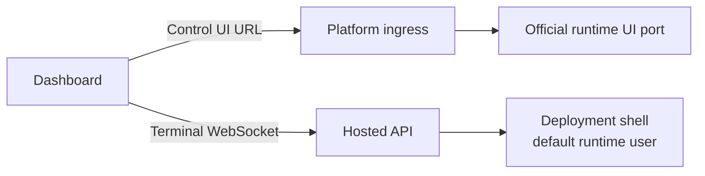

# Managed Runtime Contract

| Field | Value |
| --- | --- |
| Status | Public runtime contract |
| Last updated | 2026-08-02 |
| Owner | CLI runtime and cloud-api layers |

This document describes the public Clawdi CLI and dashboard contract for managed
runtime environments. It intentionally avoids deployment-specific topology,
private service details, live service hosts, and internal runtime orchestration.

Related public docs:

- CLI notes: [`plans/managed-runtime-cli.md`](plans/managed-runtime-cli.md)
- Roadmap: [`plans/managed-runtime-roadmap.md`](plans/managed-runtime-roadmap.md)
- Projection boundary:
  [`plans/runtime-projection-boundary.md`](plans/runtime-projection-boundary.md)

## Scope

The open-source CLI owns local runtime convergence, explicit `clawdi run`
env-injection, generic/self-hosted runtime UI bridging, and diagnostics. It does not own
OpenClaw/Hermes binaries, native update flows, or runtime process behavior.
The web app owns the hosted deployment dashboard surfaces, including Control UI
and Terminal tabs. First-party hosted control planes may provide desired state,
credentials, terminal authorization, rollout policy, and deployment lifecycle,
but those platform-specific implementations are outside this repository.

The public contract covers:

- validating runtime desired state;
- installing or verifying supported agent runtimes through their normal
  installers;
- writing non-secret local run configuration;
- projecting short-lived secrets only for the current runtime session;
- running final hosted runtimes from direct process-manager entries that name
  official Hermes/OpenClaw binaries;
- running Clawdi-owned support programs under the runtime process manager;
- supporting explicit `clawdi run -- <command>` when a caller opts into Clawdi
  runtime env injection;
- exposing strict-v2 OpenClaw directly on its native `18789` gateway with
  official token and device authentication when the typed authorization
  capability is active;
- exposing a dashboard Terminal contract for one deployment shell;
- reporting status and diagnostics through runtime commands.

The public contract does not cover:

- deployment-specific topology;
- private control-plane endpoints;
- tenant or billing policy;
- internal service implementation;
- image build pipelines or platform rollout details.

## Cloud API Runtime Observation Companion

The declarative v2 runtime adds an observation companion without changing the
existing v1 daemon heartbeat or observation writer. A deployment-bound runtime
API key sends credential-authenticated evidence to the direct `/v2` runtime
router; cloud-api appends evidence and never writes a Hosted deployment status.

Cloud-api reuses these existing runtime primitives:

- `AgentEnvironment.id` as the stable environment identity;
- managed, environment-bound `ApiKey` authentication with an immutable
  `runtime_deployment_id` identity binding;
- the first-party `X-Admin-Key` gate, mutation idempotency, and control-plane
  audit events for Hosted-facing provisioning and retirement calls;
- PostgreSQL transactions and `FOR UPDATE` locks for ingestion and retirement
  serialization.

`POST /v1/agents/{agent_id}/sync-heartbeat` remains the frozen v1 liveness and
latest-observation transport. It neither accepts strict-v2 identity fields nor
reads or writes companion tables. Strict-v2 ingestion is
`POST /v2/runtime/environments/{environment_id}/observations`; it writes only
the companion inbox, fence high-water, and boot-session head.

Four PostgreSQL tables form the additive companion boundary:

| Table | Contract |
| --- | --- |
| `v2_runtime_environment_fences` | Permanent environment/owner/deployment binding, active or retired state, replay floor, and immutable final retirement receipt/high-waters. |
| `v2_runtime_observation_inbox` | Immutable accepted identities with the five-field boot identity, boot-scoped sequence, global event id, timestamps, payload hash, and health. Private diagnostic payloads may be compacted in place after retention eligibility, while identity and hash columns remain permanently unique. |
| `v2_runtime_observation_heads` | One immutable boot-session binding with non-regressing accepted sequence, stream position, capture time, and freshness; retirement compacts it to a tombstone. |
| `v2_runtime_observation_consumer_cursors` | Environment-and-consumer ACK state, replay horizon, and explicit fail-closed expiry/reset boundary used by safe prefix retention. |

Strict-v2 credential provisioning is only available through
admin-authenticated `POST /v2/runtime/auth/keys`. The admin and platform v1 key
APIs keep their original wire shape and cannot create a fence or
deployment-bound credential. The provisioning endpoint represents one
canonical Hosted Runtime role, so its request does not negotiate scopes. The
Cloud issuer assigns the auditable bundle `connectors:read`,
`connectors:invoke`, `runtime-observations:write`, `sessions:read`,
`sessions:write`, `skills:read`, and `skills:write`. Principal identity comes
only from the managed environment/deployment binding; each data-plane operation
separately requires its scope. The database constrains only the identity
binding, while the issuer and migration own the canonical authorization bundle.

Hosted-facing `/v2` registration, read, acknowledgement, reset, retirement, and
provisioning calls all require the first-party `X-Admin-Key`. The server binds
observation cursors to its fixed Hosted controller identity, and immutable
owner/deployment authority is resolved from the environment fence rather than
caller-selected request data, so opaque cursors cannot cross consumers or
environments. Platform workload OAuth remains separate, default-closed
infrastructure for the future resale platform surface; it is not on this v2
data-plane path.

Ingestion locks the permanent environment fence and rejects a retired binding
before it inspects or creates a boot-session head. Retirement uses the same
fence lock, freezes all session high-waters, persists the final cursor and
receipt, writes one durable control-plane transition audit, and tombstones all
heads atomically. Replaying the same retirement ID returns the persisted
receipt; a different ID or deployment binding conflicts. V1 agent deletion and
key revocation retain their pre-companion behavior and do not consult the v2
fence. Trusted Hosted controller ordering obtains the retirement receipt before
using those existing teardown surfaces; the permanent fence itself is never
deleted.

Retention advances the replay floor only across a contiguous per-environment
stream prefix. Every row in a normal replay-horizon prefix must be old enough
and acknowledged by every required active consumer. Hard retention may expire
lagging consumers explicitly, but it still stops at the first younger stream
position, preventing a preserved lower id from being silently skipped. Eligible
rows are compacted in place: private diagnostics are scrubbed and
`payload_purged_at` records the one-way transition, while event ID,
environment/session/sequence identity, payload hash, timestamps, and uniqueness
constraints remain. Replay-floor maintenance may advance monotonically after
retirement without changing the immutable receipt or final high-water fields.
When the hard cap expires or advances a consumer boundary, retention writes a
redacted system audit in the same transaction as the cursor and compaction.
Active heads must reference their exact inbox stream position, and a retired
fence's final position must equal its frozen stream high-water at the database
boundary.

## Core Architecture

The primary hosted runtime model is a Linux-like runtime host. The host image
provides the OS envelope, a runtime user, a root-only `clawdi` bootstrap path,
official Hermes/OpenClaw installs, and a process manager. Runtime behavior
comes from the manifest and official runtime binaries, not from per-agent
wrappers. The managed Clawdi CLI is an administrator capability: the runtime
user, model tools, and browser terminal cannot resolve, read, or execute it.


```mermaid
flowchart TB
    CP[Hosted runtime manifest] --> Init[clawdi runtime init]
    Init --> Durable
    Init --> Ephemeral

    subgraph Durable["Durable non-secret state: /var/lib/clawdi"]
        RunConfigs[config/run/<runtime>.json]
        Projections[config/projections/<runtime>.json]
        Inventory[install-inventory/<runtime>.json]
        CliBin[root-only managed-cli/bin/clawdi]
        UserUnits[$HOME/.config/systemd/user/*.service]
    end

    subgraph Ephemeral["Ephemeral runtime state: $CLAWDI_RUN_DIR"]
        SystemUnits[systemd/system/clawdi-*.service or /run/systemd/system]
        UnitEnv[systemd/env/*.service.env]
        Secrets[secrets and auth-token files]
        EgressCA[egress/systemd/ca.pem + sidecar-private key]
    end

    subgraph Support["Clawdi support programs"]
        Watch[clawdi runtime watch]
        Daemon[clawdi daemon run]
        Sidecar[optional clawdi runtime sidecar]
        Egress[egress module]
    end

    subgraph Runtime["Official runtime programs"]
        HermesGateway[hermes gateway run]
        HermesDashboard[hermes dashboard]
        OpenClaw[openclaw gateway run]
    end

    Systemd[systemd PID 1] --> Watch
    Systemd --> Daemon
    Systemd --> Sidecar
    Sidecar --> Egress
    UserSystemd --> HermesGateway
    UserSystemd --> HermesDashboard
    UserSystemd --> OpenClaw

    Egress -. proxy URL + CA trust .-> HermesGateway
    Egress -. proxy URL + CA trust .-> HermesDashboard
    Egress -. proxy URL + CA trust .-> OpenClaw
```

The process manager is systemd. The important contract is that each
long-running program is declared directly with its official command, args, cwd,
and env. Clawdi support processes use `clawdi-*` service names; OpenClaw and
Hermes gateway base units use runtime-owned service names generated by official
service installers, such as `openclaw-gateway.service` and
`hermes-gateway.service`. Runtime services must not point at `clawdi run --
openclaw`, `clawdi run -- hermes`, a generated launch shell, or a PATH shim. If
Clawdi must temporarily run an auxiliary process that has no official service
installer, the unit uses a `clawdi-*` name and is documented as compatibility,
not as a runtime-owned service.

The Linux-like host preserves official updater behavior. If a user or an
official UI runs `openclaw update` or `hermes update`, PATH resolves to the
official binary. Clawdi does not intercept that command. After an updater
replaces files, the process manager may restart the relevant official program,
but the update transaction remains owned by the runtime.

The bootstrap boundary is deliberately small: systemd prepares its runtime
directories and runtime-user manager, then calls the root-owned image bootstrap
entrypoint by absolute path. That entrypoint reads the exact managed CLI pin
from the canonical runtime context, installs it under the root-only npm prefix, atomically activates
`/var/lib/clawdi/managed-cli/bin/clawdi`, and runs
`runtime init --non-interactive`. `runtime init` is the local administrator
convergence step. It invokes official non-interactive service installers for
desired runtime gateway base units inside the managed apply boundary, writes
only transparent hosted drop-ins/env files for those official units, and proves
the rendered systemd state before committing authority. When a later manifest
removes an official gateway service, the pre-commit phase only stops/disables
the stale unit; the matching official uninstaller and stale file garbage
collection run after authority commits. Clawdi-owned support units keep
`clawdi-*` names.

Official unit ownership follows a strict contract. The official installer owns
the base unit file; Clawdi never edits or removes a base unit it did not
generate. Clawdi owns exactly two artifacts per official unit: the drop-in
`$HOME/.config/systemd/user/<unit>.service.d/10-clawdi-hosted.conf` and the env
file `$CLAWDI_RUN_DIR/systemd/env/<unit>.service.env`, both marked with the
generated-file header so convergence can identify them. Failure handling keeps
that boundary convergent in both directions:

- If an official service install fails and no base unit exists yet, the drop-in
  is not written; convergence reports the install error and the next cycle
  retries the official installer. If a base unit already exists from an earlier
  successful install, the drop-in/env are still refreshed so the running
  service keeps its current configuration.
- If a post-commit official service uninstall fails, the committed desired
  state remains authoritative and the next convergence repeats conservative
  cleanup.
- Systemd apply is a commit prerequisite. A rendered unit that cannot reach its
  required active/enabled state, or a stale unit that cannot reach its required
  inactive/disabled state, fails the apply. Synchronous failure restores the
  exact plan-derived filesystem pre-images and reconciles systemd to that
  restored set; it never applies a partially rendered generation merely because
  another convergence step reported an error.

An official installer failure reports its exit code, terminating signal or
spawn error, and bounded stdout/stderr tails. Capture is capped at 64 KiB per
stream and each reported tail at 4,000 characters. Terminal controls are
removed and known secret values, credentials, URL parameters, and environment
assignments are redacted. For an installer with a JSON contract, Clawdi
allowlists only `error`, `message`, `hints`, and `warnings`; it never projects
the rest of the installer response, a runtime manifest, or process environment.
The failure still aborts Apply before authority commits and uses the existing
filesystem/systemd rollback transaction.

Official service installers/uninstallers run only in the hosted systemd apply
path. Unit tests select installer execution through an explicit in-process test
option; there is no production environment-variable authority that can replace
official gateway ownership. When installers are skipped, convergence still
writes the hosted drop-in/env files. Similarly, systemctl
apply runs only where the environment owns a live systemd
(`/run/systemd/system`, overridable with `CLAWDI_SYSTEMD_APPLY=1|0`); when unit
files changed but apply was skipped, init/watch status reports
`systemdApply.applied=false` instead of hiding the divergence.

Hermes gateway and dashboard are separate official commands in this model. A
deployment that needs both must use an official service installer for each
runtime-owned unit. Until Hermes exposes an official dashboard service
installer, the hosted default does not synthesize `hermes-dashboard.service`; an
explicit compatibility unit, if required, must use a `clawdi-*` name. The
Hermes dashboard binds directly to `0.0.0.0:9119` and uses Hermes' bundled
Basic authentication provider.

### Incus Files Companion

Hosted V2 may declare `companions.files` only in a trusted Incus apply context.
The declaration is a server-owned companion program, not a user runtime named
`files`; systemd planning uses the typed `file-browser` program kind so a real
user runtime with that name keeps the normal runtime-user unit behavior. The
companion is installed after boot and does not add File Browser to the base
runtime image or change the k3s runtime contract.

The manifest pins one direct File Browser executable per architecture and
provides a deployment-specific HS256 secret. Convergence downloads into a
private `.staging-*` directory, verifies the exact SHA256 and version/commit
probe, then atomically renames it to
`companions/files/candidates/<sha256>/filebrowser`. It rejects staging symlinks
or non-directories, executes the content-addressed candidate directly, and
garbage-collects older candidates only after applied authority commits. The
existing manifest snapshot covers the desired candidate, root-owned `0640`
configuration, install receipt, systemd unit/environment file, and applied
state, so a download, verification, systemd, or readiness failure restores the
previous exact pre-image. There is no separate active/previous link state or
hand-built chroot.

`clawdi-files.service` runs as the non-root runtime UID/GID. It reuses the
generated system-unit and environment-file writer and applies systemd's native
`ProtectSystem=strict`, `ProtectHome=tmpfs`, `BindPaths`, `ReadWritePaths`,
`ReadOnlyPaths`, private device/tmp, capability, namespace, and task-limit
controls. File Browser receives its official JWT header configuration with
password, signup, passkey, sharing, admin, API-token management, realtime, and
WebDAV disabled. The route broker supplies a short-lived owner assertion; no
password, pairing code, access code, or URL token is part of this runtime
contract. When a later manifest omits the companion, normal stale-unit
reconciliation stops and withdraws only `clawdi-files.service` while preserving
the selected Hermes or OpenClaw unit.

The authenticated request path is `Files browser -> Incus Traefik -> cloud
TanStack ForwardAuth -> Hosted assertion broker -> guest File Browser`. The
ForwardAuth server route lives beside the cloud dashboard's existing
`/api/files/authorize` callback, uses the same TanStack Clerk request context,
and calls the Hosted deploy API with the current owner token, route proof,
expected Files host, and original URI. Signed-out top-level navigation returns
to the cloud `/sign-in` route before that callback; iframe requests fail
closed. This v2 Incus path has no dependency on the Hosted Next.js application
or the `www` origin. Traefik removes the entire browser `Cookie` header before
the guest hop; File Browser authenticates every request from its official
external-JWT header and therefore does not require a child-service session
cookie or a selective cookie-rewriting proxy.

The pinned upstream contracts are File Browser's
[JWT verifier](https://github.com/gtsteffaniak/filebrowser/blob/79552f8adb27c3e29934c4001660eb98f4aab5d6/backend/auth/jwt.go),
[JWT middleware](https://github.com/gtsteffaniak/filebrowser/blob/79552f8adb27c3e29934c4001660eb98f4aab5d6/backend/http/middleware.go),
and [authentication settings](https://github.com/gtsteffaniak/filebrowser/blob/79552f8adb27c3e29934c4001660eb98f4aab5d6/backend/common/settings/auth.go),
plus the documented
[systemd execution sandbox](https://www.freedesktop.org/software/systemd/man/latest/systemd.exec.html).
Reverse-proxy origin/header behavior remains the single topology smoke check
owned by the hosted control plane; repository tests verify the manifest,
rollback, sandbox, signed-out callback, and UI eligibility contracts without
claiming to emulate a real browser/Traefik deployment.

Done: `bash scripts/test.sh cli src/runtime/manifest-reconciliation.test.ts`
and `bash scripts/test.sh web src/pages/files/files-authorize-route.test.ts
src/pages/files/files-forward-auth-route.test.ts` exit 0 and report `0 fail`.

### Runtime Host Contents

| Area | Contains | Must not contain |
| --- | --- | --- |
| Host envelope | runtime user, home directory, base packages, process manager, host policy | runtime-specific shell wrappers |
| Clawdi | managed `clawdi`, runtime-fetched `mitmdump` (mitmproxy) transparent gateway, status/doctor tooling, `clawdi-*` support units | per-agent command shims, OpenClaw/Hermes binaries |
| Hermes | official install and official `hermes` binary | Clawdi-owned `hermes` wrapper |
| OpenClaw | official install and official `openclaw` binary | Clawdi-owned `openclaw` wrapper |
| Runtime state | `/var/lib/clawdi`, `$CLAWDI_RUN_DIR`, workspace, short-lived secret files | durable plaintext provider secrets |

The host should not add:

- `/usr/local/bin/openclaw` or `/usr/local/bin/hermes` wrappers owned by
  Clawdi;
- generated launch scripts that call `clawdi run -- openclaw` or
  `clawdi run -- hermes`;
- a Clawdi process as PID 1 for Hermes or OpenClaw;
- direct public exposure of `--auth none` runtime ports.

The image must not contain per-agent command wrappers, generated launch scripts,
or PATH shims for `openclaw`, `hermes`, or future runtime names. Official
runtime commands still resolve to official binaries, so native commands such as
`openclaw update` and `hermes update` keep their own updater behavior.

## Support Module Boundaries

The Clawdi support programs run under the same process manager as the runtime
programs. `clawdi runtime sidecar` is the egress support process and keeps an
explicit authority boundary:

| Module | Starts when | Direction | Sensitive input | Network exposure | Must not own |
| --- | --- | --- | --- | --- | --- |
| manifest/watch | an auth token file exists | control-plane polling | Clawdi auth token from file | outbound API only | official runtime PID 1 |
| live-sync daemon | `liveSync.agents` is non-empty | live sync and local daemon APIs | Clawdi auth token from file | local daemon surface | egress rewrite policy |
| sidecar egress module | enabled egress profiles exist | runtime outbound proxy | profile bundle, CA cert/key under `$CLAWDI_RUN_DIR`, optional secret file | loopback/private proxy | live-sync/API authority |
| official runtime program | runtime is enabled | normal runtime behavior | runtime-specific env/config only | official runtime ports | Clawdi auth secrets |

The sidecar is still not a hidden wrapper around Hermes/OpenClaw. It only hosts
Clawdi-owned support modules; official runtime programs remain direct process
manager entries.

The egress module keeps its root CA certificate and private key under the
ephemeral run directory so a sidecar restart does not change the trust root for
already-running runtimes. Runtime programs receive only the CA certificate path
as trust env; the private key path is not projected into runtime env.

The combined system-plus-egress CA bundle is certificate-only trust material,
but it is consumed by the non-root runtime processes through `NODE_EXTRA_CA_CERTS`,
`REQUESTS_CA_BUNDLE`, and `SSL_CERT_FILE`. The root-owned sidecar therefore
publishes it atomically as `root:<runtime primary group>` with mode `0640` on
both creation and replacement. Making it root-only would break the declared
runtime-user service model; making it world-readable would unnecessarily expose
the managed trust projection to unrelated local users. The egress CA private key
remains separate under the egress identity's private directory and is never
group-readable by the runtime user.

### Official Container Reference Research

Official runtime images are useful references, but they are not the primary
hosted architecture while in-place official UI updates are a requirement:

| Image | Useful reference | Update implication |
| --- | --- | --- |
| `nousresearch/hermes-agent` | s6 starts `hermes gateway run` and, with `HERMES_DASHBOARD=1`, also starts `hermes dashboard`; ports are `8642` and `9119` | Docker installs update by pulling/recreating the image, so dashboard update cannot be the normal in-place updater path |
| `ghcr.io/openclaw/openclaw` | `tini` runs the gateway; official container rejects unauthenticated non-loopback binds; `--auth token --bind auto` works for directly exposed ports | Docker installs update by image rollout; in-place `openclaw update` belongs to non-Docker installs |

The Linux-like host can adopt these lessons without switching to container
rollout updates: use separate official systemd user services when the runtime
provides service installers for separate surfaces, and require runtime-native
auth when exposing the official OpenClaw port directly.

## Manifest Shape

The control plane accepts only exact
`Accept: application/vnd.clawdi.runtime-bundle.v2+json` and returns strict
`clawdi.hosted-runtime.bundle.v2`. The response contains the hosted manifest,
sanitized Telegram and Discord `channelBindings`, one merged `secretValues`
map, and deterministic `sourceRevision`. Missing or unsupported media types
return `406`; the CLI does not fall back to another representation or a second
`/v1/channels` request.

Bundle responses identify the vendor media type and return `Vary: Accept`.
Negotiation `406` responses also return `Vary: Accept` and
`Cache-Control: no-store`, so errors are not reused across media types.
The v2 strong ETag is `"sha256:<sourceRevision>"`; the immutable renderer and
the revision's effective public and secret-source identity make it a strong
validator without decrypting secrets in the health summary.

### Channel reconcile boundary

Telegram and Discord `ChannelBotAgentLink` rows are runtime desired state. A
link create or re-link, link delete, account archive, or link credential
rotation changes the rendered channel projection and therefore
`sourceRevision`. Those mutation transactions also enqueue the existing
signal-only `runtime_manifest_changed` event for the linked Agent. The event is
delivered only after commit; the runtime refetches the manifest and converges at
the normal ETag/sourceRevision boundary. ETag polling remains the missed-event
fallback, so no separate restart or channel-specific reconcile state machine is
required. Creating a pair code emits this signal only when that request also
creates an AgentLink.

`ChannelBinding` rows are provider routing state, not runtime identity. Pairing
or unpairing a chat updates only the binding and provider-owned per-chat
projection, including Telegram command scopes and menu state. It does not enter
`sourceRevision`, emit a runtime-manifest signal, archive the AgentLink, or
restart/reconfigure the Agent. Telegram bindings currently identify a chat by
the stored external chat identity; runtime conversation/session threading is a
separate concern.

The bundle root optionally carries `applyGeneration`, the deployment Apply
identity. The inner manifest `generation` remains checkpoint/content identity.
`applyGeneration` is omitted while persisted runtime state is null, preserving
the legacy bundle bytes and validator; once explicit, it is included in
`sourceRevision`. It must be positive. Checkpoint and Apply generations are
independent monotonic sequences, with no ordering relationship between their
values.

The CLI normalizes these wire contracts into the desired-state shape:

- `clawdi.hosted-runtime.manifest.v1` is the hosted control-plane response
  shape served only from `/v1/runtime/manifest`. It requires explicit `runtime`
  and `environmentId` fields and rejects unknown fields instead of accepting
  compatibility payloads. `system`, `controlPlane`, `clawdiCli`, `runtimes`,
  `providers`, `liveSync`, and `recovery` are required. `egressProfiles`, `mcp`,
  `skills`, and `tools` remain explicit optional projections.
- `clawdi.runtimeDesiredState.v1` is the normalized internal convergence shape
  consumed by `runtime init`.
- `clawdi.hosted-runtime.bundle.v2` wraps an inner
  `clawdi.hosted-runtime.manifest.v1` and is marked locally after validation.
  OpenClaw requires typed native auth, the exact gateway command, and an
  environment secret reference for the gateway token.

Normalization maps hosted fields into the internal shape:

| Hosted field | Internal purpose |
| --- | --- |
| `deploymentId`, `environmentId`, `instanceId`, `generation` | Deployment/instance identity and checkpoint/content generation for cache and content state |
| Bundle root `applyGeneration` | Optional deployment Apply identity; legacy bundles resolve it from checkpoint `generation` through one named compatibility rule |
| `runtime` | Required selected compute runtime; exactly one enabled `openclaw` or `hermes` entry must match it |
| `locale.language`, `locale.timezone` | Required supported language and valid IANA timezone |
| `system.openclawControlUiAllowedOrigins` | Strict-v2 OpenClaw public origin allowlist |
| `system.openclawGatewayAuth` | Strict-v2 OpenClaw token and required device-auth capability; the token itself is an environment secret reference |
| `system.hermesDashboardAuth` | Strict-v2 Hermes Basic provider settings, public URL, session TTL, and environment secret references; plaintext credentials are never part of the manifest |
| `controlPlane.cloudApiUrl` | Required and only control-plane field; `appId`, `apiUrl`, and `manifestUrl` are not public manifest fields |
| `clawdiCli.source` | Required literal `npm:clawdi` for Hosted managed CLI updates |
| `clawdiCli.packageSpec` | Required exact `clawdi@<semver>` without build metadata, at most 200 characters; remote Hosted manifests never select an npm dist-tag or local path |
| `clawdiCli.registry` | Required literal `https://registry.npmjs.org`; Hosted does not use npm registry defaults or overrides |
| `runtimes.<name>.enabled` | Run config and systemd unit state |
| `runtimes.<name>.install` | Required strict `{source: "official"}` selector; CLI owns installer URL and args |
| `runtimes.<name>.run` | Command, args, cwd, env, and PATH projection |
| `runtimes.<name>.providerMode` | Required runtime-provider ownership discriminator: `configured` or `unmanaged` |
| `runtimes.<name>.provider_ids` | Core Hosted configured mode requires exactly one provider; unmanaged mode requires an exact empty list. Selection is replacement-only, with no fallback or secondary pool. |
| `runtimes.<name>.primary_model.{provider_id,model}` | Required only in configured mode and its provider must belong to `provider_ids`; absent in unmanaged mode |
| Hosted filesystem defaults | Derived locally from Hosted `RuntimePaths`: HOME, workspace, persistence root, installer home, and explicit process/service cwd use `userHome`; obsolete external `system`/runtime path fields are rejected |
| `providers.<id>` | Canonical Hosted provider projection: `kind` is exactly `openai-compatible`; normal entries also require `type` and `baseUrl`, while `provider_not_found` is the only reduced error entry |
| `runtimes.<name>.services` | Runtime-owned auxiliary processes, such as a browser dashboard, managed without user command shims |
| `providers` | Required runtime-scoped AI provider projections whose keys exactly match selected `provider_ids`; `{}` in unmanaged mode |
| `terminalTooling.codex` | Required typed Hosted terminal-tool projection with one Clawdi-managed provider metadata and secret reference, independent of runtime providers |
| `mcp.servers` | Required canonical map for generic named stdio or remote HTTP server declarations; invalid stored MCP state fails closed with `409` |
| `skills.entries.<id>.{enabled,version}` | Generic bundled-Skill intent; the entry key is the Skill id and `version` is a positive integer |
| `tools` | Existing unrelated tool projection pass-through; it does not include terminal Codex |
| `liveSync.{enabled,agents}` | Required explicit daemon sync configuration; Hosted does not infer it from agent metadata |
| `egressProfiles` | Explicit local sidecar profiles |
| `recovery.{cacheManifest,allowOfflineBoot}` | Required explicit manifest cache and offline-boot behavior |

Hosted parsing does not accept camel-case runtime binding aliases, snake-case
provider transport aliases, or string `primary_model` values. Provider model
catalog fields such as `models[].api_mode` and ownership metadata such as
`managed_by` remain canonical snake-case wire fields. Singular provider
`model` is not a Hosted alias; model selection lives in runtime
`primary_model`, while provider catalogs use `models[]`. Provider error
projections require `status: "error"` and `error` together, including a
non-empty `error.message`. A
`provider_not_found` entry contains `kind` plus that error pair; other error and
healthy entries retain the normal `kind`, `type`, and `baseUrl` projection.

This strict typing claim applies only to the Hosted fields modeled in this
release. `egressEngine` and `egressProfiles` use closed schemas matching the
Hosted CLI wire and are validated at admin write and manifest read boundaries.
Invalid stored egress JSON fails closed with `409`. `terminalTooling.codex` is
the one typed terminal-tool subset in this release. It does not declare MCP and
does not participate in runtime `provider_ids`, runtime primary-model selection,
source-level applied provider IDs, or runtime provider health. An `mcp` object
with an own `servers` field is validated as the generic stdio/remote declaration
collection; an object without `servers` and unrelated `tools` fields retain
their released pass-through behavior. The normalized generic
`clawdi.runtimeDesiredState.v1` shape also retains optional install metadata,
default install args, and arbitrary provider projection data such as singular
`model` for non-Hosted inputs.

### Runtime Provider Ownership And Terminal Codex

Agent v2 requires exactly one selected OpenClaw or Hermes runtime. Provider
intent is also explicit: `configured` means Clawdi owns the selected runtime
provider projection, while `unmanaged` means Clawdi projects no runtime provider
metadata, secret reference, environment variable, or primary model. Empty
provider state never implies a mode. Runtime-only deployments therefore render
`providerMode: "unmanaged"`, `provider_ids: []`, no `primary_model`, and
`providers: {}`. Health is exact only when the source-level applied provider set
is also empty.

Hosted Codex is a separate terminal tool plane. Its fixed provider reference is
materialized under `terminalTooling.codex` from the same repeatable-read batch as
runtime providers. When both consumers use the same provider, Cloud resolves
and decrypts that provider auth payload once. The CLI uses the terminal-tool
reference to own exactly one Hosted Codex default configuration at
`$CODEX_HOME/config.toml` (default `~/.codex/config.toml`) and a managed command
shim. The shim exports the process-scoped egress placeholder and executes the
real Codex with the original arguments; it never adds `--profile`. Managed,
BYOK, Codex OAuth, and unmanaged runtime-provider modes all receive the same
terminal Codex default. Unmanaged OpenClaw or Hermes units receive no provider
environment.

This mode controls default configuration ownership, not pod-wide network
isolation. Egress matching is domain based, so another pod process could call a
tool-plane gateway deliberately; the credential remains deployment-scoped and
charges that deployment user's wallet.

Platform provider and tool credentials are stored as encrypted provider auth
payloads and projected through bundle secret references. They are not user
Vault items, do not use `clawdi://` references, and do not depend on Vault
attach, share, delete, or resolve operations. User Vault participation remains
explicit through the existing user-facing provider and `clawdi run` flows. The
unmanaged provider discriminator does not reject an independently, explicitly
selected user Vault-backed run or service secret reference; it only prevents
provider-plane material from being inferred or projected into the runtime.
The backend's existing low-level encryption helper and key reuse is legacy
infrastructure; it is not a runtime Vault contract and this release does not
change its ciphertext format or key.

Remote Hosted CLI policy is exact-version only. Values such as npm dist-tags,
bare package names, build-metadata versions such as `clawdi@1.2.3+build.1`, and
malformed SemVer prereleases are rejected before normalization. Valid
prereleases follow SemVer identifier rules, including forms such as `beta.51`
and `rc-1.2`; empty identifiers and numeric identifiers with leading zeroes are
invalid. Prerelease CLI publication uses the standard npm `beta` dist-tag, but
that tag is non-authoritative publication metadata. Cloud and Hosted production
never resolve or persist it: rollout state contains an exact `clawdi@<semver>`
package spec, and `clawdi@beta` is rejected at both write and manifest-read
boundaries. A managed bootstrap tgz under
`/usr/local/share/clawdi/bootstrap/` is accepted only by the explicit
in-process manifest fixture seam used by paired-image tests. Hosted init/watch
always fetch from the typed runtime-context `manifestSource`; remote fetches
cannot use the fixture schema. Generic
`clawdi.runtimeDesiredState.v1` manifests retain their existing floating package
support; exact Hosted updates do not call `npm view` and can move to either a
higher or lower exact version.

The trusted CLI catalog maps each Hosted bundled Skill entry to a package-local
directory and SHA-256 digest. The private manifest keeps the existing `clawdi`
version `1` compatibility label; installing a newer exact CLI package refreshes
the managed Skill bytes and catalog digest directly, without a separate Skill
rollout or public version choice. The asset remains at
`skills/hosted-versions/1/clawdi/SKILL.md`, so the Skill file's direct parent
matches its frontmatter name. Source paths, content, digests, and package specs
never cross the runtime wire. Unknown ids or versions, unmanaged targets,
source digest mismatches, and unsupported source file types fail closed. An
exact managed marker plus an actual target-content digest match is a filesystem
no-op; package refreshes, drift, and legacy ownership markers use staged
replacement.

Managed-bundle integrity does not reuse `computeSkillFolderHash`. That function
is an established client/server sync protocol over the safe dereferenced
regular-file archive projection, with upload exclusions and its historical
unframed `path + content` hash. It does not encode regular-file permission
modes, so chmod-only projection fidelity is not guaranteed. The managed catalog
instead uses a private, framed full-file scan over
relative path, regular-file permission bits, and bytes. It does not hash
ownership or timestamps, rejects source symlinks, and treats target symlinks as
drift without following them. The public sync hash remains unchanged for old
and new clients.

### Skill And MCP Authority Boundaries

The bundled `clawdi` Skill is platform infrastructure. Hosted constructs its
private `skills.entries` runtime state internally, and capable CLIs reconcile
enabled and disabled lifecycle state from that wire. The public deployment
spec and update request deliberately have no `skills` field, and the dashboard
does not render, edit, or delete the bundle. Existing runtime-observed summary
fields remain compatibility/convergence evidence only; they are not user Skill
inventory or mutation intent.

Agent filesystem Skills have a separate one-way lifecycle. The guarded adapter
target is authoritative and Cloud stores an `agent_sync` projection. A
versioned local ledger records the exact Agent and Agent Project that
successfully claimed each projection. Local absence may delete only that exact
claim; remote listing failures never infer deletion. A Project reassignment
first deletes the Agent-owned projection under the old Project fence and then
projects current local state to the new Project. Legacy hash-only state may be
an upload baseline but cannot authorize deletion. The current CLI uses only
the dedicated Agent sync boundary. A 404 from that boundary is ambiguous
between a backend without the route and an identity the caller cannot prove,
so both cases fail closed: the durable operation and exact claim remain, and
no generic Project mutation is attempted. Dashboard writes and orphan projects
also fail closed. Compatibility writes still prove CLI Agent and Agent Project
identity; slug-only delete additionally requires an environment-bound API key.

The CLI declares `X-Clawdi-Skill-Sync-Protocol: agent-authoritative-v1` on
Agent-Project listing, SSE, and writes. A missing header or explicit
`agent-authoritative-v0` selects the supported legacy behavior, including
Agent Project downloads; malformed and unknown values return 400. Explicit v1
keeps the one-way boundary and rejects Agent Project downloads. A current CLI
receives a dedicated 404 from an old backend and leaves its filesystem and
durable projection state intact. Additive
`agent_skill_changed`/`agent_skill_deleted` events protect only mutations
created by current backend workers from released parsers on older connections;
current daemons treat both event families only as local-rescan hints. Workspace
and personal Project events keep their released Cloud-owned behavior.

An enabled private bundled-Skill entry reserves its key ahead of managed target
installation. Conforming CLI/daemon uploads fail closed at that reservation
boundary. If reservation wins after a user-authored Skill was deleted or
renamed, the durable exact claim still queues removal of the old Cloud
projection while the managed target is never uploaded or removed by live sync.
Failed managed installation rolls back the reservation transaction; private
disable releases its ownership without importing or resurrecting a stale
projection. No reservation or managed target is projected into user Skill
inventory.

MCP remains independent of Skills and has no user declaration or mutation
contract in this release. The dashboard therefore exposes no MCP page. The safe
inventory API treats a valid empty or platform-only runtime state as an
available empty inventory; a missing projection is unavailable, and unknown
server entries without explicit user provenance fail closed. The preinstalled
`clawdi` aggregate is private infrastructure, and Composio is a dynamic tool
source behind `POST /v1/mcp/clawdi`; neither appears
as a separate MCP row. No URL, header, secret reference, command, argument, or
environment value is projected to the browser.

Manifest `generation` is the checkpoint/content identity and is part of the
remote manifest ETag. The CLI applies any
non-304 manifest without monotonic generation gating, while treating generation
as the desired intent sequence and the ETag as effective content identity. A
generation-only control-plane bump therefore produces a new ETag so `runtime
watch` converges immediately.

Reconciliation validates and plans projections before live mutation, completes
required installers before Apply, and commits last-good, remote ETags, and
root-owned `0600` `status/runtime-applied.json` only after managed files and
systemd state apply successfully. A recoverable Apply failure restores the
previous Clawdi-owned files and systemd declaration and leaves those authority
records unchanged.
The last-good manifest and scoped secret cache are each replaced atomically,
then `runtime-applied.json` is replaced atomically as the final commit record.
After a crash, strict-v2 offline load requires that final record to match the
cached checkpoint generation, resolved Apply generation, instance, manifest,
and canonical secret union exactly, so
a partially advanced cache fails closed instead of becoming mixed authority.
Last-good remains an offline recovery cache; `runtime-applied.json` is the
online record of the applied instance, checkpoint generation, optional Apply
generation, content identity,
source manifest provider IDs, and the target-specific projected provider ID map
needed for stale deletion. The record is committed only after Apply succeeds.

Manifest validation is defensive. A Hosted manifest selects exactly one enabled
`openclaw` or `hermes` compute runtime; top-level `runtime` must match the sole
entry in `runtimes`. Codex remains a live-sync agent type and is not a selectable
Hosted compute runtime. The selected runtime must provide exactly
`install: {source: "official"}`. Hosted cannot select an installer channel, URL,
or arguments; the CLI unconditionally owns the official URL and argument vector
for the selected runtime. Cloud-owned `controlPlane` contains only
`cloudApiUrl`; `appId`, `apiUrl`, and `manifestUrl` are not emitted. Generic
desired-state manifests keep their existing optional installer, channel, and
argument behavior. Unknown generic runtime names require `run.command`;
otherwise the manifest is rejected so the image does not need to know every
future agent.

## Managed CLI privilege boundary

The shared `/var/lib/clawdi/bin` directory remains traversable because it also
contains explicitly intended runtime-user tools such as the Codex shim. It must
not contain a `clawdi` entry. The active managed CLI instead lives at
`/var/lib/clawdi/managed-cli/bin/clawdi`; its parent directories, active npm
package prefix under `/var/lib/clawdi/npm`, and executable target are root-owned
and mode `0700`. The image bootstrap entrypoint is also root-owned and mode
`0700`.

Root system services use the absolute managed CLI path for watch, daemon, and
sidecar commands. OpenClaw and Hermes user services execute their official
binaries and keep `/var/lib/clawdi/managed-cli/bin` and `/var/lib/clawdi/npm`
out of `PATH`. The interactive runtime-user shell may retain
`/var/lib/clawdi/bin` for explicit tools such as Codex without exposing the
managed CLI.

CLI self-upgrade verifies a new exact package before making its target and npm
prefix root-only, then atomically switches the active link inside the root-only
managed directory. Reconciliation also removes the legacy shared-bin link and
best-effort tightens a writable baked image shim. That last step is migration
defense, not a rollout guarantee: a container with a read-only root filesystem
cannot have its baked shim retrofitted in place. Full non-discoverability for an
existing workload therefore requires the paired hosted image containing the
root-only shim, the matching exact CLI package, and workload replacement or
recreation. Manifest reconciliation alone cannot retrofit an old read-only
container.

The image bootstrap and CLI self-upgrade are independent atomic activation
owners. If the image bootstrap replaces the active CLI while an older activated
self-upgrade transaction remains, the transaction controller compares the full
old transaction as its fence, verifies that bootstrap status exactly matches
the active managed link, and atomically replaces the journal with an activated,
non-rollbackable transaction owned by that verified identity. Replay is
idempotent, and ordinary post-convergence completion retires the handoff
journal. `badVersions` is preserved. Missing, stale, tampered, or mismatched
bootstrap identity continues through verified rollback and otherwise fails
closed; version ordering is not an ownership signal.

The exact package selection and handoff are also the compatibility boundary.
The manifest carries no independent minimum CLI version: an old process either
installs and hands off to the selected package or fails before applying the new
desired state.

When only the exact CLI package changes and the capability image remains
compatible, the substrate may rotate the fixed runtime-context directory in
place without replacing the workload. The running watcher first requires the
context `cliPackageSpec` to match the fetched manifest package, installs and
verifies that exact package, atomically activates it, and exits cleanly. The
`Restart=always` systemd unit then starts the watcher from the absolute managed
CLI path. The new CLI performs the complete manifest and systemd convergence;
the old applied authority remains current until that convergence commits the
new Apply identity. A failed first convergence rolls back to the previously
verified CLI. This is a process handoff inside the existing workload, not a
workload restart or replacement.

## Commands

Root runtime operators can use these commands in controlled environments:

```bash
clawdi runtime init --non-interactive
clawdi runtime watch
clawdi runtime sidecar
clawdi runtime status --json
clawdi runtime doctor --json
clawdi run -- <command>
```

Normal local onboarding still uses `clawdi setup`. Runtime commands are for
managed environments where configuration is supplied by policy or a manifest,
not by an interactive user setup flow.

`runtime watch` is the long-running reconciliation loop. It refreshes remote
manifest state using ETags, applies changes, records status, and falls back to
last-good cached manifests only when recovery policy allows it. `runtime
sidecar` runs outbound egress handling when explicit egress profiles are
enabled.

## Runtime UI Authentication

Strict-v2 OpenClaw binds the official gateway directly to the pod network with
`gateway run --allow-unconfigured --port 18789 --bind lan --force`, and provide
`OPENCLAW_GATEWAY_TOKEN` only through `run.secretEnv`. The local config patch
sets official shared-token auth, intentionally sets
`dangerouslyDisableDeviceAuth: true` for the managed v2 product, disables
insecure and Host-header fallback modes, derives `gateway.controlUi.basePath`
from the clean public URL, and includes that URL's origin in `allowedOrigins`.
The patch writes `gateway.auth.token: null` to delete any stale durable token;
OpenClaw documents this RFC 7396 behavior in
[`merge-patch.ts` lines 88-113](https://github.com/openclaw/openclaw/blob/ba467fbd3efa9ab109e620c4e42cfe92388171c5/src/config/merge-patch.ts#L88-L113),
while the active token comes from the ephemeral service environment.

Direct OpenClaw exposure remains fail closed behind the typed
`openclaw-native-auth-v1` capability and an available
`OPENCLAW_GATEWAY_TOKEN`. Hosted returns a clean endpoint plus an explicit token
and `handoff_url` through an owner-checked, no-store credential endpoint. The
handoff carries exactly one official `#token=` fragment. Device pairing and
device-auth behavior are deliberately outside this managed token-only contract.

Hermes direct exposure requires `hermes-basic-auth-v1`, a stable HTTPS public
URL (including any path prefix), exact `0.0.0.0:9119` service args, and the
official Basic password/session environment secret references. Hosted derives
the password and an independent session-signing secret from the gateway token
and durable Runtime UI access revision. The CLI projects non-secret settings to
`dashboard.basic_auth` and secrets to the official
`HERMES_DASHBOARD_BASIC_AUTH_*` environment variables.

The dashboard consumes generated discriminated deployment metadata; it does not
infer auth from the runtime name or fall back to legacy `native_url` fields.
Both runtimes declare `browser_mode: embedded_and_top_level` and remain embedded
in the Console. Public endpoint URLs contain no secret. The owner-checked
credential response carries the Hermes username/password or the OpenClaw token
and exact `handoff_url`, never a query token. Credentials fail closed unless the
displayed resource version is the exact converged current Ready rollout.

Both runtimes use the same Runtime UI Access dialog and declarative reset. Reset
rotates the existing encrypted gateway credential and advances the durable
access revision through the ordinary generation, manifest, reconcile, and LRO
completion path; restart and ordinary updates do not rotate it.

The Hermes contract was verified against NousResearch/hermes-agent commit
[`8208fc52701332f213e6c51ebc0b610be00300de`](https://github.com/NousResearch/hermes-agent/tree/8208fc52701332f213e6c51ebc0b610be00300de),
specifically `cli-config.yaml.example`,
`plugins/dashboard_auth/self_hosted/__init__.py`,
`hermes_cli/dashboard_auth/public_paths.py`, and `hermes_cli/web_server.py`.

### Official OpenClaw evidence

Installer research was refreshed on 2026-08-02. The official `main` commit at
that time was
[`1e9a620a28d6d8f8a0ba165f2004718a79030460`](https://github.com/openclaw/openclaw/commit/1e9a620a28d6d8f8a0ba165f2004718a79030460).
The stable release tag
[`v2026.7.1`](https://github.com/openclaw/openclaw/releases/tag/v2026.7.1),
resolves to release commit
[`2d2ddc43d0dcf71f31283d780f9fe9ff4cc04fe4`](https://github.com/openclaw/openclaw/commit/2d2ddc43d0dcf71f31283d780f9fe9ff4cc04fe4).
The immutable integration target is `openclaw@2026.7.1-2` with npm integrity
`sha512-ycF3yPcbjN6bUPeaUx6Mh6vze1hQWoD3CT/wWcmD7a8xaHHHRUaAlaq+lFxMHf1ssEgODVAwjlzYqp2twkYZ7g==`.
Its npm manifest omits `gitHead`, while its own `openclaw --version` reports
`OpenClaw 2026.7.1-2 (0790d9f)`, identifying official source commit
[`0790d9f593ad30c940ed93b5872a8cf6d6f3cf8c`](https://github.com/openclaw/openclaw/commit/0790d9f593ad30c940ed93b5872a8cf6d6f3cf8c).

At that published commit, the official installer contract is:

| Stage | Official line evidence | Diagnostic consequence |
| --- | --- | --- |
| Gateway install preparation | [`install.ts` lines 141-298](https://github.com/openclaw/openclaw/blob/0790d9f593ad30c940ed93b5872a8cf6d6f3cf8c/src/cli/daemon-cli/install.ts#L141-L298) | Config initialization, service inspection, token resolution, and plan construction all precede the platform service install. |
| JSON failure response | [`response.ts` lines 49-50](https://github.com/openclaw/openclaw/blob/0790d9f593ad30c940ed93b5872a8cf6d6f3cf8c/src/cli/daemon-cli/response.ts#L49-L50) and [109-177](https://github.com/openclaw/openclaw/blob/0790d9f593ad30c940ed93b5872a8cf6d6f3cf8c/src/cli/daemon-cli/response.ts#L109-L177) | `--json` emits the structured failure through the JSON writer and exits with code 1. Clawdi must inspect stdout as well as stderr. |
| Systemd staging | [`systemd.ts` lines 831-950](https://github.com/openclaw/openclaw/blob/0790d9f593ad30c940ed93b5872a8cf6d6f3cf8c/src/daemon/systemd.ts#L831-L950) | User-manager validation and environment/unit writes happen before activation. |
| Systemd activation | [`systemd.ts` lines 1101-1147](https://github.com/openclaw/openclaw/blob/0790d9f593ad30c940ed93b5872a8cf6d6f3cf8c/src/daemon/systemd.ts#L1101-L1147) | `daemon-reload`, enable, and restart are separate failure points after staging. |

Consequently, the absence of gateway process journal entries does not identify
which installer stage failed. The isolated regression test runs the published
package's real `gateway install --force --json` path under a live systemd user
manager and UID/GID 10001, forces an immutable pre-activation `EISDIR` failure,
and proves exit/stdout propagation plus exact transaction rollback without
inventing a success path:

```bash
scripts/test-runtime-official-installer-systemd.sh
```

Done: the command exits 0 and reports `1 pass`.

The Runtime UI behavior evidence below remains pinned to exact official commit
[`ba467fbd3efa9ab109e620c4e42cfe92388171c5`](https://github.com/openclaw/openclaw/commit/ba467fbd3efa9ab109e620c4e42cfe92388171c5).

| Requirement | Official line evidence | Contract consequence |
| --- | --- | --- |
| Gateway bind, port, auth, and token | [`docs/cli/gateway.md` lines 26-85](https://github.com/openclaw/openclaw/blob/ba467fbd3efa9ab109e620c4e42cfe92388171c5/docs/cli/gateway.md#L26-L85), [`configuration-reference.md` lines 629-661](https://github.com/openclaw/openclaw/blob/ba467fbd3efa9ab109e620c4e42cfe92388171c5/docs/gateway/configuration-reference.md#L629-L661) | Use native `18789`, container-reachable `lan`, required token auth, and explicit public `allowedOrigins`. |
| Control UI auth | [`docs/web/control-ui.md` lines 33-69](https://github.com/openclaw/openclaw/blob/ba467fbd3efa9ab109e620c4e42cfe92388171c5/docs/web/control-ui.md#L33-L69) | Token is sent in `connect.params.auth.token`; managed v2 uses this shared-token path without device pairing. |
| Device-auth policy | [`docs/web/control-ui.md` lines 588-632](https://github.com/openclaw/openclaw/blob/ba467fbd3efa9ab109e620c4e42cfe92388171c5/docs/web/control-ui.md#L588-L632) | `dangerouslyDisableDeviceAuth: true` is an intentional managed-product policy tradeoff, not an inferred security default. |
| Dashboard URL discovery | [`docs/cli/dashboard.md` lines 20-42](https://github.com/openclaw/openclaw/blob/ba467fbd3efa9ab109e620c4e42cfe92388171c5/docs/cli/dashboard.md#L20-L42), [`src/commands/dashboard.ts` lines 33-118](https://github.com/openclaw/openclaw/blob/ba467fbd3efa9ab109e620c4e42cfe92388171c5/src/commands/dashboard.ts#L33-L118) | Official JSON discovery reports resolved HTTP/WS URLs; the official handoff uses `#token=`, not a query token. |
| Fragment browser handoff | [`ui/src/app/startup-settings.ts` lines 91-172](https://github.com/openclaw/openclaw/blob/ba467fbd3efa9ab109e620c4e42cfe92388171c5/ui/src/app/startup-settings.ts#L91-L172), [`docs/web/control-ui.md` lines 742-754](https://github.com/openclaw/openclaw/blob/ba467fbd3efa9ab109e620c4e42cfe92388171c5/docs/web/control-ui.md#L742-L754) | Query tokens are legacy, warned, and stripped; Clawdi loads the clean URL plus the official `#token=` handoff in its embedded iframe and optional top-level window. |
| WebSocket auth | [`docs/concepts/architecture.md` lines 75-112](https://github.com/openclaw/openclaw/blob/ba467fbd3efa9ab109e620c4e42cfe92388171c5/docs/concepts/architecture.md#L75-L112) | The first frame is `connect`; managed v2 supplies the shared token and does not initiate a device-pairing flow. |
| Gateway health surfaces | [`docs/gateway/embedding.md` lines 91-107](https://github.com/openclaw/openclaw/blob/ba467fbd3efa9ab109e620c4e42cfe92388171c5/docs/gateway/embedding.md#L91-L107), [`docs/gateway/index.md` lines 40-49](https://github.com/openclaw/openclaw/blob/ba467fbd3efa9ab109e620c4e42cfe92388171c5/docs/gateway/index.md#L40-L49) | The CLI commit proof is the required systemd units reaching active/enabled. The workload platform separately gates Service exposure with loopback startup/readiness probes against the official `/healthz` and `/readyz` surfaces; it does not claim an authenticated WebSocket or `gateway status --require-rpc` proof. Hermes additionally requires readiness metadata asserting `auth_required` with provider `basic`. |
| Base path/prefix | [`docs/web/control-ui.md` lines 10-15](https://github.com/openclaw/openclaw/blob/ba467fbd3efa9ab109e620c4e42cfe92388171c5/docs/web/control-ui.md#L10-L15) | Configure official `gateway.controlUi.basePath`; do not inject or rewrite browser paths. |
| Service lifecycle | [`docs/cli/daemon.md` lines 13-47](https://github.com/openclaw/openclaw/blob/ba467fbd3efa9ab109e620c4e42cfe92388171c5/docs/cli/daemon.md#L13-L47) | Use official gateway install/start/stop/restart/status lifecycle and keep Clawdi ownership limited to its hosted drop-in/env. |

## Desired State Boundary

The CLI consumes a desired-state document plus optional secret values. The
desired state should contain only non-secret configuration such as enabled
runtimes, command launch settings, channel projections, and provider routing
metadata. Secret values are delivered separately and must not be embedded in
the manifest or general runtime config. When offline recovery is explicitly
enabled, the CLI retains a root-owned, reference-scoped `0600` cache containing
only the active `secret://` values required to reproduce the applied state. It
never persists the complete transport bundle or inactive secret values as one
document. Secret references are exact canonical `secret://` values; aliases and
other reference schemes are rejected at the datasource boundary before
manifest validation or projection.

At the boundary:

- the control plane owns desired config generation, deterministic source
  rendering, and secret resolution;
- the CLI owns local validation, projection, diagnostics, and command launch;
- the runtime process owns normal agent behavior after launch.

For Agent v2, `generation` remains the Hosted checkpoint/content intent and CAS
sequence. Optional bundle-root `applyGeneration` is the deployment Apply
identity. The only compatibility resolution is `applyGeneration` when explicit,
otherwise legacy `generation`; cache, applied-state, offline, observation, and
health paths all use that named boundary rule rather than inferring one identity
from the other.
The canonical `/v1/agents/{agent_id}/runtime-observed` response intentionally
keeps `desired.desired_config_generation` as the checkpoint and
`observed.observed_config_generation` as the Apply identity; only its health
comparison resolves the explicit Apply generation or named legacy fallback.
The deprecated `/v1/environments/{environment_id}/runtime-observed` v1 route
retains its byte-frozen checkpoint comparison and is not changed by this
amendment.
`sourceRevision` is a deterministic SHA-256 identity of the effective public
descriptor and the selected encrypted secret-source identities, keyed by
secret reference. For the immutable v2 renderer, the strong ETag is derived as
`"sha256:<sourceRevision>"`. The endpoint and summary paths use the same batch
loader and pure materializer inside a read-only repeatable-read snapshot; the
summary path does not decrypt secrets.

The inner manifest wire field remains `generation`, but it is specifically the
desired checkpoint/content generation. Cloud API records daemon convergence separately as
`observed_at`, `observed_config_generation`, and `observed_manifest_etag`, plus
validated diagnostics JSONB. Agent v2 diagnostics report applied ETag,
`sourceRevision`, and the source-level applied provider ID set only from
`runtime-applied.json`; its observation tuple reports resolved Apply generation,
not checkpoint generation. Target-specific projected IDs remain local stale-deletion
state. Health compares observed config generation to explicit Apply generation,
with the same named checkpoint fallback for legacy state, and compares the v2 ETag with the validator derived from current
`sourceRevision` and requires exact provider-set equality, reporting missing and
extra sets separately. Legacy provider-set authority remains unknown.
`observed_at` is the server receipt time for the accepted heartbeat; the
client-reported timestamp remains diagnostics only. The ETag cannot be inferred
from the generation, and the generation cannot be inferred from the ETag. These
CONFIG convergence fields are separate from hosted provider COMPUTE convergence
fields such as desired or observed replica generation.

Strict-v2 workloads provide their bootstrap and apply authority through the
single fixed file `/etc/clawdi/runtime-context/runtime-context.json`. The file
is a strict `clawdi.runtimeContext.v2` object containing an `apply` tuple
(`generation`, `manifestETag`, `applyReceiptId`, and `bootNonce`), an exact
`cliPackageSpec`, and a typed HTTP `manifestSource` with bearer auth. Business
secrets are not bootstrap context: the fetched bundle's `secretValues` map is
the sole authority for exact manifest `secret://` references. API URLs that are
already in the manifest, auth selectors, paths, mode, runtime user, and process
environment are not duplicated in the context. A missing or malformed context
fails closed, and no field falls back to ambient process environment. The
applied generation and exact CLI package must match the fetched manifest and
are validated before CLI installation, systemd mutation, or applied-authority
commit can occur. The paired-image local tarball exception exists only when the
explicit test-installer gate is enabled. `manifestETag` names the
Hosted control-plane snapshot and is persisted separately from the fetched
bundle's HTTP ETag, which remains the strong validator derived from
`sourceRevision`; the two values are intentionally independent. This lets one
atomic context-directory replacement advance bootstrap and apply identity;
bundle ETag/generation changes carry desired config and business-secret
rotation. `bootNonce` remains a workload-boot identity rather than a
config-generation identity.

Manifest fields such as provider `runtimeEnvName` only name the environment
variable delivered to the target process. They never identify, transport, or
resolve secret material; the corresponding exact `secret://` reference does.

The runtime context is a substrate-neutral filesystem ABI. Every substrate
delivers the complete `/etc/clawdi/runtime-context/` directory containing only
the root-owned `0400` `runtime-context.json`: Kubernetes uses a read-only
projected Secret directory without `subPath`; Docker or Compose uses a read-only
directory bind/secret rather than a single-file bind that pins an inode; and a
managed bare-VPS provisioner stages and atomically replaces the directory view.
The CLI always reads the same fixed path on every convergence and does not
branch on substrate. This contract does not itself implement Docker/Compose or
VPS provisioner products. `runtime init`, `runtime watch`, and `runtime sidecar`
reject non-Hosted execution, and manifest convergence or bundle-channel
projection invoked as a library requires an explicit apply context. Process
environment is not an Apply identity or secret authority.

The CLI writes durable non-secret state under the service state root. Important
outputs include:

| Output | Purpose |
| --- | --- |
| `config/clawdi.json` | Redacted managed runtime config |
| `sync/runtimes.json` | Runtime sync state |
| `cache/manifest.last-good.json` | Last successfully applied effective, channel-projected manifest for offline recovery |
| `cache/runtime-secrets.last-good.json` | Root-only `0600` reference-scoped set of active `secret://` values required to reproduce last-good |
| `status/runtime-applied.json` | Root-only `0600` Agent v2 authority for one ETag, source revision, instance, checkpoint `generation`, optional `applyGeneration`, private recoverability content identity, source provider IDs, and target-specific projected provider IDs |
| `install-inventory/<runtime>.json` | Install/verify observation |
| `companions/files/candidates/<sha256>/filebrowser` | Verified, content-addressed Files executable selected directly by the manifest |
| `config/filebrowser.yaml` | Root-owned, runtime-group-readable File Browser configuration with the deployment-scoped JWT secret |
| `managed-cli/bin/clawdi` | Root-only active managed CLI link used by system services |
| `npm/` | Root-only managed CLI package prefixes and active targets |
| `config/projections/<runtime>.json` | Runtime projection payload |
| `config/projections/managed-mcp-servers.json` | Canonical v2 managed MCP server-name ownership ledger per runtime, written atomically only after the full native-config apply succeeds |
| `config/run/<runtime>.json`, `config/run/<runtime>+<service>.json` | `clawdi run` launch config for runtime main processes and internal runtime-owned services |
| `$CLAWDI_RUN_DIR/secrets/*` | Short-lived token and secret files for the current runtime session |
| `$CLAWDI_RUN_DIR/systemd/env/*.service.env` | Ephemeral env files for local systemd services, including short-lived runtime secrets |
| `$CLAWDI_RUN_DIR/systemd/system/*.service` or `/run/systemd/system/*.service` | Generated system units for root-owned Clawdi support programs |
| `$HOME/.config/systemd/user/*.service` | Official runtime gateway base units and direct runtime-user programs |
| `$HOME/.config/systemd/user/*.service.d/10-clawdi-hosted.conf` | Transparent hosted drop-ins for official runtime units |

Each reconciliation plan declares the exact managed root and runtime-user file
targets it may mutate. Before any command that can change live state, Apply
captures complete in-memory pre-images for those targets, including absence,
regular-file bytes or symlink target, mode, uid, gid, and directory metadata.
A synchronous failure restores that same bounded set and then reconciles
systemd to the restored files. It never snapshots `$HOME` or a runtime-user
tree. A process crash has no durable rollback journal: the next cycle converges
forward from durable authority. If committed egress secret material cannot be
verified during synchronous compensation, the derived secret file is removed,
the sidecar is stopped fail-closed, and independent units still reconcile.
Directory trust checks remain mandatory: every root-managed directory must be
a real, root-owned directory without group/world write permission before Apply
begins.

Generic MCP reconciliation compares desired servers, the previous managed
server-name ownership ledger, and the current native map. The ledger never
stores desired or native config values. A retained v1 ledger is migrated by
strictly validating its schema, runtime keys, server-map boundaries, and server
names, then discarding every legacy config value; all desired native config is
derived from the current manifest. OpenClaw current state is the
canonical `mcp.servers` object in `~/.openclaw/openclaw.json`; Hermes uses
`mcp_servers` in `~/.hermes/config.yaml`. A desired name that already exists
without ledger ownership fails closed. Native absence already satisfies a
managed deletion. The runtime apply snapshots both complete native configs and
the ledger, preserves unrelated entries, writes the ledger last, and restores
the exact previous files and metadata if any later mutation fails.
These paths and transports are pinned to official fixed-commit sources:
OpenClaw's
[`mcp-config.ts` read path](https://github.com/openclaw/openclaw/blob/2d2ddc43d0dcf71f31283d780f9fe9ff4cc04fe4/src/config/mcp-config.ts#L51-L65),
its
[`setConfiguredMcpServer` write path](https://github.com/openclaw/openclaw/blob/2d2ddc43d0dcf71f31283d780f9fe9ff4cc04fe4/src/config/mcp-config.ts#L162-L184),
and
[`docs/cli/mcp.md` lines 661-767](https://github.com/openclaw/openclaw/blob/2d2ddc43d0dcf71f31283d780f9fe9ff4cc04fe4/docs/cli/mcp.md#L661-L767),
plus Hermes'
[`tools/mcp_tool.py` lines 1-64](https://github.com/NousResearch/hermes-agent/blob/8208fc52701332f213e6c51ebc0b610be00300de/tools/mcp_tool.py#L1-L64),
which defines `mcp_servers` URL, header, transport, and SSE handling.

Short-lived consumer projections belong under the runtime run directory, not
in durable config. The runtime-user aggregate continues to exclude refs used
only by the egress sidecar; the egress identity receives those refs through its
separate ephemeral `0600` file. Offline recovery uses the root-only persistent
cache to reconstruct both projections exactly. The applied content identity is
computed from the same canonical recoverable union, and any missing or changed
cached value fails closed. The complete transport bundle is never cached.
Status and diagnostic output must redact secrets.

The recoverability content identity hashes the canonical secret union and is
therefore private verifier material, not a public integrity checksum. In hosted
operation only root-side init/apply and the root system services
`clawdi-runtime-watch` and `clawdi-daemon` consume that file; runtime-user units
and the ordinary `runtime status`/`runtime doctor` paths do not. Readers repair
a legacy world-readable mode (and, when root, legacy ownership) only when it is
not already secure, and fail closed if the file cannot be secured. Status and
observation payloads omit the private identity; when a non-v2 fixture has no
transport ETag or source revision, its public fallback revision hashes only the
manifest.

## Command And Launch Model

`clawdi run -- <command>` is a local vault-injection command and an interactive
hosted shell boundary. In hosted mode, it first tries to resolve the command
against a generated runtime run config. If a matching enabled config exists, it
launches that runtime with the configured command, args, cwd, env, PATH, secret
refs, and optional sidecar profile. If the config exists but is disabled,
`clawdi run` exits with a disabled-runtime error.

Interactive shell commands are not intercepted. `openclaw`, `hermes`, and
future runtime names resolve to official binaries on PATH. Clawdi only
participates when the caller explicitly invokes `clawdi run` or when
`runtime init` projects manifest-selected config.

Hosted daemon startup avoids `clawdi run`. For OpenClaw/Hermes gateways,
`runtime init` invokes the official service installer to create the base user
unit, then writes a hosted drop-in with the minimum local environment needed by
the Linux-like container. Sensitive env lives under `$CLAWDI_RUN_DIR/systemd/env`
instead of durable unit files:

```ini
# $HOME/.config/systemd/user/openclaw-gateway.service.d/10-clawdi-hosted.conf
[Service]
WorkingDirectory=/home/clawdi
Environment="XDG_RUNTIME_DIR=%t"
Environment="DBUS_SESSION_BUS_ADDRESS=unix:path=%t/bus"
EnvironmentFile="/run/clawdi/systemd/env/openclaw-gateway.service.env"
ExecStart="/home/clawdi/.openclaw/bin/openclaw" "gateway" "run" "--allow-unconfigured" "--port" "18789" "--bind" "lan" "--force"
```

When egress profiles are enabled, systemd runs the Clawdi sidecar. Egress
interception uses a runtime-fetched `mitmdump` (mitmproxy) transparent gateway
running under the explicit non-root `CLAWDI_EGRESS_UID` and
`CLAWDI_EGRESS_GID` numeric identity
(both default to `10002`). The CLI owns its paths, permissions, and privilege
drop; the image does not need a named egress account. Engagement is a minimal
nft redirect of the runtime UID's
outbound :80/:443 to the local mitmproxy port (default-allow: non-profiled hosts
pass through end-to-end against the real upstream CA); no forward-proxy env is
injected. Egress profile/CA/secret config stays inside the sidecar. Runtime
programs therefore receive only CA-trust env such as `NODE_EXTRA_CA_CERTS`,
`REQUESTS_CA_BUNDLE`, and `SSL_CERT_FILE`; sidecar control env and secret-file
paths stay out of the official runtime process.

Generated managed-provider profiles match the configured origin, base-URL path,
and public authorization placeholder before replacing the header. The sidecar
validates every secret reference in enabled profiles at load time and refuses to
start when material is missing. A channel that is feature-gated off contributes
neither runtime configuration, egress profiles, nor channel secret material.

This ownership boundary is codified in
[ADR-0002](adr/0002-runtime-image-is-a-stable-capability-envelope.md).

Hermes has multiple long-running surfaces, but its dashboard has no official
service installer. The gateway uses the official lifecycle that Hermes
actually provides; the dashboard remains the existing
`clawdi-hermes-dashboard` compatibility unit. Clawdi must not invent an
official dashboard installer or claim the compatibility unit is upstream-owned.

Strict-v2 OpenClaw uses the official gateway directly on native port `18789`.
Clawdi patches `gateway.port=18789`, `gateway.bind=lan`, and
`gateway.auth.mode=token` from `OPENCLAW_GATEWAY_TOKEN`; the launch command does
not pass a conflicting `--auth` override:

```bash
openclaw gateway run --allow-unconfigured --port 18789 --bind lan --force
```

The strict manifest references the token only as
`secret://runtime/openclaw/gateway-token`; its value comes only from the fetched
bundle's `secretValues` map and is absent from manifest config and durable
general config. Missing token, native-auth capability, deployment policy,
public origin or exact command rejects the
strict-v2 configuration before exposure.

## Official Update Compatibility

Systemd is compatible with official updater behavior when the runtime container
boots a real `systemd --user` manager for the runtime user:

- runtime-owned units name official binaries directly;
- install roots are writable by the runtime user expected by the official
  installer;
- `openclaw`, `hermes`, and their update subcommands are not shadowed by
  Clawdi wrappers or PATH shims;
- `clawdi run` is used only when explicitly requested by a caller;
- OpenClaw receives `OPENCLAW_SYSTEMD_UNIT=openclaw-gateway.service` and can use
  `systemd-run --user --scope --collect` for managed update handoff;
- after an updater replaces files, the process manager restarts the relevant
  official programs, or autorestart picks them up when they exit.

The update transaction belongs to Hermes/OpenClaw. Clawdi may observe status,
surface diagnostics, and restart programs, but it must not emulate or wrap
`hermes update` or `openclaw update`.

Runtime-owned services use the same generated run-config and systemd model, but
they are not user commands and do not receive command shims. Gateway units must
come from official service installers. A manifest entry such as
`runtimes.hermes.services.dashboard` may still write
`config/run/hermes+dashboard.json`; until Hermes exposes an official dashboard
service installer, systemd must run it only as an explicit `clawdi-*`
compatibility unit:

```ini
ExecStart="hermes" "dashboard" "--host" "0.0.0.0" "--port" "9119" "--no-open"
```

This covers browser helper processes such as a runtime dashboard while keeping
the user's shell PATH clean: typing `hermes` enters the managed Hermes runtime,
not a dashboard alias. It must not be represented as
`hermes-dashboard.service` unless Hermes itself generates that unit.

## Provider And Channel Routing

Provider configuration uses standard Clawdi AI Provider modes:

- `openai_chat`;
- `openai_responses`;
- `anthropic_messages`;
- `google_generate_content`.

Agent-specific transport details belong to the target runtime projection layer.
For example, if a runtime needs a target-native transport name, the CLI maps the
standard provider contract into that runtime's configuration format at launch
time. The Clawdi provider model itself should stay provider-oriented, not
runtime-transport-oriented.

Channel configuration follows the same rule: the open-source contract describes
the local projection shape and validation rules, while service-specific channel
control planes remain outside this repository.

Telegram Bot API clients construct method and file URLs as
`/bot<token>/...` and `/file/bot<token>/...`. Managed runtimes therefore give
the client a Bot API-shaped, non-secret routing placeholder. The egress sidecar
preserves that placeholder in the Cloud URL and injects the real agent-link
credential as a redacted Bearer header; cloud-api authenticates the header and
binds it to the placeholder before routing either request class. This boundary
is expressed by the strict managed-channel and egress manifest schemas, not by
comparing the selected product version to a semver floor.

## Runtime UI And Terminal

Hosted deployment pages expose two live surfaces:

- **Control UI** opens runtime-native authentication in a top-level window. The
  surface is runtime-specific and labelled as `<Runtime> Control UI`.
- **Terminal** opens a shell for the deployment. It is not split per agent; a
  deployment has one Terminal surface.


```mermaid
flowchart LR
    Dashboard[Dashboard] -->|Control UI URL| Ingress[Platform ingress]
    Ingress --> RuntimeUI[Official runtime UI port]
    Dashboard -->|Terminal WebSocket| HostedAPI[Hosted API]
    HostedAPI --> Shell[Deployment shell<br/>default runtime user]
```

The browser Terminal contract is:

1. The dashboard calls `POST /v2/deployments/{deployment_id}/terminal`.
2. The API returns a short-lived `websocket_url`.
3. The frontend removes any fragment token from the URL and sends it as a
   WebSocket subprotocol named `clawdi-terminal.<token>` when possible.
4. The frontend also sends the `tty` subprotocol and uses tty-style frames:
   `0` for terminal input/output and `1` for resize.
5. The terminal uses xterm, auto-fits to the panel, focuses on pointer down, and
   switches theme when the dashboard switches light/dark mode.

The service-side implementation is outside this repository. It must
authenticate the user, require the deployment to be running, bind the terminal
token to the deployment, and bridge the WebSocket to a shell as the default
runtime user. Query-param token transport is kept only as a compatibility
fallback for environments that reject custom WebSocket subprotocols.

## Security Rules

- Do not persist auth tokens, private keys, provider secrets, or resolved vault
  values in durable runtime config.
- Keep non-secret desired state separate from secret values.
- Treat runtime policy as an input to the CLI, not as hardcoded private logic.
- Prefer official runtime configuration and installers before proxying or
  request rewriting.
- Expose strict-v2 official runtime ports only when native auth and the typed
  deployment-authorization capability are active; otherwise fail closed.
- Keep defensive validation at every boundary: manifests, provider references,
  channel descriptors, filesystem paths, and process launch arguments.
- Remove `CLAWDI_AUTH_TOKEN` from agent child process environments unless that
  process is explicitly the Clawdi daemon or runtime reconciler.
- Never disable OpenClaw device auth or enable its insecure/Host-header fallback
  modes for strict v2.
- Prefer WebSocket subprotocol auth for Terminal sessions so bearer tokens do
  not normally appear in URLs or proxy access logs.

## Recovery Rules

- Cache only manifests that validate and converge without install/projection
  errors.
- Use ETags for remote refreshes where the datasource supports them.
- Offline boot is allowed only when `recovery.allowOfflineBoot` is true and the
  cached manifest does not require missing secret values. Its root-only secret
  cache must reproduce the applied canonical secret union exactly, including
  active egress-only refs; missing or stale values enter repair instead.
- `runtime status --json` and `runtime doctor --json` should surface enough
  state to distinguish manifest fetch failures, manifest rejection, degraded
  offline boot, install failures, and disabled runtimes.

## Cloud Hosted Authority

Clawdi OSS does not authenticate the Hosted product session. Hosted authorizes
the owner before returning deployment credentials; Hermes and OpenClaw then own
their official browser sessions. Missing deployment secret material prevents
runtime activation and credential delivery.

The exact-only Hosted package, fixture-only bootstrap tgz, strict
provider/install fields, and preserved generic desired-state behavior described
above are the CLI boundary. Hosted selects `cli_package_spec` from its
database-backed setting and persists it with the deployment; Cloud validates,
persists, and projects that exact value into the public manifest. Cloud fixes
`clawdiCli.source` to `npm:clawdi` and `clawdiCli.registry` to
`https://registry.npmjs.org`. Stored package state is revalidated on every read
and fails closed with `409` when invalid. There is no independent version floor,
default, nullable fallback, floating tag, local path, or forward compatibility
use of the historical `clawdi_cli` column.

The security boundary is delivered as a paired artifact rollout: the Hosted
runtime image supplies the root-only bootstrap entrypoint and replaces the
workload, while the manifest pins the matching exact CLI. Updating only the
manifest or reconciling an existing container is insufficient when the old
image root filesystem is read-only.

Runtime-state writes use generation compare-and-swap while locking the
corresponding `AgentEnvironment` before the optional `HostedRuntimeState`.
Lower generations return structured `stale_generation` conflicts; equal
generations with material differences return structured `generation_conflict`
responses. Both include `current_generation`. Equal identical state is an
idempotent `200`, while higher generations apply. Rejected and idempotent writes
do not create duplicate state, audit events, or manifest invalidation.

`apply_generation` is a separate nullable persistence/API field constrained to
positive values. Omission preserves the current value;
explicit null is rejected so null remains legacy/gated state only. An unbound
row may bind a positive value once, and Apply generation may advance at an
unchanged checkpoint when no other material field changes. Apply-generation
regression, explicit clear, and any same-checkpoint material change are
rejected. Checkpoint-only model, Skill, MCP, or CLI pin changes preserve the
existing Apply generation. Each sequence is monotonic on its own; neither is
ordered relative to the other, and no cross-sequence upper bound applies.

Additive manifest capabilities roll out consumer first: publish and select a
CLI version that understands the new fields, then advance existing deployments
through ordinary higher-generation runtime-state reconciliation. Database
migrations backfill stored authority where required; operators do not patch
individual production rows to advance deployments.

For the optional v2 `applyGeneration` amendment, strict older consumers reject
the new root field. This OSS consumer release must deploy before Hosted producer
activation. The nullable database field is the default-closed receiving edge;
Hosted must not write it until compatible CLI deployment is confirmed.

The pre-activation sequence uses existing Hosted desired-state behavior. If a
deployment is at metadata/apply `1` and checkpoint `2`, first leave the CLI pin
unchanged and accept the existing
`POST /v2/deployments/{deployment_id}/restart` mutation, whose desired-state
change increments only `rollout_nonce`; while the producer gate is off, the
legacy checkpoint floor aligns the deployment to `2/2` without a runtime-state
content change. Next, select the exact compatible CLI and use its ordinary
controlled rollout to advance metadata and the CLI-pin checkpoint together to
`3/3`. A direct CLI pin from `1/2` would produce `2/3`, so it is not an
alignment mechanism. Verify the online bundle, `runtime-applied.json`,
last-good cache, offline boot, observation tuple, and canonical Agent health
before enabling the Hosted producer gate. No direct database, Cloud state, Pod
cache, or tenant filesystem mutation is part of this protocol.

After every active CLI and stored applied state has explicit Apply identity, a
narrow follow-up contract release removes the optionality, legacy fallback,
null omission gate, temporary rollout text, and legacy compatibility tests.

Bundled-Skill versioning follows expand, migrate, contract ordering. During
expand, the CLI accepts the prior enabled-only Skill entry and canonicalizes
only that missing value to pinned integer `1`; explicit versions must be
positive integers, and no value resolves as a moving version. Runtime-state
writers require and persist explicit `version: 1` for new desired state.
Existing enabled-only rows continue to emit their stored enabled-only payload
at their existing generation. A controlled backfill or normal reconcile may
add explicit v1 only with a higher generation; the compare-and-swap contract
rejects the same material change at an equal generation. Future Skill upgrades
likewise require an explicit desired-state write and new generation, so a CLI
upgrade cannot change Skill bytes implicitly. After every consumer is upgraded
and stored rows are migrated, a later contract release removes the CLI's
missing-version parser branch and requires the field at read time.

Committed manifest changes emit a signal-only `runtime_manifest_changed` event
through `/v1/sync/events`. The payload contains only `type` and
`environment_id`; clients refetch through the public manifest and ETag contract.
PostgreSQL LISTEN/NOTIFY carries the signal across API workers, bound deploy keys
receive only their environment, and ETag polling remains the missed-event
fallback.

## Implementation Notes

The CLI implementation should remain portable and testable:

- runtime commands must support JSON output for automation;
- local fixture manifests may be used for tests;
- generated provider and channel projections should be deterministic;
- diagnostics should report actionable local state without exposing secrets;
- operator-only behavior should not change normal laptop onboarding.

Primary implementation files:

| Area | Files |
| --- | --- |
| Manifest schema | `packages/cli/src/runtime/manifest-contract.ts` |
| Manifest fetch/normalize/validate | `packages/cli/src/runtime/manifest-source.ts` |
| Runtime convergence | `packages/cli/src/runtime/manifest.ts` |
| Runtime paths | `packages/cli/src/runtime/paths.ts` |
| Host policy | `packages/cli/src/runtime/host-policy.ts` |
| Run config | `packages/cli/src/runtime/run-config.ts` |
| Command execution | `packages/cli/src/commands/run.ts` |
| CLI update policy | `packages/cli/src/runtime/cli-update.ts` |
| Dashboard terminal | `apps/web/src/hosted/agents/hosted-terminal-panel.tsx` |
| Dashboard hosted detail page | `apps/web/src/hosted/agents/hosted-agent-detail.tsx` |
