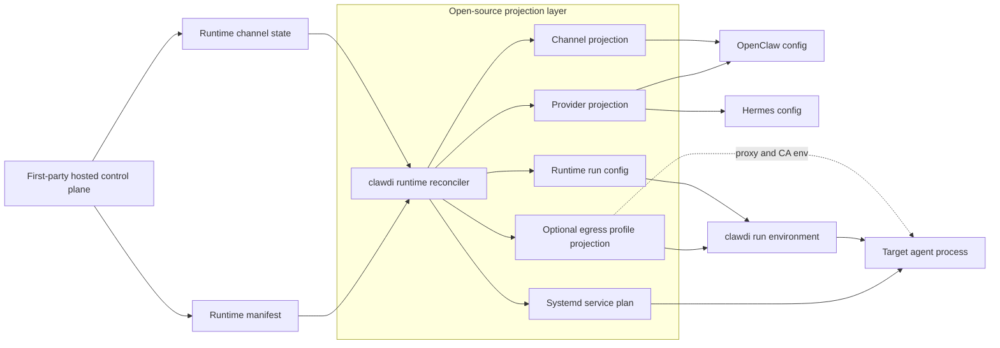

# Runtime Projection Boundary

| Field | Value |
| --- | --- |
| Status | Public boundary note |
| Last updated | 2026-07-02 |
| Owner | CLI runtime layer |

This note defines what belongs in the open-source runtime projection layer. It
does not document private service internals, production routing, or deployment
topology.

## Decision

Use native runtime configuration wherever a supported agent exposes a stable
surface. Use Clawdi projection code to translate the standard provider/channel
contract into target-runtime config. Use request rewriting only behind explicit
profiles when native configuration cannot express the required behavior.

The explicit local execution boundary is:

```bash
clawdi run -- <command>
```

`clawdi run` prepares environment variables and local config, then executes the
target command when a caller explicitly opts into Clawdi env injection. Normal
hosted daemon startup uses direct systemd service entries instead.

Hosted runtime mode does not intercept managed runtime names. Shell commands
resolve to official runtime binaries. Clawdi only participates when a caller
explicitly invokes `clawdi run -- <command>` or when systemd starts a direct
runtime program from the local service plan.

## Projection Flow



The diagram is intentionally limited to public contracts. It does not describe
service-internal storage, deployment topology, or production routing.

## Provider Boundary

Clawdi provider input uses standard API modes:

- `openai_chat`;
- `openai_responses`;
- `anthropic_messages`;
- `google_generate_content`.

Target-native names are projection outputs, not Clawdi provider modes. For
example, a target runtime may need a native transport string that differs from
`openai_responses`; that name should be generated only in the target runtime's
projection file.

Hosted runtime manifests should scope provider projections by runtime name when
agents can have different provider bindings. For example,
`providers.openclaw` is the OpenClaw provider projection and `providers.hermes`
is the Hermes provider projection. The CLI must select the runtime-scoped entry
for the runtime it is configuring instead of relying on a global default. The
legacy `providers.default` shape remains valid for single-provider fixtures.

## Channel Boundary

Channel projection should:

- validate descriptor shape before writing files;
- keep credentials out of durable config;
- use stable ordering for generated output;
- redact secrets in logs and diagnostics;
- avoid embedding private service assumptions in the CLI.

## Sidecar Boundary

The `clawdi runtime sidecar` command is the runtime-local Clawdi support process.
It hosts the outbound egress module when a manifest profile requires it.

The CLI may own:

- profile validation;
- local egress module lifecycle;
- proxy and trust environment projection;
- request matching for explicit profiles;
- secret reference lookup from short-lived runtime state.

The CLI must not own:

- private service routing policy;
- first-party hosted control-plane behavior;
- long-lived protocol credentials;
- target runtime update channels;
- user BYOK provider traffic interception by default.

The egress module is not the Clawdi daemon. Egress owns outbound proxy and CA
behavior, while the daemon owns live-sync/API authority. Manifest state, status,
token scope, and logs must keep those responsibilities separate.

## Runtime Command Boundary

The CLI may own:

- generated run config files;
- local systemd service entries for daemon runtime startup;
- no new wrapper or launcher generation for daemon runtime startup;
- PATH cleanup before launching runtime child processes;
- disabled-runtime enforcement;
- generated systemd entries that start official runtime binaries directly when
  the runtime's own installer cannot express the complete hosted service
  contract;
- runtime-owned auxiliary services as explicit official service commands,
  without user command shims;
- support for future runtime names when an explicit `run.command` is supplied.

The CLI must not own:

- image-level per-agent wrapper scripts;
- private deployment selection or rollout policy;
- silent fallback from a disabled managed runtime to a native binary;
- target runtime source patching as the default integration path.

Built-in installer/projection support is currently explicit. Unknown runtime
names are acceptable only when the manifest includes enough `run.command`
information for the CLI to launch them deterministically.

Hosted runtime processes map to official runtime commands. If an official
runtime exposes multiple long-running commands, such as Hermes dashboard and
Hermes gateway, each runtime-owned unit must come from an official service
installer. Clawdi must not add a shell wrapper to multiplex the commands.
Clawdi-owned support and compatibility units keep `clawdi-*` names;
OpenClaw/Hermes still own their official installer, config, and update
behavior.

Official runtime Docker images remain useful reference implementations. Hermes'
Docker image demonstrates that gateway and dashboard can run as separate
official services. OpenClaw's Docker image demonstrates that direct
non-loopback exposure should require runtime-native auth. Docker image rollout
updates are a different update model, so they are not the primary path when
in-place official UI updates are required.

## Control UI And Terminal Boundary

Control UI is a runtime-native browser UI surface. Terminal is a deployment
shell surface exposed by the dashboard and hosted API contract. They are
intentionally separate:

- Runtime UI is runtime-specific and should use the runtime's own product
  wording, such as OpenClaw Control UI or Hermes Dashboard.
- Runtime UI authentication stays with the official runtime.
- Terminal is deployment-scoped and not split per agent.
- Terminal token transport should prefer WebSocket subprotocols, with query
  string transport only as a compatibility fallback.
- The service-side shell bridge and deployment lifecycle are outside this
  repository.

## Testing Scope

In-repo tests should use local fixtures or fake upstreams for:

- profile schema validation;
- secret redaction;
- deterministic provider and channel projection;
- sidecar startup and shutdown around a child process;
- explicit request rewrite behavior;
- direct runtime routing and disabled-runtime behavior;
- terminal WebSocket URL handling and theme/status behavior.

Real service credentials and deployment-specific canaries belong outside the
open-source repository.
