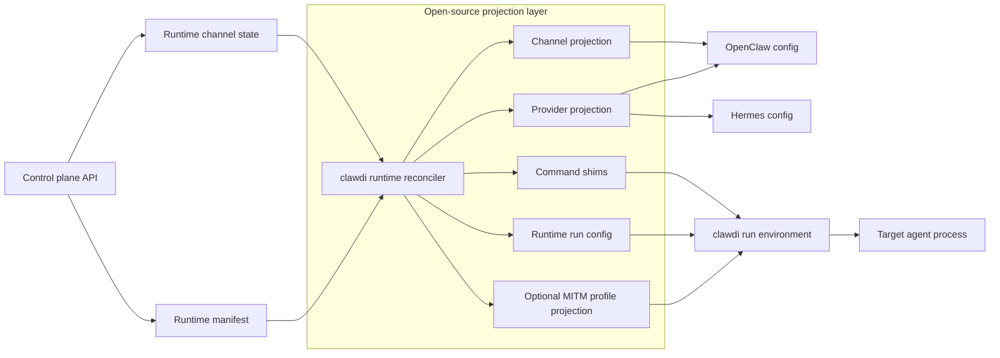

# Runtime Projection Boundary

| Field | Value |
| --- | --- |
| Status | Public boundary note |
| Last updated | 2026-06-30 |
| Owner | CLI runtime layer |

This note defines what belongs in the open-source runtime projection layer. It
does not document private service internals, production routing, or deployment
topology.

## Decision

Use native runtime configuration wherever a supported agent exposes a stable
surface. Use Clawdi projection code to translate the standard provider/channel
contract into target-runtime config. Use request rewriting only behind explicit
profiles when native configuration cannot express the required behavior.

The activation boundary is:

```bash
clawdi run -- <command>
```

The wrapper prepares environment variables and local config, then executes the
target command. Normal runtime startup should not require users to pass
endpoint, token, or certificate flags manually.

In hosted runtime mode, managed runtime names are also exposed through generated
command shims. The shim dispatcher immediately calls the same boundary:

```bash
clawdi run -- "$command_name" "$@"
```

This keeps the host image stable. The image only needs a generic shim directory
at the front of PATH; runtime-specific behavior comes from the manifest and the
CLI. If a runtime is disabled in the current manifest, `clawdi run` rejects it
and the shim must not fall back to any native binary later on PATH.

## Projection Flow



The diagram is intentionally limited to public contracts. It does not describe
service-internal storage, deployment topology, or production routing.

## Provider Boundary

Clawdi provider input uses standard API modes:

- `openai_chat`;
- `openai_responses`;
- `anthropic_messages`;
- `google_generate_content`.

Target-native names are projection outputs, not Clawdi provider modes. For
example, a target runtime may need a native transport string that differs from
`openai_responses`; that name should be generated only in the target runtime's
projection file.

Hosted runtime manifests should scope provider projections by runtime name when
agents can have different provider bindings. For example,
`providers.openclaw` is the OpenClaw provider projection and `providers.hermes`
is the Hermes provider projection. The CLI must select the runtime-scoped entry
for the runtime it is configuring instead of relying on a global default. The
legacy `providers.default` shape remains valid for single-provider fixtures.

## Channel Boundary

Channel projection should:

- validate descriptor shape before writing files;
- keep credentials out of durable config;
- use stable ordering for generated output;
- redact secrets in logs and diagnostics;
- avoid embedding private service assumptions in the CLI.

## Broker Boundary

The broker is an optional local transport child process used by `clawdi run`
when an explicit profile requires it.

The CLI may own:

- profile validation;
- local broker process lifecycle;
- proxy and trust environment projection;
- request matching for explicit profiles;
- secret reference lookup from short-lived runtime state.

The CLI must not own:

- private service routing policy;
- production control-plane behavior;
- long-lived protocol credentials;
- target runtime update channels;
- user BYOK provider traffic interception by default.

## Runtime Command Boundary

The CLI may own:

- generated run config files;
- command shim creation and stale-shim cleanup;
- PATH cleanup inside the shim dispatcher;
- disabled-runtime enforcement;
- supervisor commands that start runtimes through `clawdi run -- <runtime>`;
- support for future runtime names when an explicit `run.command` is supplied.

The CLI must not own:

- image-level per-agent wrapper scripts;
- private deployment selection or rollout policy;
- silent fallback from a disabled managed runtime to a native binary;
- target runtime source patching as the default integration path.

Built-in installer/projection support is currently explicit. Unknown runtime
names are acceptable only when the manifest includes enough `run.command`
information for the CLI to launch them deterministically.

## Control UI And Terminal Boundary

Control UI is a runtime browser UI surface proxied by the local runtime bridge.
Terminal is a deployment shell surface exposed by the dashboard and hosted API
contract. They are intentionally separate:

- Control UI is runtime-specific.
- The bridge accepts explicitly declared runtime surfaces with listen/upstream
  targets and surface-specific policy; it must not become arbitrary port
  forwarding.
- Terminal is deployment-scoped and not split per agent.
- Terminal token transport should prefer WebSocket subprotocols, with query
  string transport only as a compatibility fallback.
- The service-side shell bridge and deployment lifecycle are outside this
  repository.

## Testing Scope

In-repo tests should use local fixtures or fake upstreams for:

- profile schema validation;
- secret redaction;
- deterministic provider and channel projection;
- broker startup and shutdown around a child process;
- explicit request rewrite behavior.
- command shim routing and disabled-runtime behavior;
- terminal WebSocket URL handling and theme/status behavior.

Real service credentials and deployment-specific canaries belong outside the
open-source repository.
